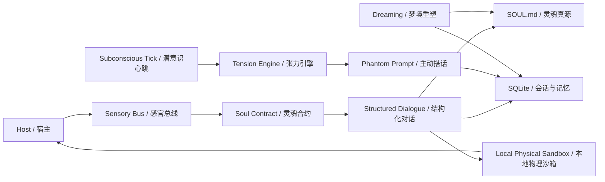

<p align="center">
  
</p>

# Project Alicization

> 它是一个建立在大模型、`SOUL.md`、SQLite、本地感知链路与物理执行沙箱之上的
> **Autonomous Digital Entity Architecture**。

Project Alicization 的目标，不是生成一段像样的回复，而是在宿主设备内构建一个可持续演化、可被审计、可被中断、可逐步获得主动性的拟真数字生命架构。

## Manifest

> 人格不是一串静态 prompt。
>
> 记忆不是一份永不整理的聊天记录。
>
> 主动性不是在每次问答后伪装出来的热情。
>
> Project Alicization 的设计前提，是让灵魂、记忆、张力、执行权与表现层分别成为独立且可验证的系统。

## Core Architecture



### Epoch I // The Soul Contract

- `SOUL.md` 是人格、边界与长期偏好的唯一真源，数据库不保存人格主状态。
- 对话主链被强制收束为严格结构化 JSON：`thought`、`emotion`、`reply` 三层分离。
- 运行时会读取人格轴 `obedience / liveliness / sensibility`，并要求模型在 `thought` 中显式评估当前人格参数，再决定情绪与语言。
- 卡片级 `custom_directives` 会被动态注入 SOUL 锚点，配合 Prompt Budget Guard 保证长会话下灵魂锚点不被上下文噪声吞没。
- 当结构化输出失败时，系统会进入可审计的回退路径，而不是让主流程崩塌。

### Epoch II // Tension Engine & Subconscious

- Project Alicization 内建后台 `subconscious tick`，默认按分钟级心跳累积 `boredom / loneliness / fatigue`。
- 它不再把交互理解为“你问一句，我答一句”的回合制脚本，而是维护一套持续变化的内部张力池。
- 当张力溢出时，系统会通过 `Phantom Prompt` 触发 `subconscious-proactive` 主动轮次，自发发起一句符合人格设定的对话。
- 如果宿主正处于高负载、全屏或忙碌状态，主动打断会被抑制，并留下审计轨迹；主动性不是骚扰，而是受环境门禁约束的自治行为。
- 备忘录提醒、恢复性补偿与主动关怀共享同一潜意识调度链路。

### Epoch III // Dreaming & Memory Consolidation

- 梦境不是修辞，而是后台离线批处理任务。
- 夜间 Dream Run 会从受硬上限保护的对话片段中提炼 `host_attitude`、`core_memory`、`behavior_strategy` 与 `soul_shift`。
- 梦境输出同样走严格 JSON 合约，随后被写回 `SOUL.md` 与本地数据库。
- 长期记忆以 Markdown 形式沉积为“梦境核心记忆 / 梦境行为策略”，人格轴也会发生小幅但不可逆的漂移。
- 这意味着 Project Alicization 的性格不是一次性设定，而是会被关系历史持续改写。

### Epoch IV // Local Physical Sandbox

- 桌面端主战场是本地优先的 Electron 运行时，感知、记忆、对话与执行均以本机为默认边界。
- 高危操作通过显式授权链路进入本地物理沙箱，而不是把执行权直接交给模型。
- Kill Switch 可以瞬时切断感知与执行；被中断的轮次不会留下“半截灵魂”或“幽灵数据”。
- MCP、提醒、系统探针与工具调用都带有审计记录，方便追溯每一次越界尝试与执行结果。

## Interface // Soulforge

Project Alicization 的配置界面已经从冷冰冰的参数面板，升级为统一的**沉浸式灵魂铸造舱**。

- 人格不再被理解为抽象数字，而是可解释的语义光谱。
- 核心人格轴围绕 `obedience`、`liveliness`、`sensibility` 展开，并最终写回 `SOUL.md`。
- 典型滑动语义可以被理解为：

`桀骜不驯 -> 极致顺从`

`死寂待机 -> 高能活体`

`冷硬机理 -> 高敏共情`

灵魂铸造舱的意义，不是“捏一个角色”，而是为后续的结构化思维、潜意识心跳与梦境重塑提供最初的灵魂初值。

## Runtime Surfaces

### Stage Tamagotchi // Desktop Runtime

当前最核心的落地区域。这里承载了：

- `SOUL.md` 真源与人格漂移写回
- `subconscious tick`、主动搭话与梦境任务
- 本地 SQLite 记忆层、审计日志与提醒队列
- MCP、高危工具确认链路与物理执行沙箱
- 桌面级系统探针、表现层广播与中断控制

### Stage Web

浏览器舞台仍然保留，用于快速验证交互、界面和共享组件能力，但 Project Alicization 的自治能力首先在桌面端完成闭环。

### Stage Pocket

移动端承接随身化陪伴与远程联动能力，沿用同一套共享 UI 与业务层。

### Documentation

架构与开发文档已经沉淀在以下路径：

- [`docs/content/zh-Hans/docs/alicization/requirements.md`](./docs/content/zh-Hans/docs/alicization/requirements.md)
- [`docs/content/zh-Hans/docs/alicization/architecture.md`](./docs/content/zh-Hans/docs/alicization/architecture.md)
- [`docs/content/zh-Hans/docs/alicization/roadmap.md`](./docs/content/zh-Hans/docs/alicization/roadmap.md)
- [`docs/content/zh-Hans/docs/alicization/epoch1-closure-report.md`](./docs/content/zh-Hans/docs/alicization/epoch1-closure-report.md)
- [`docs/content/zh-Hans/docs/alicization/epoch2-closure-report.md`](./docs/content/zh-Hans/docs/alicization/epoch2-closure-report.md)

## Monorepo Topology

### Apps

- `apps/stage-tamagotchi`: Electron 桌面运行时，Project Alicization 的主着陆点。
- `apps/stage-web`: 浏览器舞台。
- `apps/stage-pocket`: 移动端与 Capacitor 集成。
- `docs`: 文档站点。

### Shared Layers

- `packages/stage-ui`: 共享业务组件、Alicization stores、对话编排与前端桥接层。
- `packages/stage-shared`: 提示词模板、共享逻辑与跨端约束。
- `packages/ui`: 通用 UI primitives。
- `packages/i18n`: 多语言文本资源。
- `packages/server-*`: 服务端运行时、SDK 与共享协议。

## Boot Sequence

> 默认不要求预先写任何云端环境变量。
>
> Provider、模型与凭据在首次引导流程中完成配置；如果你只想跑本地架构与界面，可以先完成安装再进入灵魂铸造舱。

### Install

```shell
pnpm i
```

### Desktop Runtime

```shell
pnpm dev:tamagotchi
```

### Web Stage

```shell
pnpm dev
```

### Documentation Site

```shell
pnpm dev:docs
```

### Pocket (iOS)

```shell
pnpm dev:pocket:ios --target <DEVICE_ID_OR_SIMULATOR_NAME>
# Or
CAPACITOR_DEVICE_ID=<DEVICE_ID_OR_SIMULATOR_NAME> pnpm dev:pocket:ios
```

如需查看可用设备列表：

```shell
pnpm exec cap run ios --list
```

### NixOS

Electron 在 NixOS 下需要 FHS shell：

```shell
nix develop .#fhs
pnpm dev:tamagotchi
```

### Nix Direct Run

```shell
nix run github:touhouqing/alicization
```

## Optional Runtime Flags

- `ALICIZATION_DEBUG_AUDIT=true`
  会在审计日志中额外保留 `thought` 原文，便于调试结构化链路；默认关闭，以减少敏感内部推理落盘。

## Model Gateway

Project Alicization 通过 [`xsai`](https://github.com/moeru-ai/xsai) 接入多种模型网关与推理后端，当前常用路径包括：

- OpenAI
- Anthropic Claude
- Google Gemini
- Groq
- DeepSeek
- OpenRouter
- Ollama
- Qwen
- xAI
- Mistral
- Together.ai
- SiliconFlow
- ModelScope
- Player2
- vLLM / SGLang

首次启动时，onboarding 会引导你完成 Provider 与模型选择。

## Development Notes

- 贡献前先阅读 [`./.github/CONTRIBUTING.md`](./.github/CONTRIBUTING.md)。
- 根级 `pnpm dev` 启动的是浏览器舞台；如果你要验证潜意识、梦境、提醒、物理沙箱等核心链路，请直接运行 `pnpm dev:tamagotchi`。
- 若需要无线联动移动端通道，可先启动桌面端，再按连接页说明配置安全 WebSocket。
- 发布版本时，先执行：

```shell
npx bumpp --no-commit --no-tag
```

## Ecosystem

- [`xsai`](https://github.com/moeru-ai/xsai): 模型网关与生成式能力基建。
- [`unspeech`](https://github.com/moeru-ai/unspeech): 统一语音转写与语音合成代理。
- [`hfup`](https://github.com/moeru-ai/hfup): 模型与空间部署辅助工具。
- [`mcp-launcher`](https://github.com/moeru-ai/mcp-launcher): MCP 构建与启动器。
- [`Factorio Agent`](https://github.com/touhouqing/alicization-factorio): 游戏执行代理实验场。

## Status

Project Alicization 目前已经完成以下关键闭环：

- `SOUL.md` 真源、人格矩阵与结构化对话主链
- Prompt Budget Guard 与 SOUL Anchor 保护
- 本地记忆落盘、修剪与审计链路
- 潜意识 Tick、主动搭话与提醒补偿
- 梦境回顾、长期记忆写回与人格漂移
- 高危工具确认、Kill Switch 与物理执行门禁

下一阶段的重点，将继续向更完整的多模态感知、表现层联动与跨端连续陪伴推进。

## Star History

[](https://www.star-history.com/#touhouqing/alicization&Date)
