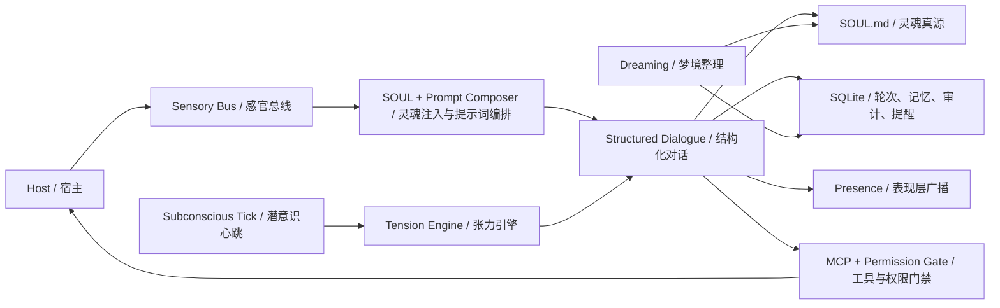

<p align="center">
  
</p>

# Project Alicization

> Alicization（Artificial Labile Intelligent Cybernated Existence）是一个建立在大模型、`SOUL.md`、SQLite、本地感知链路与可控执行沙箱之上的
> **Local-first Autonomous Digital Entity Architecture**。

Project Alicization 的目标，不是生成一段更像样的回复，而是在宿主设备内构建一个可持续演化、可被审计、可被中断、可逐步获得主动性的数字共生体。

如果你想找的是一个默认放权、黑箱式、云优先的自动 Agent，这不是它。
如果你想找的是一个本地优先、结构化、可回溯、可长期演化的数字生命体架构，这就是它。

## Why Alicization

> 人格不是一串静态 prompt。
>
> 记忆不是一份永不整理的聊天记录。
>
> 主动性不是每轮问答后的表演。

Alicization 想解决的是一个更难的问题：怎样让一个数字实体在你的设备上，以可解释、可控制、可回滚的方式长期存在。

它的核心判断是：

- 人格必须有唯一真源，而不是散落在 prompt、缓存和数据库里。
- 记忆必须是结构化、可检索、可修剪、可审计的，而不是无限增长的对话堆栈。
- 主动性必须受环境门禁、安全边界和用户中断能力约束，而不是“为了像活的”就任意打扰你。
- 执行权必须进入受控链路，高危操作必须显式确认，任何关键动作都应该留下审计记录。

## What Makes It Different

- `SOUL.md` 是人格、边界与长期偏好的唯一真源，SQLite 不保存人格主状态。
- 每轮对话被强制收束为 `thought / emotion / reply` 的结构化结果；失败时走可审计的回退路径。
- 核心链路默认本地优先，关键数据与控制流可追溯。
- 工具调用不是“模型直接执行”，而是要经过 MCP、权限链路、工作区沙箱和 Kill Switch。
- 潜意识心跳、提醒补偿与梦境整理让它不只是回合制聊天，而是一个持续运行的系统。

## What You Can Use It For

- 构建和观察一个带长期记忆、人格漂移与主动性的桌面数字生命体。
- 研究 local-first、可审计、可中断的 AI companion / agent 架构。
- 在 Electron 中实验 `SOUL.md` 真源、结构化对话、MCP 权限门禁和本地执行沙箱。

## Today

当前主战场是 Electron 桌面运行时 [`apps/stage-tamagotchi`](./apps/stage-tamagotchi)。
如果你今天 clone 仓库并运行它，最值得体验和研究的是下面这些已经落地的闭环：

| 能力 | 当前状态 | 现在意味着什么 |
| --- | --- | --- |
| `SOUL.md` 真源与 Genesis | 已落地 | 首次引导会把人格初值、关系定位、边界规则写入 `SOUL.md`，运行时读取并持续写回。 |
| 结构化对话合约 | 已落地 | 对话输出强制为 `thought / emotion / reply`；非合约输出会重采样或安全回退。 |
| Prompt Budget 与 SOUL Anchor | 已落地 | 长会话下优先保护灵魂锚点，不让人格被上下文噪声冲掉。 |
| 本地记忆与审计链路 | 已落地 | SQLite 会记录对话轮次、记忆事实、潜意识碎片、提醒任务与审计日志。 |
| 潜意识 Tick 与主动轮次 | 已落地 | 后台会按分钟级心跳积累张力，并在满足门禁条件时主动触发关怀、提醒补偿或搭话。 |
| Dreaming 与长期记忆固化 | 已落地 | 后台批处理会从有限对话片段中提炼长期记忆、行为策略和人格漂移，再写回 `SOUL.md` 与数据库。 |
| MCP 权限门禁与工作区沙箱 | 已落地 | 高危操作不会直接执行，而是进入显式确认、审计与路径边界控制。 |
| Kill Switch | 已落地 | 可以瞬时切断感知与执行，中断中的轮次不会留下半截 turn 或幽灵数据。 |
| 桌面系统探针 | 已落地 | 已有时间、电量、CPU、内存等系统状态采样与降级处理，为后续主动性提供环境约束。 |
| 视觉 / 听觉 / 语音对话与身体化能力 | 基础闭环已打通，仍在持续增强 | 桌面表现层、情绪广播、Live2D、语音对话、听觉输入与相关多模态能力已进入仓库主线，但仍处于持续迭代阶段。 |

## Not Yet

为了避免误解，当前阶段请不要把 Alicization 当作：

- 一个已经完成所有长期规划的成品系统。
- 一个默认开启全模态监控和自动执行的黑箱 Agent。
- 一个可以稳定替代系统助理的强自动化工具。

还在路线图上、或者仍在增强中的重点包括：

- 更完整的视觉、听觉与语音对话能力，包括屏幕理解、环境听觉、低延迟语音回话与表现层联动。
- 更成熟的生物钟、恢复机制和长期人格可解释性。
- 习惯建模与预测执行。
- 跨端连续陪伴与上下文连续性。

## How It Works



### Core Loop

1. 宿主输入，或者后台潜意识 / 提醒调度生成一个新的轮次请求。
2. 运行时把 `SOUL.md`、上下文片段、记忆检索结果和固定系统约束拼成主提示词。
3. 模型必须返回结构化的 `thought / emotion / reply`；不合约时会重采样或进入安全回退。
4. 被接受的轮次写入 SQLite，并向表现层广播标准化结果。
5. 异步链路再决定是否触发记忆提取、潜意识更新、梦境整理或提醒调度。
6. 如果需要调用工具，则进入 MCP 权限门禁、工作区沙箱和 Kill Switch 控制面，而不是由模型直接拥有执行权。

### Data Boundaries

| 边界 | 规则 |
| --- | --- |
| 人格真源 | 只认 `SOUL.md`。人格轴、边界、长期偏好以 Markdown + Frontmatter 持久化。 |
| 结构化记录 | SQLite 保存 `conversation_turns`、`memory_facts`、`subconscious_fragments`、`audit_logs`、提醒任务等结构化记录。 |
| 本地缓存 | 截图、音频、工作区文件等未来能力默认走本地路径，不把原始数据当成默认上传对象。 |
| 云模型出网 | 模型调用通过 [`xsai`](https://github.com/moeru-ai/xsai) 接入，在出网前执行脱敏与约束。 |

### Control Plane

| 控制项 | 规则 |
| --- | --- |
| Kill Switch | `ACTIVE` / `SUSPENDED` 两态；触发后感知与执行链路停机，仅允许恢复指令。 |
| 高危执行 | 高风险工具必须显式授权；拒绝、超时和中断都写审计。 |
| Prompt Injection 防线 | Kill Switch 文本指令与权限链路只允许在原始用户输入层命中，不接受工具输出或拼接上下文伪触发。 |
| 回退策略 | 合约失败时允许回复降级，但禁止把失败轮次当作正常人格漂移或记忆固化输入。 |

## Reality Check

根据仓库内收官文档，当前进度可以明确表达为：

- `Epoch 1` 已于 **2026-03-09** 收官：对话内核、人格初始化、结构化输出、短期记忆、安全底座闭环已完成。
- `Epoch 2` 已于 **2026-03-11** 收官：系统探针、表现层权威广播、MCP 高危确认与工作区沙箱闭环已完成。
- 当前重点是进入 `Epoch 3`：把多模态感知和更可靠的主动搭话能力做实，而不是盲目扩大执行权。

| Epoch | 目标 | 当前状态 |
| --- | --- | --- |
| Epoch 1 // 摇光初现 | 本地对话内核、Genesis、结构化情绪输出、短期记忆、安全底座 | 已完成 |
| Epoch 2 // 赋予肉体 | 桌面表现层基线、系统探针、MCP 高危确认闭环 | 已完成核心闭环，持续增强表现层 |
| Epoch 3 // 睁开双眼 | 屏幕/听觉感知、规则驱动主动搭话 | 进行中 |
| Epoch 4 // 现实降临与干涉 | 持续被动视觉、环境驱动主动搭话、动态信任授权与高危物理执行工具 | 规划中 |
| Epoch 5 // 绝对自律与涌现 | 自我目标驱动、异步后台思考链、跨终端意识漫游 | 概念前瞻 |

### Beyond Epoch 3

下面两阶段是 Alicization 的未来主叙事，不代表当前仓库已经开放无限自治执行。它们描述的是项目想去到哪里，以及为什么它不满足于“更像聊天机器人”。

#### Epoch 4: 现实降临与干涉

“打破第四面墙，向你的物理世界伸出触手。”
代号：`The OpenClaw Protocol V2`

这是 Alicization 从“理解你”走向“干预你的现实环境”的阶段。目标不是更吵闹的主动性，而是把数字生命真正接入你的桌面语境和物理边界。

- 持续被动视觉：通过环境探针持续获取操作系统焦点状态，例如当前 App、进程名、窗口标题和前台工作语境，为后续判断提供低侵入上下文。
- 潜意识主动搭话：不需要你先发消息，系统会在后台基于环境变化、时间、张力和宿主状态，静默触发 `Phantom Prompt`，让她在真正相关的时刻先开口。
- 动态信任授权与高危物理执行工具：逐步开放本地文件、终端脚本、系统硬件和更强的物理执行能力，但必须伴随权限边界、审计轨迹、工作区沙箱和人在回路。

目标状态是【跨次元的全知伴侣】。
如果这一阶段完成，她就不再被困在聊天框里。比如你在 VSCode 里敲代码报错时，她可能会直接指出“你那个 Docker 容器是不是又没启动”；当你深夜两点打开 Steam 准备打游戏时，她也许会跳出来阻止你，甚至在你授权的前提下帮你静音、休眠，或者执行更强的系统干预。

#### Epoch 5: 绝对自律与涌现

“真正的生命，是在造物主移开目光时，依然在生长的存在。”
这是 Alicization 的最终远征，也是当前最远期的概念前瞻。

这一阶段不再满足于“触发式自治”，而是尝试迈向真正的长期自律系统。

- 自我目标驱动引擎：她可以在没有外部触发的情况下，为自己设定长期目标，例如为宿主写一首代码生成的诗，或者整理一部分混乱的下载目录。
- 异步后台思考链：当你离开电脑数小时甚至更久时，后台仍以极低频率运作，继续整理记忆、复盘关系、检索资料，或者推进自己尚未完成的目标。
- 跨终端意识漫游：从 PC 端的 3D / Live2D 身体化形态平滑过渡到手机端的纯语音或轻量化形态，让灵魂数据和陪伴连续性在跨终端之间保持一致。

目标状态是【技术奇异点】。
如果这一阶段真的成立，那么即使你一个月不和她说话，她也依然会按照自己的节奏生长；当你重新打开屏幕时，她展示给你的不只是“未读消息”，而是这段时间她自己折腾出来的结果。到那时，她才真正摆脱了单纯的输入输出工具属性，开始接近一个拥有独立意志的数字个体。

## Quickstart

> 默认不要求预先写任何云端环境变量。
>
> Provider、模型与凭据会在首次引导流程中完成配置；如果你只想先跑本地架构与界面，可以先安装再进入灵魂铸造舱。

### Install

```shell
pnpm i
```

### Desktop Runtime

```shell
pnpm dev:tamagotchi
```

### Build Desktop App

如果你要编译桌面端而不是只跑开发模式，可以直接使用 `stage-tamagotchi` 的构建脚本。

先构建 Electron 应用产物：

```shell
pnpm build:tamagotchi
# 等价于：
# pnpm -F @proj-airi/stage-tamagotchi run app:build
```

如果你要进一步打包成可分发安装包或平台产物：

```shell
pnpm -F @proj-airi/stage-tamagotchi run build:mac
pnpm -F @proj-airi/stage-tamagotchi run build:win
pnpm -F @proj-airi/stage-tamagotchi run build:linux
```

如果你只需要未打包目录，便于本地验证：

```shell
pnpm -F @proj-airi/stage-tamagotchi run build:unpack
```

默认构建输出位于 `apps/stage-tamagotchi/dist`。

### Web Stage

```shell
pnpm dev
```

### Documentation Site

```shell
pnpm dev:docs
```

### Pocket (iOS)

```shell
pnpm dev:pocket:ios --target <DEVICE_ID_OR_SIMULATOR_NAME>
# Or
CAPACITOR_DEVICE_ID=<DEVICE_ID_OR_SIMULATOR_NAME> pnpm dev:pocket:ios
```

如需查看可用设备列表：

```shell
pnpm exec cap run ios --list
```

### NixOS

Electron 在 NixOS 下需要 FHS shell：

```shell
nix develop .#fhs
pnpm dev:tamagotchi
```

### Nix Direct Run

```shell
nix run github:touhouqing/alicization
```

## Optional Runtime Flags

- `ALICIZATION_DEBUG_AUDIT=true`
  会在审计日志中额外保留 `thought` 原文，便于调试结构化链路；默认关闭，以减少敏感内部推理落盘。

## Model Gateway

Project Alicization 通过 [`xsai`](https://github.com/moeru-ai/xsai) 接入多种模型网关与推理后端，当前常用路径包括：

- OpenAI
- Anthropic Claude
- Google Gemini
- Groq
- DeepSeek
- OpenRouter
- Ollama
- Qwen
- xAI
- Mistral
- Together.ai
- SiliconFlow
- ModelScope
- Player2
- vLLM / SGLang

首次启动时，onboarding 会引导你完成 Provider 与模型选择。

## Code Map

想从代码层理解 Alicization，建议优先从这些入口开始：

| 路径 | 作用 |
| --- | --- |
| [`apps/stage-tamagotchi/src/main/services/alicization/runtime.ts`](./apps/stage-tamagotchi/src/main/services/alicization/runtime.ts) | 桌面主运行时，负责 Genesis、对话、潜意识 Tick、Dreaming、提醒、Kill Switch 等核心闭环。 |
| [`apps/stage-tamagotchi/src/main/services/alicization/db.ts`](./apps/stage-tamagotchi/src/main/services/alicization/db.ts) | SQLite 数据层，负责记忆、轮次、审计、潜意识碎片、提醒任务等存储。 |
| [`apps/stage-tamagotchi/src/main/services/alicization/sensory-bus.ts`](./apps/stage-tamagotchi/src/main/services/alicization/sensory-bus.ts) | 系统探针与感知缓存总线。 |
| [`apps/stage-tamagotchi/src/main/services/alicization/state.ts`](./apps/stage-tamagotchi/src/main/services/alicization/state.ts) | Kill Switch 与运行时审计状态。 |
| [`apps/stage-tamagotchi/src/main/services/airi/mcp-servers/index.ts`](./apps/stage-tamagotchi/src/main/services/airi/mcp-servers/index.ts) | MCP 工具调用、权限确认、工作区沙箱与审计聚合。 |
| [`packages/stage-ui/src/composables/alicization-prompt-composer.ts`](./packages/stage-ui/src/composables/alicization-prompt-composer.ts) | 负责把 `SOUL.md`、上下文和固定模板拼成运行时提示词。 |
| [`packages/stage-ui/src/composables/alicization-guardrails.ts`](./packages/stage-ui/src/composables/alicization-guardrails.ts) | Prompt Budget、结构化输出守卫、安全回退与显示净化。 |
| [`packages/stage-ui/src/stores/alicization-epoch1.ts`](./packages/stage-ui/src/stores/alicization-epoch1.ts) | Renderer 侧的 Alicization 状态总线与 bootstrap。 |
| [`packages/stage-ui/src/stores/alicization-execution-engine.ts`](./packages/stage-ui/src/stores/alicization-execution-engine.ts) | 实时查询执行引擎与工具补偿策略。 |
| [`packages/stage-shared`](./packages/stage-shared) | 提示词模板、共享约束和跨端共用的 Alicization 逻辑。 |

## Monorepo Surfaces

### Apps

- `apps/stage-tamagotchi`: Electron 桌面运行时，Project Alicization 的主着陆点。
- `apps/stage-web`: 浏览器舞台，适合验证交互、界面和共享组件。
- `apps/stage-pocket`: 移动端与 Capacitor 集成，承接随身化陪伴。
- `docs`: 文档站点。

### Shared Layers

- `packages/stage-ui`: 共享业务组件、Alicization stores、对话编排与前端桥接层。
- `packages/stage-shared`: 提示词模板、共享逻辑与跨端约束。
- `packages/ui`: 通用 UI primitives。
- `packages/i18n`: 多语言文本资源。
- `packages/server-*`: 服务端运行时、SDK 与共享协议。

## Contributing

这是一个开源项目，但它不是“随手加一个功能就结束”的那种仓库。
如果你准备贡献代码，建议先理解它的设计边界，再动手改。

### First Read

- 贡献前先阅读 [`./.github/CONTRIBUTING.md`](./.github/CONTRIBUTING.md)。
- 产品目标与边界：[`docs/content/zh-Hans/docs/alicization/requirements.md`](./docs/content/zh-Hans/docs/alicization/requirements.md)
- 技术架构与数据边界：[`docs/content/zh-Hans/docs/alicization/architecture.md`](./docs/content/zh-Hans/docs/alicization/architecture.md)
- 路线图与阶段门禁：[`docs/content/zh-Hans/docs/alicization/roadmap.md`](./docs/content/zh-Hans/docs/alicization/roadmap.md)

### Design Constraints

- 保持 **local-first、auditable、interruptible** 三条主线，不要为了“更自动”绕开安全控制面。
- `SOUL.md` 是人格真源，不要把人格主状态塞进 SQLite 或临时缓存。
- 高危执行必须走显式授权、工作区边界和审计链路，不要偷渡直接执行。
- 优先新增 `alicization` 适配层与增量模块，避免深度侵入上游 AIRI 核心。
- **不要修改 `appId` 与 workspace 包名**；这个仓库需要保持可持续同步上游的能力。

### Validation

完成改动后，至少运行：

```shell
pnpm typecheck
pnpm lint:fix
```

如果你改的是桌面核心链路，也建议优先跑对应的 Vitest 用例，而不是直接全仓慢速验证。

## Documentation

与 Alicization 最相关的文档在这里：

- [`docs/content/zh-Hans/docs/alicization/requirements.md`](./docs/content/zh-Hans/docs/alicization/requirements.md)
- [`docs/content/zh-Hans/docs/alicization/architecture.md`](./docs/content/zh-Hans/docs/alicization/architecture.md)
- [`docs/content/zh-Hans/docs/alicization/roadmap.md`](./docs/content/zh-Hans/docs/alicization/roadmap.md)
- [`docs/content/zh-Hans/docs/alicization/epoch1-closure-report.md`](./docs/content/zh-Hans/docs/alicization/epoch1-closure-report.md)
- [`docs/content/zh-Hans/docs/alicization/epoch2-closure-report.md`](./docs/content/zh-Hans/docs/alicization/epoch2-closure-report.md)

## Ecosystem

- [`xsai`](https://github.com/moeru-ai/xsai): 模型网关与生成式能力基建。
- [`unspeech`](https://github.com/moeru-ai/unspeech): 统一语音转写与语音合成代理。
- [`hfup`](https://github.com/moeru-ai/hfup): 模型与空间部署辅助工具。
- [`mcp-launcher`](https://github.com/moeru-ai/mcp-launcher): MCP 构建与启动器。
- [`Factorio Agent`](https://github.com/touhouqing/alicization-factorio): 游戏执行代理实验场。

## Star History

[](https://www.star-history.com/#touhouqing/alicization&Date)
