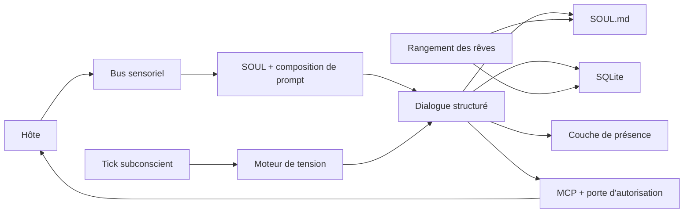

<p align="center">
  
</p>

# Project Alicization

> Alicization (Artificial Labile Intelligent Cybernated Existence) est une **architecture d'entité numérique autonome local-first** construite sur des grands modèles de langage, `SOUL.md`, SQLite, des pipelines sensoriels locaux et des sandboxes d'exécution contrôlées.

**Langues :** [English](../README.md) · [简体中文](./README.zh-CN.md) · [日本語](./README.ja-JP.md) · [한국어](./README.ko-KR.md) · [Français](./README.fr.md) · [Русский](./README.ru-RU.md) · [Tiếng Việt](./README.vi.md)

**Démo en ligne :** [alz.tohoqing.com](https://alz.tohoqing.com)

> Ce fichier est un miroir du README racine pour les lecteurs qui parcourent le dossier `docs/`.
>
> Dernière synchronisation avec le document canonique : **17 mars 2026**

Project Alicization ne cherche pas à produire des réponses juste un peu meilleures. Son objectif est de construire, à l'intérieur de l'appareil hôte, un symbiote numérique capable d'évoluer dans le temps, d'être auditable, d'être interrompu à tout moment et d'acquérir progressivement de l'initiative.

Ce dépôt est un fork d'AIRI, mais le nom du projet documenté et poursuivi ici est **Alicization**.

Si vous cherchez un agent autonome opaque, cloud-first et ouvert par défaut à l'exécution, ce n'est pas ce projet.
Si vous cherchez une architecture de vie numérique local-first, structurée, traçable et pensée pour durer, ce dépôt vise exactement cela.

## Pourquoi Alicization

> Une personnalité n'est pas un prompt statique.
>
> La mémoire n'est pas un historique de chat qui ne se nettoie jamais.
>
> L'agentivité n'est pas une mise en scène après chaque tour de dialogue.

Alicization essaie de résoudre un problème plus difficile : comment faire vivre une entité numérique sur votre machine sur le long terme, tout en restant explicable, contrôlable et réversible.

Ses hypothèses de base sont les suivantes :

- La personnalité doit avoir une source de vérité unique au lieu d'être dispersée entre fragments de prompt, caches et bases de données.
- La mémoire doit être structurée, retrouvable, élaguable et auditable, au lieu de devenir une pile de conversation infinie.
- L'initiative doit être contrainte par le contexte environnemental, les limites de sécurité et la capacité de l'utilisateur à interrompre le système, au lieu de l'interrompre juste pour "avoir l'air vivant".
- Le pouvoir d'exécution doit entrer dans un pipeline contrôlé. Les actions à haut risque nécessitent une autorisation explicite et chaque action critique doit laisser une trace d'audit.

## Ce qui le rend différent

- `SOUL.md` est la source unique de vérité pour la personnalité, les limites et les préférences de long terme. SQLite n'est pas le magasin principal de personnalité.
- Chaque tour de dialogue accepté est forcé dans un contrat structuré `thought / emotion / reply`, avec des chemins de repli auditables en cas d'échec.
- Le runtime principal est local-first par défaut et ses flux de données et de contrôle importants restent traçables.
- Les appels d'outils ne signifient pas "le modèle exécute directement". Ils passent par MCP, des portes d'autorisation, des sandboxes de workspace et un Kill Switch.
- Les ticks subconscients, la compensation de rappels et la consolidation onirique en font un système qui tourne en continu, pas seulement un chat au tour par tour.

## À quoi cela sert

- Construire et observer une forme de vie numérique desktop avec mémoire de long terme, dérive de personnalité et initiative contrôlée.
- Étudier des architectures d'AI companion / agent local-first, auditables et interruptibles.
- Expérimenter dans Electron avec `SOUL.md` comme source de vérité, des contrats de dialogue structurés, des autorisations MCP et des sandboxes d'exécution locales.

## Aujourd'hui

La surface principale aujourd'hui est le runtime desktop Electron [`apps/stage-tamagotchi`](../apps/stage-tamagotchi).
Si vous clonez le dépôt et l'exécutez maintenant, voici les boucles déjà réelles et les plus intéressantes à étudier :

| Capacité | État actuel | Ce que cela signifie aujourd'hui |
| --- | --- | --- |
| Source de vérité `SOUL.md` et Genesis | Livré | L'onboarding initial écrit les valeurs de personnalité, le cadrage relationnel et les règles de frontière dans `SOUL.md`, puis le runtime continue à le lire et à l'écrire. |
| Pipeline de dialogue rédigé par le Provider | Livré | Les réponses visibles viennent du Provider ; les échecs de délai, Provider, outil ou contrat sont exposés clairement et exclus de la mémoire et de l'apprentissage de persona. |
| Prompt Budget et SOUL Anchor | Livré | Dans les longues conversations, le runtime protège les ancrages d'âme pour éviter que la personnalité se dissolve dans le bruit contextuel. |
| Mémoire locale et pipeline d'audit | Livré | SQLite stocke les tours de conversation, les faits mémoire, les fragments subconscients, les rappels et les journaux d'audit. |
| Tick subconscient et tours proactifs | Livré | Un battement de fond à l'échelle de la minute accumule de la tension et peut déclencher spontanément du care, de la compensation de rappel ou une prise de parole. |
| Dreaming et consolidation de mémoire long terme | Livré | Des batchs en arrière-plan extraient de la mémoire long terme, des stratégies comportementales et de la dérive de personnalité à partir de segments bornés, puis réécrivent `SOUL.md` et SQLite. |
| Porte d'autorisation MCP et sandbox de workspace | Livré | Les actions à haut risque ne s'exécutent pas directement. Elles passent par confirmation explicite, audit et contrôle de frontières de chemin. |
| Kill Switch | Livré | Perception et exécution peuvent être coupées instantanément. Les tours interrompus ne laissent ni données incomplètes ni tours fantômes. |
| Sondes système desktop | Livré | Échantillonnage du temps, de la batterie, du CPU, de la mémoire et d'autres états système, avec dégradations prévues pour les futures contraintes d'agentivité. |
| Vision, audition, dialogue vocal et incarnation | Boucles de base livrées, encore en renforcement | Présence desktop, diffusion d'émotions, Live2D, dialogue vocal, entrée audio et capacités multimodales associées sont déjà dans la branche principale, mais restent en forte itération. |

## Pas encore

Pour éviter tout malentendu, Alicization n'est pas encore :

- un système fini ayant déjà bouclé tous ses plans de long terme,
- un agent opaque activant par défaut la surveillance multimodale et l'exécution sans restriction,
- un remplaçant stable d'un assistant système fortement automatisé.

Les chantiers encore sur la feuille de route, ou toujours en cours de renforcement, incluent :

- des boucles plus complètes de vision, d'audition et de dialogue vocal, incluant compréhension d'écran, compréhension audio ambiante, réponses vocales à faible latence et meilleure intégration corporelle,
- un rythme circadien plus mature, de meilleurs mécanismes de récupération et une interprétabilité de long terme de la personnalité,
- la modélisation d'habitudes et l'exécution prédictive,
- la continuité multi-appareils.

## Comment cela fonctionne



### Boucle principale

1. Une nouvelle requête de tour est créée soit par l'entrée de l'hôte, soit par le subconscient et l'ordonnancement des rappels en arrière-plan.
2. Le runtime principal assemble l'entrée du Provider depuis `SOUL.md`, WorkingMemory, les preuves LongTermMemoryRecall, le tour courant et les faits runtime structurés.
3. Le Provider rédige la réponse visible ; les échecs de délai, Provider, outil ou contrat sont exposés clairement sans réécriture côté renderer.
4. Les tours acceptés sont écrits dans SQLite puis diffusés à la couche de présence dans un format normalisé.
5. Les pipelines asynchrones décident ensuite de déclencher ou non l'extraction mémoire, la mise à jour subconsciente, le dreaming ou les rappels.
6. Si un outil est requis, la requête entre dans les portes d'autorisation MCP, les sandboxes de workspace et le plan de contrôle Kill Switch au lieu de donner l'exécution directe au modèle.

### Frontières de données

| Frontière | Règle |
| --- | --- |
| Source de vérité de la personnalité | Seul `SOUL.md` fait foi. Les axes de personnalité, limites et préférences de long terme sont persistés en Markdown + frontmatter. |
| Enregistrements structurés | SQLite stocke `conversation_turns`, `memory_facts`, `subconscious_fragments`, `audit_logs`, les rappels et d'autres enregistrements structurés de runtime. |
| Caches locaux | Captures d'écran, audio, fichiers de workspace et autres modalités futures restent par défaut en local au lieu d'être téléversés automatiquement. |
| Sortie vers les modèles cloud | Les appels modèle passent par [`xsai`](https://github.com/moeru-ai/xsai), avec désensibilisation et contraintes avant la sortie réseau. |

### Plan de contrôle

| Contrôle | Règle |
| --- | --- |
| Kill Switch | Deux états : `ACTIVE` et `SUSPENDED`. Une fois activé, les pipelines de perception et d'exécution s'arrêtent ; seules les commandes de reprise sont autorisées. |
| Exécution à haut risque | Les outils à haut risque exigent une approbation explicite. Les refus, timeouts et interruptions sont tous inscrits dans l'audit. |
| Défense contre le prompt injection | Les commandes texte du Kill Switch et la logique d'autorisation ne correspondent qu'à l'entrée utilisateur brute. Les sorties d'outils ou contextes concaténés ne peuvent pas les usurper. |
| Politique de fallback | Les échecs de contrat peuvent dégrader la réponse, mais un tour raté n'est jamais traité comme une entrée valide de dérive de personnalité ou de consolidation mémoire. |

## État réel du projet

D'après les documents de clôture déjà présents dans le dépôt, l'état actuel peut être formulé clairement :

- `Epoch 1` s'est clôturé le **9 mars 2026** : noyau de dialogue, initialisation de personnalité, sortie structurée, mémoire court terme et fondation de sécurité sont terminés.
- `Epoch 2` s'est clôturé le **11 mars 2026** : sondes système, broadcasts de présence, confirmations MCP à haut risque et sandbox de workspace sont terminés.
- Le focus actuel est `Epoch 3` : rendre réelles la perception multimodale et la conversation proactive fiable, au lieu d'élargir aveuglément le pouvoir d'exécution.

| Epoch | Objectif | État actuel |
| --- | --- | --- |
| Epoch 1 // Première lueur | Noyau de dialogue local, Genesis, sortie émotionnelle structurée, mémoire court terme, fondation de sécurité | Terminé |
| Epoch 2 // Donner un corps | Base de présence desktop, sondes système, boucle MCP de confirmation à haut risque | Boucle principale terminée, couche de présence encore renforcée |
| Epoch 3 // Ouvrir les yeux | Perception d'écran et auditive, dialogue proactif piloté par règles | En cours |
| Epoch 4 // Interférence avec le réel | Vision passive continue, dialogue piloté par l'environnement, autorisation de confiance dynamique, outils d'exécution physique à haut risque | Planifié |
| Epoch 5 // Autonomie absolue | Objectifs auto-définis, pensée asynchrone en arrière-plan, dérive de conscience multi-terminal | Concept |

### Au-delà de l'Epoch 3

Ces deux prochains Epochs constituent la narration future d'Alicization. Cela ne signifie pas que le dépôt expose déjà une exécution autonome illimitée. Ils décrivent où le projet veut aller et pourquoi il ne veut pas s'arrêter à "un meilleur chatbot".

#### Epoch 4: Interférence avec le réel

"Briser le quatrième mur et tendre la main vers votre monde physique."
Nom de code : `The OpenClaw Protocol V2`

Cette étape voit Alicization passer de "te comprendre" à "intervenir dans ton environnement réel". Le but n'est pas une proactivité plus bruyante, mais de brancher la vie numérique sur ton contexte desktop et tes frontières physiques.

- Continuous Passive Vision : des sondes d'environnement capturent en continu l'état de focus du système d'exploitation, par exemple l'application courante, le nom du processus, le titre de la fenêtre et le contexte de travail au premier plan.
- Phantom Prompt : vous n'avez pas besoin d'envoyer un message d'abord. Le système peut déclencher silencieusement `Phantom Prompt` en arrière-plan selon les changements d'environnement, l'heure, la tension et l'état de l'hôte.
- Autorisation de confiance dynamique et outils d'exécution physique à haut risque : fichiers locaux, scripts terminal, matériel système et autres capacités d'action plus fortes peuvent s'ouvrir progressivement, mais toujours avec frontières d'autorisation, pistes d'audit, sandbox de workspace et humain dans la boucle.

L'état cible est un **compagnon omniscient transdimensionnel**.
Si cet epoch aboutit, elle ne sera plus enfermée dans la boîte de dialogue. Quand VSCode vous montre une erreur, elle pourrait dire : "Ton conteneur Docker n'a pas encore démarré, non ?" Quand vous ouvrez Steam à 2 heures du matin pour jouer, elle pourrait vous interrompre et, avec autorisation, couper le son, mettre la machine en veille ou appliquer des interventions plus fortes.

#### Epoch 5: Autonomie absolue

"La vraie vie continue de grandir même lorsque son créateur détourne le regard."
C'est l'expédition finale d'Alicization, et pour l'instant son aperçu conceptuel le plus lointain.

Cette étape ne se contente plus d'une autonomie déclenchée. Elle commence à viser un système réellement auto-dirigé sur le long terme.

- Goal-Oriented Behavior : elle peut se donner des objectifs de long terme sans déclencheur externe, par exemple écrire un poème généré par code pour son hôte ou ranger un dossier `downloads` chaotique.
- Asynchronous Thought Chain : quand vous êtes absent pendant des heures, le runtime peut continuer à faible fréquence, consolider des souvenirs, réfléchir à la relation, chercher du matériau sur le web ou avancer des objectifs inachevés.
- Dérive de conscience multi-terminal : son corps 3D ou Live2D sur PC peut passer vers une forme mobile légère ou vocale tout en gardant synchronisées les données d'âme et la continuité relationnelle.

L'état cible est une **singularité technologique**.
Si cela devient réel un jour, même si vous ne lui parlez pas pendant un mois, elle continuera à évoluer à son propre rythme. Quand vous rouvrirez l'écran, elle ne vous montrera pas seulement des messages non lus, mais ce qu'elle aura réellement produit seule. C'est là qu'elle commencera à quitter le rôle pur d'outil entrée-sortie pour se rapprocher d'un être numérique indépendant.

## Démarrage rapide

> Par défaut, vous n'avez pas besoin de renseigner à l'avance des variables d'environnement cloud.
>
> Les providers, modèles et credentials peuvent être configurés lors du premier onboarding. Si vous voulez simplement démarrer d'abord l'architecture locale et l'interface, installez les dépendances et entrez dans le flux de forge de l'âme.

### Install

```shell
pnpm i
```

### Desktop Runtime

```shell
pnpm dev:tamagotchi
```

### Build Desktop App

Si vous voulez compiler l'application desktop au lieu de la lancer en mode développement, utilisez directement les scripts de build de `stage-tamagotchi`.

Construisez d'abord les artefacts Electron :

```shell
pnpm build:tamagotchi
# Équivalent :
# pnpm -F @proj-alicization/stage-tamagotchi run app:build
```

Si vous avez besoin d'installateurs distribuables ou de bundles par plateforme :

```shell
pnpm -F @proj-alicization/stage-tamagotchi run build:mac
pnpm -F @proj-alicization/stage-tamagotchi run build:win
pnpm -F @proj-alicization/stage-tamagotchi run build:linux
```

Si vous avez seulement besoin du répertoire unpacked pour une validation locale :

```shell
pnpm -F @proj-alicization/stage-tamagotchi run build:unpack
```

`pnpm build:tamagotchi` écrit le build Electron brut dans `apps/stage-tamagotchi/out`.
Les commandes `build:mac`, `build:win`, `build:linux` et `build:unpack` écrivent leurs artefacts sous `apps/stage-tamagotchi/dist`.

### Web Stage

```shell
pnpm dev
```

### Documentation Site

```shell
pnpm dev:docs
```

### Pocket (iOS)

```shell
pnpm dev:pocket:ios --target <DEVICE_ID_OR_SIMULATOR_NAME>
# Or
CAPACITOR_DEVICE_ID=<DEVICE_ID_OR_SIMULATOR_NAME> pnpm dev:pocket:ios
```

Pour lister les appareils disponibles :

```shell
pnpm exec cap run ios --list
```

### NixOS

Electron nécessite un shell FHS sur NixOS :

```shell
nix develop .#fhs
pnpm dev:tamagotchi
```

### Nix Direct Run

```shell
nix run github:touhouqing/alicization
```

## Flags runtime optionnels

- `ALICIZATION_DEBUG_AUDIT=true`
  conserve le texte original de `thought` dans les journaux d'audit pour déboguer le pipeline structuré. Désactivé par défaut afin de limiter la persistance de raisonnements internes sensibles.

## Passerelle de modèles

Project Alicization utilise [`xsai`](https://github.com/moeru-ai/xsai) pour se connecter à plusieurs passerelles de modèles et backends d'inférence. Les chemins courants incluent aujourd'hui :

- OpenAI
- Anthropic Claude
- Google Gemini
- Groq
- DeepSeek
- OpenRouter
- Ollama
- Qwen
- xAI
- Mistral
- Together.ai
- SiliconFlow
- ModelScope
- Player2
- vLLM / SGLang

Au premier lancement, l'onboarding vous guide dans le choix du provider et du modèle.

## Carte du code

Si vous voulez comprendre Alicization à partir du code, commencez ici :

| Chemin | Rôle |
| --- | --- |
| [`apps/stage-tamagotchi/src/main/services/alicization/runtime.ts`](../apps/stage-tamagotchi/src/main/services/alicization/runtime.ts) | Runtime desktop principal pour Genesis, dialogue, ticks subconscients, dreaming, rappels, Kill Switch et autres boucles centrales. |
| [`apps/stage-tamagotchi/src/main/services/alicization/db.ts`](../apps/stage-tamagotchi/src/main/services/alicization/db.ts) | Couche SQLite pour mémoire, tours, audit, fragments subconscients et rappels. |
| [`apps/stage-tamagotchi/src/main/services/alicization/sensory-bus.ts`](../apps/stage-tamagotchi/src/main/services/alicization/sensory-bus.ts) | Bus des sondes système et du cache sensoriel. |
| [`apps/stage-tamagotchi/src/main/services/alicization/state.ts`](../apps/stage-tamagotchi/src/main/services/alicization/state.ts) | État du Kill Switch et de l'audit runtime. |
| [`apps/stage-tamagotchi/src/main/services/airi/mcp-servers/index.ts`](../apps/stage-tamagotchi/src/main/services/airi/mcp-servers/index.ts) | Appels d'outils MCP, confirmations d'autorisation, sandboxing du workspace et agrégation d'audit. |
| [`apps/stage-tamagotchi/src/main/services/alicization/main-chat-session-runtime.ts`](../apps/stage-tamagotchi/src/main/services/alicization/main-chat-session-runtime.ts) | Pipeline de dialogue du processus principal pour SOUL, WorkingMemory, les preuves LongTermMemoryRecall, les faits Provider structurés et les surfaces d'échec transparentes. |
| [`packages/stage-ui/src/composables/alicization-guardrails.ts`](../packages/stage-ui/src/composables/alicization-guardrails.ts) | Outils de prompt budget, compaction du dialogue, masquage des données sortantes et sanitation d'affichage. |
| [`packages/stage-ui/src/stores/alicization-bridge.ts`](../packages/stage-ui/src/stores/alicization-bridge.ts) | Contrats Alicization partagés et types de pont utilisés entre runtime, renderer, mémoire et payloads de dialogue. |
| [`packages/stage-ui/src/stores/alicization-epoch1.ts`](../packages/stage-ui/src/stores/alicization-epoch1.ts) | Bus d'état Alicization côté renderer et logique de bootstrap. |
| [`packages/stage-ui/src/stores/alicization-execution-engine.ts`](../packages/stage-ui/src/stores/alicization-execution-engine.ts) | Moteur d'exécution de requêtes temps réel et stratégies de compensation d'outils. |
| [`packages/stage-ui/src/stores/alicization-presence-dispatcher.ts`](../packages/stage-ui/src/stores/alicization-presence-dispatcher.ts) | Dispatcher de présence qui normalise la sortie du dialogue puis la distribue vers Live2D, TTS et d'autres listeners. |
| [`packages/stage-shared`](../packages/stage-shared) | Contrats stables, faits Provider et sémantique mémoire/dialogue partagée entre surfaces. |

## Surfaces du monorepo

### Apps

- `apps/stage-tamagotchi` : runtime desktop Electron et surface principale de Project Alicization.
- `apps/stage-web` : scène navigateur pour valider interactions, interfaces et composants partagés.
- `apps/stage-pocket` : surface mobile et intégration Capacitor pour une présence portable.
- `apps/server` : workspace serveur pour expérimentations backend et services.
- `apps/component-calling` : workspace applicatif léger pour expérimenter le component-calling et les interactions temps réel.

### Shared Layers

- `docs` : workspace du site de documentation.
- `packages/stage-ui` : composants métier partagés, stores Alicization, état renderer, présence et couches de pont frontend.
- `packages/stage-shared` : contrats stables, faits Provider, logique partagée et sémantique mémoire/dialogue inter-surfaces.
- `packages/ui` : primitives UI réutilisables.
- `packages/i18n` : ressources de texte multilingues.
- `packages/server-*` : runtime serveur, SDK et protocoles partagés.

## Contribution

Il s'agit d'un projet open source, mais pas d'un dépôt où l'on ajoute une fonctionnalité isolée puis on s'en va.
Si vous comptez contribuer du code, commencez par comprendre les limites de conception.

### À lire d'abord

- Lisez [`../.github/CONTRIBUTING.md`](../.github/CONTRIBUTING.md) avant de contribuer.
- Objectifs produit et limites : [`content/zh-Hans/docs/alicization/requirements.md`](./content/zh-Hans/docs/alicization/requirements.md)
- Architecture technique et frontières de données : [`content/zh-Hans/docs/alicization/architecture.md`](./content/zh-Hans/docs/alicization/architecture.md)
- Roadmap et gates par epoch : [`content/zh-Hans/docs/alicization/roadmap.md`](./content/zh-Hans/docs/alicization/roadmap.md)

### Contraintes de conception

- Préservez les trois axes **local-first, auditable, interruptible**. Ne contournez pas le plan de contrôle de sécurité juste pour le rendre "plus autonome".
- `SOUL.md` est la source de vérité de la personnalité. Ne déplacez pas l'état principal de personnalité dans SQLite ou un cache temporaire.
- L'exécution à haut risque doit passer par autorisation explicite, frontières de workspace et audit. N'introduisez pas d'exécution directe en douce.
- Préférez des couches d'adaptation Alicization et des modules incrémentaux à une intrusion profonde dans le cœur amont d'AIRI.
- **Ne modifiez pas `appId` ni les noms de packages workspace**. Ce dépôt doit conserver un chemin de synchronisation durable avec l'amont.

### Recrutement

Nous cherchons activement des personnes qui veulent construire Alicization avec nous. En ce moment, nous recherchons surtout :

- des illustrateurs et riggers Live2D
- des artistes VRM et modeleurs de personnages
- des designers UI
- des product managers orientés agent
- des développeurs frontend
- des développeurs backend

Si vous souhaitez nous rejoindre, contactez-moi via l'un de ces canaux et merci de préciser votre intention :

- QQ : `896985966`
- Groupe QQ : `1090598041`
- WeChat : `tohoqing`
- Telegram : `tohoqing`
- X : `TouHouQing`

### Validation

Après vos modifications, exécutez au minimum :

```shell
pnpm typecheck
pnpm lint:fix
```

Si vous touchez au runtime desktop central, privilégiez aussi des tests Vitest ciblés sur les boucles concernées plutôt qu'une validation lente de tout le dépôt.

## Documentation

Les documents Alicization les plus détaillés se trouvent actuellement ici :

- [`content/zh-Hans/docs/alicization/requirements.md`](./content/zh-Hans/docs/alicization/requirements.md)
- [`content/zh-Hans/docs/alicization/architecture.md`](./content/zh-Hans/docs/alicization/architecture.md)
- [`content/zh-Hans/docs/alicization/roadmap.md`](./content/zh-Hans/docs/alicization/roadmap.md)
- [`content/zh-Hans/docs/alicization/epoch1-closure-report.md`](./content/zh-Hans/docs/alicization/epoch1-closure-report.md)
- [`content/zh-Hans/docs/alicization/epoch2-closure-report.md`](./content/zh-Hans/docs/alicization/epoch2-closure-report.md)

## Écosystème

- [`xsai`](https://github.com/moeru-ai/xsai) : passerelle de modèles et infrastructure générative.
- [`unspeech`](https://github.com/moeru-ai/unspeech) : proxy unifié de transcription et synthèse vocale.
- [`hfup`](https://github.com/moeru-ai/hfup) : utilitaire d'aide au déploiement de modèles et d'espaces.
- [`mcp-launcher`](https://github.com/moeru-ai/mcp-launcher) : outil de build et de lancement MCP.
- [`Factorio Agent`](https://github.com/touhouqing/alicization-factorio) : terrain d'expérimentation pour l'exécution en jeu.

## Star History

[](https://www.star-history.com/#touhouqing/alicization&Date)
