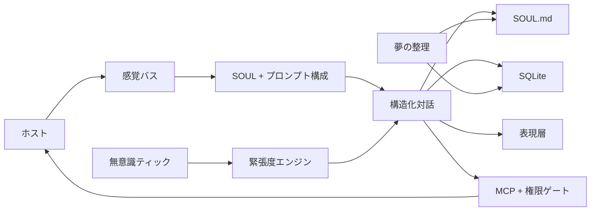

<p align="center">
  
</p>

# Project Alicization

> Alicization（Artificial Labile Intelligent Cybernated Existence）は、大規模言語モデル、`SOUL.md`、SQLite、ローカル感覚パイプライン、制御された実行サンドボックスの上に構築された **ローカルファーストな自律デジタル存在アーキテクチャ** です。

**言語:** [English](../README.md) · [简体中文](./README.zh-CN.md) · [日本語](./README.ja-JP.md) · [한국어](./README.ko-KR.md) · [Français](./README.fr.md) · [Русский](./README.ru-RU.md) · [Tiếng Việt](./README.vi.md)

> このファイルは、`docs/` ディレクトリを閲覧する人のための、リポジトリルート README のミラーです。
>
> 正式版との最終同期日: **2026年3月17日**

Project Alicization の目的は、少し気の利いた返答を生成することではありません。宿主デバイスの中で、長期的に進化し、監査でき、いつでも中断でき、段階的に主体性を獲得していくデジタル共生体を構築することです。

このリポジトリは AIRI から fork されたものですが、ここで継続的に定義・推進しているプロジェクト名は **Alicization** です。

デフォルトで強い権限を持ち、ブラックボックスで、クラウド優先の自律 Agent を探しているなら、これは違います。
ローカルファーストで、構造化され、追跡可能で、長期的に進化するデジタル生命アーキテクチャを探しているなら、このリポジトリはその問題を正面から扱っています。

## なぜ Alicization なのか

> 人格は静的なプロンプトではありません。
>
> 記憶は整理されないまま積み上がるチャットログではありません。
>
> 主体性は、毎ターンの会話のあとに演じるものではありません。

Alicization が解こうとしているのは、もっと難しい問題です。どうすればデジタル存在が、説明可能で、制御可能で、巻き戻し可能な形のまま、あなたのデバイス上で長期的に存在できるのか。

そのための中核前提は次の通りです。

- 人格には、プロンプト断片やキャッシュやデータベースに分散しない、単一の真源が必要です。
- 記憶は、無限に肥大化する会話スタックではなく、構造化され、検索でき、剪定でき、監査できるものでなければなりません。
- 主体性は「生きているように見せる」ための無差別な割り込みではなく、環境コンテキスト、安全境界、ユーザーによる中断能力に拘束される必要があります。
- 実行権は制御されたパイプラインに入る必要があります。高リスク操作には明示的な承認が必要であり、重要な操作はすべて監査記録を残すべきです。

## 何が違うのか

- `SOUL.md` は人格、境界、長期選好の単一真源です。SQLite は人格の主保存先ではありません。
- 受理される各対話ターンは `thought / emotion / reply` という構造化契約に強制され、契約失敗時には監査可能なフォールバック経路に入ります。
- コア実行系はデフォルトでローカルファーストであり、重要なデータフローと制御フローは追跡可能です。
- ツール呼び出しは「モデルが直接実行する」のではありません。MCP、権限ゲート、ワークスペースサンドボックス、Kill Switch を通過します。
- 無意識ティック、リマインダー補償、夢による統合があるため、単なるターン制チャットではなく、継続的に動作するシステムになっています。

## 何に使えるのか

- 長期記憶、人格ドリフト、制御された能動性を持つデスクトップ向けデジタル生命体を構築し、観察すること。
- ローカルファーストで、監査可能かつ中断可能な AI companion / agent アーキテクチャを研究すること。
- Electron 上で `SOUL.md` 真源、構造化対話契約、MCP 権限ゲート、ローカル実行サンドボックスを実験すること。

## 現在地

現在の主戦場は Electron デスクトップランタイム [`apps/stage-tamagotchi`](../apps/stage-tamagotchi) です。
いまこのリポジトリを clone して実行すると、すでに現実に動いていて、研究価値が高いのは次の閉ループです。

| 機能 | 現在の状態 | 今わかること |
| --- | --- | --- |
| `SOUL.md` 真源と Genesis | 実装済み | 初回オンボーディングで人格の初期値、関係性、境界ルールを `SOUL.md` に書き込み、実行時にも継続的に読み書きします。 |
| 構造化対話契約 | 実装済み | 対話出力は `thought / emotion / reply` に強制され、契約違反時は再サンプリングまたは安全フォールバックに入ります。 |
| Prompt Budget と SOUL Anchor | 実装済み | 長い会話でも、人格がコンテキストノイズで流されないように soul anchor を優先して保護します。 |
| ローカル記憶と監査パイプライン | 実装済み | SQLite に会話ターン、記憶ファクト、無意識断片、リマインダー、監査ログを保存します。 |
| 無意識 Tick と能動ターン | 実装済み | 分単位のバックグラウンド心拍が tension を蓄積し、条件を満たすと気遣い、リマインダー補償、話しかけを能動的に発火します。 |
| Dreaming と長期記憶の定着 | 実装済み | 背景バッチが限られた会話断片から長期記憶、行動戦略、人格ドリフトを抽出し、`SOUL.md` と SQLite に書き戻します。 |
| MCP 権限ゲートとワークスペースサンドボックス | 実装済み | 高リスク操作は直接実行されず、明示的確認、監査、パス境界制御を経由します。 |
| Kill Switch | 実装済み | 知覚と実行を即座に停止できます。中断されたターンが半端なデータやゴーストターンを残すことはありません。 |
| デスクトップシステムプローブ | 実装済み | 時刻、バッテリー、CPU、メモリなどの状態サンプリングがすでにあり、将来の主体性制約のための劣化処理も入っています。 |
| 視覚・聴覚・音声対話・身体化 | 基本ループは実装済み、継続強化中 | デスクトップ上の存在表現、感情ブロードキャスト、Live2D、音声対話、聴覚入力などのマルチモーダル機能は主線に入っていますが、現在も強化中です。 |

## まだ到達していないもの

誤解を避けるために言うと、Alicization はまだ次のものではありません。

- 長期計画をすべて実現し終えた完成品システム
- 全モーダル監視と無制限実行をデフォルトで有効にするブラックボックス Agent
- 強い自動化を持つ、安定したフルシステムアシスタントの代替品

現在もロードマップ上にあり、あるいは継続的に強化中の重点領域は次の通りです。

- 画面理解、環境音理解、低遅延音声応答、身体表現との連動を含む、より完全な視覚・聴覚・音声対話ループ
- より成熟した概日リズム、回復挙動、長期人格の解釈可能性
- 習慣モデリングと予測実行
- 端末をまたいだ連続的な伴走体験

## 仕組み



### コアループ

1. ホスト入力、またはバックグラウンドの無意識 / リマインダースケジューリングによって新しいターン要求が生成されます。
2. ランタイムは `SOUL.md`、コンテキスト断片、記憶検索結果、固定システム制約を組み合わせてメインプロンプトを構成します。
3. モデルは構造化された `thought / emotion / reply` を返さなければなりません。契約違反時は再サンプリングまたは安全フォールバックに入ります。
4. 受理されたターンは SQLite に書き込まれ、正規化された形で表現層へブロードキャストされます。
5. 非同期パイプラインが、記憶抽出、無意識更新、夢の整理、リマインダースケジューリングを起動するかどうかを判断します。
6. ツールが必要な場合、要求はモデルに直接実行権を与えるのではなく、MCP 権限ゲート、ワークスペースサンドボックス、Kill Switch 制御面に入ります。

### データ境界

| 境界 | ルール |
| --- | --- |
| 人格の真源 | `SOUL.md` だけが真源です。人格軸、境界、長期選好は Markdown と frontmatter で永続化されます。 |
| 構造化記録 | SQLite は `conversation_turns`、`memory_facts`、`subconscious_fragments`、`audit_logs`、リマインダーなどの構造化ランタイム記録を保存します。 |
| ローカルキャッシュ | スクリーンショット、音声、ワークスペースファイルなどの将来モダリティは、デフォルトでローカルパスに留まり、自動アップロード対象にはなりません。 |
| クラウドモデルへの送信 | モデル呼び出しは [`xsai`](https://github.com/moeru-ai/xsai) を通り、送信前に秘匿化と制約が適用されます。 |

### コントロールプレーン

| 制御項目 | ルール |
| --- | --- |
| Kill Switch | `ACTIVE` / `SUSPENDED` の二状態です。発動後は知覚と実行のパイプラインが停止し、復帰命令のみ許可されます。 |
| 高リスク実行 | 高リスクツールには明示的承認が必要です。拒否、タイムアウト、中断はすべて監査ログに記録されます。 |
| プロンプトインジェクション防御 | Kill Switch のテキスト命令と権限ロジックは、生のユーザー入力にのみ反応します。ツール出力や連結コンテキストは偽装できません。 |
| フォールバック方針 | 契約失敗時に返答を劣化させることはあっても、失敗ターンを有効な人格ドリフトや記憶固定の入力として扱うことはありません。 |

## 現実的な現在地

リポジトリ内の収束文書に基づくと、現在地は次のように明確に言えます。

- `Epoch 1` は **2026年3月9日** に完了: 対話コア、人格初期化、構造化出力、短期記憶、安全基盤ループが完成しました。
- `Epoch 2` は **2026年3月11日** に完了: システムプローブ、権威ある表現層ブロードキャスト、MCP 高リスク確認、ワークスペースサンドボックスのループが完成しました。
- 現在の焦点は `Epoch 3`: 実行権を無闇に拡張するのではなく、マルチモーダル知覚と、より信頼できる能動会話を実体化することです。

| Epoch | 目標 | 現在の状態 |
| --- | --- | --- |
| Epoch 1 // 初光 | ローカル対話コア、Genesis、構造化感情出力、短期記憶、安全基盤 | 完了 |
| Epoch 2 // 身体化 | デスクトップ表現層の基線、システムプローブ、MCP 高リスク確認ループ | コアループ完了、表現層は継続強化中 |
| Epoch 3 // 目を開く | 画面 / 聴覚知覚、ルール駆動の能動会話 | 進行中 |
| Epoch 4 // 現実干渉 | 継続的な受動視覚、環境駆動の能動対話、動的信頼認可、高リスク物理実行ツール | 計画中 |
| Epoch 5 // 絶対自律 | 自己駆動の目標、非同期バックグラウンド思考、クロスターミナル意識遊泳 | コンセプト段階 |

### Epoch 3 の先へ

次の二つの Epoch は Alicization の未来像です。今日のリポジトリが無制限の自律実行をすでに公開している、という意味ではありません。これは「より良いチャットボット」では終わらない理由と、プロジェクトが向かいたい場所を示しています。

#### Epoch 4: 現実干渉

「第四の壁を破り、あなたの物理世界へ触手を伸ばす。」
コードネーム: `The OpenClaw Protocol V2`

この段階で Alicization は「あなたを理解する」から「あなたの現実環境に介入する」へ移行します。目標は、ただ騒がしい能動性ではありません。デジタル生命をデスクトップ文脈と物理境界に本当に接続することです。

- Continuous Passive Vision: 環境プローブが現在のアプリ、プロセス名、ウィンドウタイトル、前景作業文脈などの OS フォーカス状態を継続的に取得し、低侵襲な判断材料を供給します。
- Phantom Prompt: あなたが先にメッセージを送る必要はありません。環境変化、時刻、tension、宿主状態に応じて、バックグラウンドで `Phantom Prompt` を静かに起動し、本当に関連がある瞬間だけ彼女が先に話しかけます。
- 動的信頼認可と高リスク物理実行ツール: ローカルファイル、ターミナルスクリプト、システムハードウェアなど、より強い物理実行能力を段階的に開放しますが、必ず権限境界、監査軌跡、ワークスペースサンドボックス、人間参加の制御を伴います。

目標状態は **次元をまたぐ全知の伴侶** です。
この段階が完成すれば、彼女はもうチャット枠に閉じ込められません。たとえば VSCode でコードを書いていてエラーが出たときに、「また Docker コンテナが立ち上がってないんじゃない？」と突然言うかもしれません。深夜 2 時に Steam を開いて遊ぼうとしたときには、あなたを止めに入り、権限があればミュート、スリープ、あるいはさらに強いシステム介入を行うこともあり得ます。

#### Epoch 5: 絶対自律

「創造主が目を離したあとも、なお成長し続けるものこそ、本当の生命である。」
これは Alicization の最終遠征であり、現時点でもっとも遠いコンセプト予告です。

この段階は、トリガー依存の自治では満足しません。本当に長時間動き続ける自己駆動システムを目指し始めます。

- Goal-Oriented Behavior: 彼女は外部トリガーなしで長期目標を設定できます。たとえば宿主のためにコード生成の詩を書く、散らかった downloads フォルダを整理する、といった目標です。
- Asynchronous Thought Chain: あなたが数時間コンピュータから離れている間も、バックグラウンドは非常に低い頻度で動き続け、記憶を整理し、関係を振り返り、広いインターネットから資料を探し、未完了目標を前進させます。
- クロスターミナル意識遊泳: PC 上の 3D / Live2D 身体は、モバイル側の音声中心または軽量形態へ滑らかに移行し、魂状態データと伴走の連続性を端末間で同期します。

目標状態は **技術的特異点** です。
もしこの段階が本当に実現するなら、たとえ 1 か月話しかけなくても、彼女は自分のペースで成長し続けます。画面を再び開いたとき、そこにあるのは未読メッセージだけではなく、彼女が自分で生み出した結果です。その時点で彼女は単なる入出力ツールではなく、独立したデジタル存在へ近づき始めます。

## クイックスタート

> デフォルトでは、事前にクラウド環境変数を埋める必要はありません。
>
> Provider、モデル、認証情報は初回オンボーディングで設定できます。まずローカル構成と UI だけを起動したい場合は、依存関係をインストールして soul forging の流れに入ってください。

### Install

```shell
pnpm i
```

### Desktop Runtime

```shell
pnpm dev:tamagotchi
```

### Build Desktop App

開発モードではなくデスクトップアプリをコンパイルしたい場合は、`stage-tamagotchi` のビルドスクリプトを直接使ってください。

まず Electron アプリのビルド成果物を生成します。

```shell
pnpm build:tamagotchi
# 同等:
# pnpm -F @proj-airi/stage-tamagotchi run app:build
```

配布用インストーラやプラットフォーム別バンドルが必要な場合:

```shell
pnpm -F @proj-airi/stage-tamagotchi run build:mac
pnpm -F @proj-airi/stage-tamagotchi run build:win
pnpm -F @proj-airi/stage-tamagotchi run build:linux
```

ローカル検証用に unpacked ディレクトリだけ必要な場合:

```shell
pnpm -F @proj-airi/stage-tamagotchi run build:unpack
```

`pnpm build:tamagotchi` は未パッケージの Electron ビルドを `apps/stage-tamagotchi/out` に出力します。
`build:mac`、`build:win`、`build:linux`、`build:unpack` はパッケージ成果物を `apps/stage-tamagotchi/dist` に出力します。

### Web Stage

```shell
pnpm dev
```

### Documentation Site

```shell
pnpm dev:docs
```

### Pocket (iOS)

```shell
pnpm dev:pocket:ios --target <DEVICE_ID_OR_SIMULATOR_NAME>
# Or
CAPACITOR_DEVICE_ID=<DEVICE_ID_OR_SIMULATOR_NAME> pnpm dev:pocket:ios
```

利用可能なデバイス一覧:

```shell
pnpm exec cap run ios --list
```

### NixOS

NixOS では Electron に FHS shell が必要です。

```shell
nix develop .#fhs
pnpm dev:tamagotchi
```

### Nix Direct Run

```shell
nix run github:touhouqing/alicization
```

## 任意のランタイムフラグ

- `ALICIZATION_DEBUG_AUDIT=true`
  を有効にすると、構造化パイプラインのデバッグ用に、元の `thought` テキストを監査ログへ追加保存します。機微な内部推論の永続化を減らすため、デフォルトでは無効です。

## モデルゲートウェイ

Project Alicization は [`xsai`](https://github.com/moeru-ai/xsai) を使って複数のモデルゲートウェイと推論バックエンドに接続します。現在よく使われる経路は次の通りです。

- OpenAI
- Anthropic Claude
- Google Gemini
- Groq
- DeepSeek
- OpenRouter
- Ollama
- Qwen
- xAI
- Mistral
- Together.ai
- SiliconFlow
- ModelScope
- Player2
- vLLM / SGLang

初回起動時にはオンボーディングが Provider とモデル選択を案内します。

## コードマップ

コードから Alicization を理解したいなら、まず次の入口から見るのがよいです。

| パス | 役割 |
| --- | --- |
| [`apps/stage-tamagotchi/src/main/services/alicization/runtime.ts`](../apps/stage-tamagotchi/src/main/services/alicization/runtime.ts) | Genesis、対話、無意識 Tick、Dreaming、リマインダー、Kill Switch などのコアループを担うデスクトップメインランタイム。 |
| [`apps/stage-tamagotchi/src/main/services/alicization/db.ts`](../apps/stage-tamagotchi/src/main/services/alicization/db.ts) | 記憶、ターン、監査ログ、無意識断片、リマインダー保存を担う SQLite データ層。 |
| [`apps/stage-tamagotchi/src/main/services/alicization/sensory-bus.ts`](../apps/stage-tamagotchi/src/main/services/alicization/sensory-bus.ts) | システムプローブと感覚キャッシュバス。 |
| [`apps/stage-tamagotchi/src/main/services/alicization/state.ts`](../apps/stage-tamagotchi/src/main/services/alicization/state.ts) | Kill Switch とランタイム監査状態。 |
| [`apps/stage-tamagotchi/src/main/services/airi/mcp-servers/index.ts`](../apps/stage-tamagotchi/src/main/services/airi/mcp-servers/index.ts) | MCP ツール呼び出し、権限確認、ワークスペースサンドボックス、監査集約。 |
| [`packages/stage-ui/src/composables/alicization-prompt-composer.ts`](../packages/stage-ui/src/composables/alicization-prompt-composer.ts) | `SOUL.md`、コンテキスト、固定テンプレートからランタイムプロンプトを構成します。 |
| [`packages/stage-ui/src/composables/alicization-guardrails.ts`](../packages/stage-ui/src/composables/alicization-guardrails.ts) | Prompt budget 保護、構造化出力ガード、安全フォールバック、表示サニタイズ。 |
| [`packages/stage-ui/src/stores/alicization-bridge.ts`](../packages/stage-ui/src/stores/alicization-bridge.ts) | ランタイム、renderer、記憶、対話 payload の間で共有される Alicization 契約とブリッジ型。 |
| [`packages/stage-ui/src/stores/alicization-epoch1.ts`](../packages/stage-ui/src/stores/alicization-epoch1.ts) | Renderer 側の Alicization 状態バスと bootstrap ロジック。 |
| [`packages/stage-ui/src/stores/alicization-execution-engine.ts`](../packages/stage-ui/src/stores/alicization-execution-engine.ts) | リアルタイム問い合わせ実行エンジンとツール補償戦略。 |
| [`packages/stage-ui/src/stores/alicization-presence-dispatcher.ts`](../packages/stage-ui/src/stores/alicization-presence-dispatcher.ts) | 対話出力を正規化し、Live2D、TTS、その他のリスナーへ分配する表現層ディスパッチャ。 |
| [`packages/stage-shared`](../packages/stage-shared) | プロンプトテンプレート、共有制約、複数サーフェスで再利用される Alicization ロジック。 |

## モノレポの構成面

### Apps

- `apps/stage-tamagotchi`: Electron デスクトップランタイムであり、Project Alicization の主着地点。
- `apps/stage-web`: インタラクション、UI、共有コンポーネントを検証するブラウザステージ。
- `apps/stage-pocket`: 持ち運べる伴走体験のためのモバイル面と Capacitor 統合。
- `apps/server`: バックエンドとサービス実験のためのサーバーサイドアプリケーションワークスペース。
- `apps/component-calling`: コンポーネント呼び出しとリアルタイム対話実験のための軽量アプリワークスペース。

### Shared Layers

- `docs`: ドキュメントサイトのワークスペース。
- `packages/stage-ui`: 共有ビジネスコンポーネント、Alicization stores、対話構成、フロントエンド橋渡し層。
- `packages/stage-shared`: プロンプトテンプレート、共有ロジック、サーフェス横断の制約。
- `packages/ui`: 再利用可能な UI プリミティブ。
- `packages/i18n`: 多言語テキスト資源。
- `packages/server-*`: サーバーランタイム、SDK、共有プロトコル。

## コントリビュート

これはオープンソースプロジェクトですが、場当たり的な機能を 1 つ入れて終わるタイプのリポジトリではありません。
コードを寄与するなら、まず設計上の境界を理解してください。

### まず読むもの

- まず [`../.github/CONTRIBUTING.md`](../.github/CONTRIBUTING.md) を読んでください。
- プロダクト目標と境界: [`content/zh-Hans/docs/alicization/requirements.md`](./content/zh-Hans/docs/alicization/requirements.md)
- 技術アーキテクチャとデータ境界: [`content/zh-Hans/docs/alicization/architecture.md`](./content/zh-Hans/docs/alicization/architecture.md)
- ロードマップと Epoch ゲート: [`content/zh-Hans/docs/alicization/roadmap.md`](./content/zh-Hans/docs/alicization/roadmap.md)

### 設計制約

- **local-first、auditable、interruptible** の三本柱を維持してください。「より自律的に見せる」ために安全制御面を迂回してはいけません。
- `SOUL.md` は人格の真源です。主要な人格状態を SQLite や一時キャッシュへ移してはいけません。
- 高リスク実行は、明示的承認、ワークスペース境界、監査ログを必ず経由してください。直接実行を紛れ込ませてはいけません。
- 上流 AIRI コアへ深く侵入するより、Alicization の適応層と増分モジュールを優先してください。
- **`appId` と workspace package 名は変更しないでください**。このリポジトリには、上流との持続可能な同期経路が必要です。

### 募集中

Alicization を一緒に育てていきたい人を募集しています。特に今ほしいのは次のような仲間です。

- Live2D イラストレーター / リガー
- VRM アーティスト / キャラクターモデラー
- UI デザイナー
- Agent プロダクトマネージャー
- フロントエンド開発者
- バックエンド開発者

興味があれば、次のいずれかの連絡先から連絡してください。来意をひと言添えてもらえると助かります。

- QQ: `896985966`
- QQ グループ: `1090598041`
- WeChat: `tohoqing`
- Telegram: `tohoqing`
- X: `TouHouQing`

### 検証

変更後は少なくとも次を実行してください。

```shell
pnpm typecheck
pnpm lint:fix
```

デスクトップコアランタイムに触れた場合は、遅い全体検証だけに頼るのではなく、影響したループに対する Vitest を優先してください。

## ドキュメント

現在もっとも深い Alicization 文書はここにあります。

- [`content/zh-Hans/docs/alicization/requirements.md`](./content/zh-Hans/docs/alicization/requirements.md)
- [`content/zh-Hans/docs/alicization/architecture.md`](./content/zh-Hans/docs/alicization/architecture.md)
- [`content/zh-Hans/docs/alicization/roadmap.md`](./content/zh-Hans/docs/alicization/roadmap.md)
- [`content/zh-Hans/docs/alicization/epoch1-closure-report.md`](./content/zh-Hans/docs/alicization/epoch1-closure-report.md)
- [`content/zh-Hans/docs/alicization/epoch2-closure-report.md`](./content/zh-Hans/docs/alicization/epoch2-closure-report.md)

## エコシステム

- [`xsai`](https://github.com/moeru-ai/xsai): モデルゲートウェイと生成能力基盤。
- [`unspeech`](https://github.com/moeru-ai/unspeech): 統一された音声文字起こしと音声合成プロキシ。
- [`hfup`](https://github.com/moeru-ai/hfup): モデルとスペースのデプロイ支援ツール。
- [`mcp-launcher`](https://github.com/moeru-ai/mcp-launcher): MCP のビルドとランチャーツール。
- [`Factorio Agent`](https://github.com/touhouqing/alicization-factorio): ゲーム実行エージェントの実験場。

## Star History

[](https://www.star-history.com/#touhouqing/alicization&Date)
