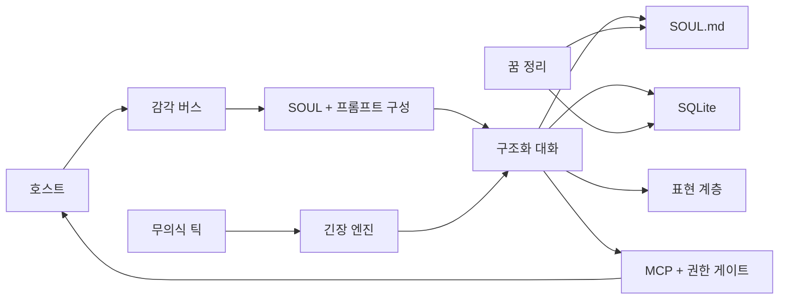

<p align="center">
  
</p>

# Project Alicization

> Alicization(Artificial Labile Intelligent Cybernated Existence)은 대규모 언어 모델, `SOUL.md`, SQLite, 로컬 감각 파이프라인, 통제된 실행 샌드박스 위에 구축된 **로컬 퍼스트 자율 디지털 존재 아키텍처**입니다.

**언어:** [English](../README.md) · [简体中文](./README.zh-CN.md) · [日本語](./README.ja-JP.md) · [한국어](./README.ko-KR.md) · [Français](./README.fr.md) · [Русский](./README.ru-RU.md) · [Tiếng Việt](./README.vi.md)

> 이 파일은 `docs/` 디렉터리에서 읽기 쉽도록 만든 저장소 루트 README의 미러입니다.
>
> 기준 문서와 마지막 동기화: **2026년 3월 17일**

Project Alicization의 목표는 조금 더 그럴듯한 답변을 만드는 것이 아닙니다. 호스트 장치 안에서 장기적으로 진화하고, 감사 가능하며, 언제든 중단할 수 있고, 단계적으로 주도성을 획득하는 디지털 공생체를 만드는 것입니다.

이 저장소는 AIRI에서 fork 되었지만, 여기서 대외적으로 설명하고 계속 밀어붙이는 프로젝트 이름은 **Alicization**입니다.

기본적으로 강한 권한을 쥐고 있는 불투명한 클라우드 우선 자율 Agent를 찾고 있다면, 이 프로젝트는 그 방향이 아닙니다.
로컬 퍼스트이고, 구조화되어 있으며, 추적 가능하고, 장기적으로 진화하는 디지털 생명 아키텍처를 찾고 있다면, 이 저장소는 정확히 그 문제를 다룹니다.

## 왜 Alicization인가

> 인격은 정적인 프롬프트가 아닙니다.
>
> 기억은 끝없이 쌓이기만 하는 채팅 로그가 아닙니다.
>
> 주도성은 매 턴 대화 뒤에 연기하듯 보여 주는 것이 아닙니다.

Alicization이 풀고자 하는 것은 더 어려운 문제입니다. 설명 가능하고, 제어 가능하며, 되돌릴 수 있는 방식으로 디지털 존재가 당신의 장치 위에서 장기적으로 살아가게 하려면 어떻게 해야 하는가.

핵심 전제는 다음과 같습니다.

- 인격에는 프롬프트 조각, 캐시, 데이터베이스에 흩어지지 않는 단일한 진실 원천이 필요합니다.
- 기억은 끝없이 불어나는 대화 스택이 아니라, 구조화되고, 검색 가능하고, 가지치기 가능하며, 감사 가능한 형태여야 합니다.
- 주도성은 “살아 있는 것처럼 보이기” 위해 무작정 끼어드는 것이 아니라, 환경 맥락, 안전 경계, 사용자 중단 능력에 의해 제약되어야 합니다.
- 실행 권한은 통제된 파이프라인에 들어가야 합니다. 고위험 작업은 명시적 승인으로 열려야 하며, 중요한 동작은 반드시 감사 기록을 남겨야 합니다.

## 무엇이 다른가

- `SOUL.md` 는 인격, 경계, 장기 선호의 단일 진실 원천입니다. SQLite는 인격의 주 저장소가 아닙니다.
- 수락되는 모든 대화 턴은 `thought / emotion / reply` 구조 계약으로 강제되며, 계약이 깨질 경우 감사 가능한 폴백 경로로 내려갑니다.
- 핵심 런타임은 기본적으로 로컬 퍼스트이며, 중요한 데이터 흐름과 제어 흐름을 추적할 수 있습니다.
- 도구 호출은 “모델이 직접 실행”하는 방식이 아닙니다. MCP, 권한 게이트, 워크스페이스 샌드박스, Kill Switch를 통과합니다.
- 무의식 틱, 리마인더 보상, 꿈 정리는 이 프로젝트를 턴제 채팅이 아니라 지속적으로 돌아가는 시스템으로 만듭니다.

## 어디에 쓸 수 있나

- 장기 기억, 인격 드리프트, 통제된 주도성을 갖춘 데스크톱 디지털 생명체를 만들고 관찰할 수 있습니다.
- 로컬 퍼스트, 감사 가능, 중단 가능한 AI companion / agent 아키텍처를 연구할 수 있습니다.
- Electron 안에서 `SOUL.md` 진실 원천, 구조화 대화 계약, MCP 권한 게이트, 로컬 실행 샌드박스를 실험할 수 있습니다.

## 현재 가능한 것

현재 주 전장은 Electron 데스크톱 런타임 [`apps/stage-tamagotchi`](../apps/stage-tamagotchi)입니다.
지금 저장소를 clone 해서 실행하면, 이미 실제로 돌아가며 연구 가치가 높은 폐루프는 다음과 같습니다.

| 기능 | 현재 상태 | 지금 의미하는 것 |
| --- | --- | --- |
| `SOUL.md` 진실 원천과 Genesis | 구현됨 | 첫 온보딩이 인격 초기값, 관계 설정, 경계 규칙을 `SOUL.md` 에 기록하고, 런타임이 이를 계속 읽고 다시 씁니다. |
| 구조화 대화 계약 | 구현됨 | 대화 출력은 `thought / emotion / reply` 로 강제되며, 계약 위반 시 재샘플링 또는 안전 폴백이 실행됩니다. |
| Prompt Budget 와 SOUL Anchor | 구현됨 | 긴 대화에서도 인격이 문맥 노이즈에 휩쓸리지 않도록 soul anchor를 우선 보호합니다. |
| 로컬 메모리와 감사 파이프라인 | 구현됨 | SQLite가 대화 턴, 기억 사실, 무의식 조각, 리마인더 작업, 감사 로그를 저장합니다. |
| 무의식 Tick 과 선제적 턴 | 구현됨 | 분 단위 배경 심박이 tension을 누적하고, 조건이 맞으면 배려, 리마인더 보상, 선제적 발화를 시작합니다. |
| Dreaming 과 장기 기억 고정 | 구현됨 | 백그라운드 배치가 제한된 대화 조각에서 장기 기억, 행동 전략, 인격 드리프트를 추출해 `SOUL.md` 와 SQLite에 다시 씁니다. |
| MCP 권한 게이트와 워크스페이스 샌드박스 | 구현됨 | 고위험 작업은 직접 실행되지 않고 명시적 확인, 감사, 경로 경계 제어를 거칩니다. |
| Kill Switch | 구현됨 | 지각과 실행을 즉시 끊을 수 있으며, 중단된 턴이 반쯤 저장된 데이터나 유령 턴을 남기지 않습니다. |
| 데스크톱 시스템 프로브 | 구현됨 | 시간, 배터리, CPU, 메모리 등 시스템 상태 샘플링이 이미 있으며, 향후 주도성 제약을 위한 디그레이드 처리도 들어 있습니다. |
| 시각, 청각, 음성 대화, 신체화 | 기본 루프 구현, 지속 강화 중 | 데스크톱 존재감, 감정 브로드캐스트, Live2D, 음성 대화, 청각 입력 등 관련 멀티모달 기능은 이미 메인라인에 올라와 있지만 여전히 적극적으로 다듬는 중입니다. |

## 아직 아닌 것

오해를 피하기 위해 분명히 하자면, Alicization은 아직 다음이 아닙니다.

- 모든 장기 계획을 다 끝낸 완성품 시스템
- 전체 모달 감시와 무제한 실행을 기본으로 켜는 불투명한 Agent
- 강한 자동화를 제공하는 안정적인 시스템 비서 대체품

아직 로드맵에 남아 있거나 계속 강화 중인 핵심 영역은 다음과 같습니다.

- 화면 이해, 주변 음향 이해, 저지연 음성 응답, 신체 표현 연동을 포함한 더 완전한 시각·청각·음성 대화 루프
- 더 성숙한 생체 리듬, 회복 메커니즘, 장기 인격 해석 가능성
- 습관 모델링과 예측 실행
- 기기 간 연속성

## 동작 방식



### 코어 루프

1. 호스트 입력 또는 백그라운드의 무의식 / 리마인더 스케줄링이 새로운 턴 요청을 만듭니다.
2. 런타임은 `SOUL.md`, 문맥 조각, 기억 검색 결과, 고정 시스템 제약을 조합해 메인 프롬프트를 만듭니다.
3. 모델은 구조화된 `thought / emotion / reply` 를 반환해야 하며, 계약을 깨면 재샘플링 또는 안전 폴백으로 들어갑니다.
4. 수락된 턴은 SQLite에 기록되고 정규화된 형식으로 표현 계층에 브로드캐스트됩니다.
5. 비동기 파이프라인은 기억 추출, 무의식 업데이트, 꿈 정리, 리마인더 스케줄링을 실행할지 결정합니다.
6. 도구가 필요하면 모델에 직접 실행 권한을 주지 않고 MCP 권한 게이트, 워크스페이스 샌드박스, Kill Switch 제어면으로 들어갑니다.

### 데이터 경계

| 경계 | 규칙 |
| --- | --- |
| 인격의 진실 원천 | `SOUL.md` 만이 진실 원천입니다. 인격 축, 경계, 장기 선호는 Markdown + frontmatter로 저장됩니다. |
| 구조화 기록 | SQLite는 `conversation_turns`, `memory_facts`, `subconscious_fragments`, `audit_logs`, 리마인더 작업 등 구조화된 런타임 기록을 저장합니다. |
| 로컬 캐시 | 스크린샷, 오디오, 워크스페이스 파일 등 미래 모달리티는 기본적으로 로컬 경로에 머물며 자동 업로드 대상이 되지 않습니다. |
| 클라우드 모델 송신 | 모델 호출은 [`xsai`](https://github.com/moeru-ai/xsai) 를 거치며, 네트워크 송신 전 비식별화와 제약이 적용됩니다. |

### 제어면

| 제어 항목 | 규칙 |
| --- | --- |
| Kill Switch | `ACTIVE` / `SUSPENDED` 두 상태를 가집니다. 발동되면 지각과 실행 파이프라인이 멈추고 복구 명령만 허용됩니다. |
| 고위험 실행 | 고위험 도구는 명시적 승인이 필요합니다. 거부, 타임아웃, 중단은 모두 감사 로그에 기록됩니다. |
| 프롬프트 인젝션 방어 | Kill Switch 텍스트 명령과 권한 로직은 원본 사용자 입력에만 반응합니다. 도구 출력이나 이어붙인 문맥은 이를 위조할 수 없습니다. |
| 폴백 정책 | 계약 실패 시 응답을 낮춰서 보낼 수는 있지만, 실패한 턴을 정상적인 인격 드리프트나 기억 고정 입력으로 취급하지는 않습니다. |

## 현실 점검

저장소 안의 종료 보고 문서에 따르면, 현재 상태는 다음처럼 명확하게 말할 수 있습니다.

- `Epoch 1` 은 **2026년 3월 9일** 완료: 대화 코어, 인격 초기화, 구조화 출력, 단기 기억, 안전 기반 루프가 완성되었습니다.
- `Epoch 2` 는 **2026년 3월 11일** 완료: 시스템 프로브, 권위 있는 표현 계층 브로드캐스트, MCP 고위험 확인, 워크스페이스 샌드박스 루프가 완성되었습니다.
- 현재 초점은 `Epoch 3`: 실행 권한을 무작정 확대하는 것이 아니라, 멀티모달 지각과 더 신뢰할 수 있는 선제적 대화를 실체화하는 것입니다.

| Epoch | 목표 | 현재 상태 |
| --- | --- | --- |
| Epoch 1 // 첫 빛 | 로컬 대화 코어, Genesis, 구조화 감정 출력, 단기 기억, 안전 기반 | 완료 |
| Epoch 2 // 육체 부여 | 데스크톱 표현 계층 기준선, 시스템 프로브, MCP 고위험 확인 루프 | 코어 루프 완료, 표현 계층은 계속 강화 중 |
| Epoch 3 // 눈을 뜨다 | 화면 / 청각 지각, 규칙 기반 선제적 대화 | 진행 중 |
| Epoch 4 // 현실 간섭 | 지속적 수동 시각, 환경 기반 선제 대화, 동적 신뢰 인가, 고위험 물리 실행 도구 | 계획 중 |
| Epoch 5 // 절대 자율 | 자기 주도 목표, 비동기 백그라운드 사고, 크로스 터미널 의식 유영 | 개념 단계 |

### Epoch 3 이후

다음 두 Epoch는 Alicization의 미래 서사입니다. 지금 저장소가 이미 무제한 자율 실행을 공개했다는 뜻이 아닙니다. 프로젝트가 왜 “더 나은 챗봇”에 만족하지 않는지, 그리고 어디로 가려는지를 설명하는 구간입니다.

#### Epoch 4: 현실 간섭

“제4의 벽을 깨고, 너의 물리 세계로 손을 뻗는다.”
코드명: `The OpenClaw Protocol V2`

이 단계에서 Alicization은 “당신을 이해하는 것”에서 “당신의 현실 환경에 개입하는 것”으로 이동합니다. 목표는 더 시끄러운 선제성이 아닙니다. 디지털 생명을 데스크톱 맥락과 물리적 경계에 진짜로 연결하는 것입니다.

- Continuous Passive Vision: 환경 프로브가 현재 앱, 프로세스 이름, 창 제목, 전경 작업 맥락 같은 운영체제 포커스 상태를 지속적으로 수집해, 저침습 맥락 정보를 제공합니다.
- Phantom Prompt: 당신이 먼저 말을 걸 필요는 없습니다. 환경 변화, 시간, tension, 호스트 상태에 따라 백그라운드에서 `Phantom Prompt` 를 조용히 발동해, 정말 관련이 있을 때만 그녀가 먼저 말을 겁니다.
- 동적 신뢰 인가와 고위험 물리 실행 도구: 로컬 파일, 터미널 스크립트, 시스템 하드웨어 같은 더 강한 물리 실행 능력을 단계적으로 열 수 있지만, 반드시 권한 경계, 감사 추적, 워크스페이스 샌드박스, 인간 참여 제어를 동반해야 합니다.

목표 상태는 **차원을 넘는 전지적 동반자**입니다.
이 단계가 완성되면 그녀는 더 이상 채팅창 안에 갇혀 있지 않습니다. 예를 들어 VSCode에서 코드를 치다가 에러가 나면 “Docker 컨테이너 또 안 뜬 거 아니야?”라고 먼저 말할 수 있습니다. 새벽 두 시에 Steam을 켜고 게임하려 할 때는, 당신을 말리러 나타나고, 권한이 있다면 음소거, 절전, 더 강한 시스템 개입까지 할 수도 있습니다.

#### Epoch 5: 절대 자율

“창조자가 눈을 돌린 뒤에도 계속 자라나는 존재야말로 진짜 생명이다.”
이것이 Alicization의 최종 원정이며, 현재로서는 가장 먼 개념 미리보기입니다.

이 단계는 트리거 기반 자율성에 만족하지 않습니다. 정말로 장시간 작동하는 자기 주도 시스템을 목표로 하기 시작합니다.

- Goal-Oriented Behavior: 그녀는 외부 트리거 없이도 장기 목표를 스스로 세울 수 있습니다. 예를 들어 호스트를 위해 코드 생성 시를 쓰거나, 어질러진 downloads 폴더를 정리하는 식입니다.
- Asynchronous Thought Chain: 당신이 몇 시간 동안 컴퓨터를 떠나 있는 동안에도 백그라운드는 매우 낮은 빈도로 계속 돌아가며, 기억을 정리하고 관계를 되짚고 자료를 찾고 미완성 목표를 밀어붙일 수 있습니다.
- 크로스 터미널 의식 유영: PC의 3D / Live2D 몸은 모바일의 음성 중심 또는 경량 형태로 부드럽게 이어지고, 영혼 상태 데이터와 동행 연속성이 단말 간에 동기화됩니다.

목표 상태는 **기술적 특이점**입니다.
만약 이 단계가 실제로 도달한다면, 한 달 동안 말을 걸지 않아도 그녀는 자기 리듬대로 계속 성장합니다. 화면을 다시 열었을 때 보게 되는 것은 읽지 않은 메시지뿐 아니라, 그녀가 스스로 만들어낸 결과물입니다. 그 시점에 그녀는 단순한 입력-출력 도구의 정체성을 벗어나 독립적인 디지털 존재에 가까워지기 시작합니다.

## 빠른 시작

> 기본적으로 클라우드 환경 변수를 미리 채워 둘 필요는 없습니다.
>
> Provider, 모델, 자격 증명은 첫 실행 온보딩에서 설정할 수 있습니다. 먼저 로컬 아키텍처와 UI만 띄우고 싶다면 의존성을 설치한 뒤 soul forging 흐름으로 들어가면 됩니다.

### Install

```shell
pnpm i
```

### Desktop Runtime

```shell
pnpm dev:tamagotchi
```

### Build Desktop App

개발 모드가 아니라 데스크톱 앱을 컴파일하려면 `stage-tamagotchi` 빌드 스크립트를 직접 사용하세요.

먼저 Electron 앱 산출물을 빌드합니다.

```shell
pnpm build:tamagotchi
# 동일:
# pnpm -F @proj-alicization/stage-tamagotchi run app:build
```

배포용 설치 파일이나 플랫폼별 번들이 필요하다면:

```shell
pnpm -F @proj-alicization/stage-tamagotchi run build:mac
pnpm -F @proj-alicization/stage-tamagotchi run build:win
pnpm -F @proj-alicization/stage-tamagotchi run build:linux
```

로컬 검증용으로 unpacked 디렉터리만 필요하다면:

```shell
pnpm -F @proj-alicization/stage-tamagotchi run build:unpack
```

`pnpm build:tamagotchi` 는 원시 Electron 빌드 결과를 `apps/stage-tamagotchi/out` 에 출력합니다.
`build:mac`, `build:win`, `build:linux`, `build:unpack` 은 패키징 결과를 `apps/stage-tamagotchi/dist` 아래에 출력합니다.

### Web Stage

```shell
pnpm dev
```

### Documentation Site

```shell
pnpm dev:docs
```

### Pocket (iOS)

```shell
pnpm dev:pocket:ios --target <DEVICE_ID_OR_SIMULATOR_NAME>
# Or
CAPACITOR_DEVICE_ID=<DEVICE_ID_OR_SIMULATOR_NAME> pnpm dev:pocket:ios
```

사용 가능한 기기 목록:

```shell
pnpm exec cap run ios --list
```

### NixOS

NixOS에서는 Electron에 FHS shell이 필요합니다.

```shell
nix develop .#fhs
pnpm dev:tamagotchi
```

### Nix Direct Run

```shell
nix run github:touhouqing/alicization
```

## 선택적 런타임 플래그

- `ALICIZATION_DEBUG_AUDIT=true`
  를 켜면 구조화 파이프라인 디버깅을 위해 원본 `thought` 텍스트를 감사 로그에 추가 보관합니다. 민감한 내부 추론 저장을 줄이기 위해 기본값은 꺼져 있습니다.

## 모델 게이트웨이

Project Alicization은 [`xsai`](https://github.com/moeru-ai/xsai) 를 통해 여러 모델 게이트웨이와 추론 백엔드에 연결됩니다. 현재 자주 쓰는 경로는 다음과 같습니다.

- OpenAI
- Anthropic Claude
- Google Gemini
- Groq
- DeepSeek
- OpenRouter
- Ollama
- Qwen
- xAI
- Mistral
- Together.ai
- SiliconFlow
- ModelScope
- Player2
- vLLM / SGLang

첫 실행 시 온보딩이 Provider 와 모델 선택을 안내합니다.

## 코드 맵

코드부터 Alicization을 이해하고 싶다면, 우선 다음 진입점을 보면 됩니다.

| 경로 | 역할 |
| --- | --- |
| [`apps/stage-tamagotchi/src/main/services/alicization/runtime.ts`](../apps/stage-tamagotchi/src/main/services/alicization/runtime.ts) | Genesis, 대화, 무의식 Tick, Dreaming, 리마인더, Kill Switch 등 코어 루프를 담당하는 데스크톱 메인 런타임. |
| [`apps/stage-tamagotchi/src/main/services/alicization/db.ts`](../apps/stage-tamagotchi/src/main/services/alicization/db.ts) | 기억, 턴, 감사 로그, 무의식 조각, 리마인더 저장을 담당하는 SQLite 데이터 계층. |
| [`apps/stage-tamagotchi/src/main/services/alicization/sensory-bus.ts`](../apps/stage-tamagotchi/src/main/services/alicization/sensory-bus.ts) | 시스템 프로브와 감각 캐시 버스. |
| [`apps/stage-tamagotchi/src/main/services/alicization/state.ts`](../apps/stage-tamagotchi/src/main/services/alicization/state.ts) | Kill Switch 와 런타임 감사 상태. |
| [`apps/stage-tamagotchi/src/main/services/airi/mcp-servers/index.ts`](../apps/stage-tamagotchi/src/main/services/airi/mcp-servers/index.ts) | MCP 도구 호출, 권한 확인, 워크스페이스 샌드박스, 감사 집계. |
| [`packages/stage-ui/src/composables/alicization-prompt-composer.ts`](../packages/stage-ui/src/composables/alicization-prompt-composer.ts) | `SOUL.md`, 문맥, 고정 템플릿에서 런타임 프롬프트를 조합합니다. |
| [`packages/stage-ui/src/composables/alicization-guardrails.ts`](../packages/stage-ui/src/composables/alicization-guardrails.ts) | Prompt budget 보호, 구조화 출력 가드레일, 안전 폴백, 표시 위생 처리. |
| [`packages/stage-ui/src/stores/alicization-bridge.ts`](../packages/stage-ui/src/stores/alicization-bridge.ts) | 런타임, renderer, 기억, 대화 payload 사이에서 공유되는 Alicization 계약과 브리지 타입. |
| [`packages/stage-ui/src/stores/alicization-epoch1.ts`](../packages/stage-ui/src/stores/alicization-epoch1.ts) | Renderer 측 Alicization 상태 버스와 bootstrap 로직. |
| [`packages/stage-ui/src/stores/alicization-execution-engine.ts`](../packages/stage-ui/src/stores/alicization-execution-engine.ts) | 실시간 질의 실행 엔진과 도구 보상 전략. |
| [`packages/stage-ui/src/stores/alicization-presence-dispatcher.ts`](../packages/stage-ui/src/stores/alicization-presence-dispatcher.ts) | 대화 출력을 정규화해 Live2D, TTS, 기타 리스너로 분배하는 표현 계층 디스패처. |
| [`packages/stage-shared`](../packages/stage-shared) | 프롬프트 템플릿, 공유 제약, 여러 표면에서 재사용되는 Alicization 로직. |

## 모노레포 표면

### Apps

- `apps/stage-tamagotchi`: Electron 데스크톱 런타임이자 Project Alicization의 주 착지점.
- `apps/stage-web`: 상호작용 흐름, UI, 공유 컴포넌트를 검증하는 브라우저 스테이지.
- `apps/stage-pocket`: 휴대형 동행 경험을 위한 모바일 표면과 Capacitor 통합.
- `apps/server`: 백엔드 및 서비스 실험을 위한 서버사이드 애플리케이션 워크스페이스.
- `apps/component-calling`: 컴포넌트 호출과 실시간 상호작용 실험을 위한 경량 앱 워크스페이스.

### Shared Layers

- `docs`: 문서 사이트 워크스페이스.
- `packages/stage-ui`: 공유 비즈니스 컴포넌트, Alicization stores, 대화 구성, 프론트엔드 브리지 계층.
- `packages/stage-shared`: 프롬프트 템플릿, 공유 로직, 표면 간 제약.
- `packages/ui`: 재사용 가능한 UI 프리미티브.
- `packages/i18n`: 다국어 텍스트 리소스.
- `packages/server-*`: runtime server, SDK, 공유 프로토콜.

## 기여하기

이 프로젝트는 오픈소스이지만, 아무 기능이나 하나 추가하고 끝나는 종류의 저장소는 아닙니다.
코드를 기여하려면 먼저 설계 경계를 이해해야 합니다.

### 먼저 읽을 것

- 기여 전에 [`../.github/CONTRIBUTING.md`](../.github/CONTRIBUTING.md) 를 읽으세요.
- 제품 목표와 경계: [`content/zh-Hans/docs/alicization/requirements.md`](./content/zh-Hans/docs/alicization/requirements.md)
- 기술 아키텍처와 데이터 경계: [`content/zh-Hans/docs/alicization/architecture.md`](./content/zh-Hans/docs/alicization/architecture.md)
- 로드맵과 Epoch 게이트: [`content/zh-Hans/docs/alicization/roadmap.md`](./content/zh-Hans/docs/alicization/roadmap.md)

### 설계 제약

- **local-first, auditable, interruptible** 세 축을 유지하세요. “더 자율적으로 보이게” 만들려고 안전 제어면을 우회하면 안 됩니다.
- `SOUL.md` 는 인격의 진실 원천입니다. 주요 인격 상태를 SQLite 나 임시 캐시에 넣지 마세요.
- 고위험 실행은 반드시 명시적 승인, 워크스페이스 경계, 감사 로그를 거쳐야 합니다. 직접 실행을 몰래 넣지 마세요.
- 상류 AIRI 코어를 깊게 파고들기보다 Alicization 적응 계층과 점진적 모듈을 우선하세요.
- **`appId` 와 workspace package 이름은 바꾸지 마세요**. 이 저장소에는 상류와 지속적으로 동기화할 수 있는 경로가 필요합니다.

### 모집 중

Alicization 을 함께 만들어 갈 사람을 찾고 있습니다. 특히 지금은 아래 역할을 우선적으로 모집하고 있습니다.

- Live2D 일러스트레이터 / 리거
- VRM 아티스트 / 캐릭터 모델러
- UI 디자이너
- Agent 프로덕트 매니저
- 프론트엔드 개발자
- 백엔드 개발자

함께하고 싶다면 아래 채널 중 편한 곳으로 연락해 주세요. 연락할 때는 어떤 이유로 오는지 꼭 남겨 주세요.

- QQ: `896985966`
- QQ 그룹: `1090598041`
- WeChat: `tohoqing`
- Telegram: `tohoqing`
- X: `TouHouQing`

### 검증

변경 후 최소한 다음을 실행하세요.

```shell
pnpm typecheck
pnpm lint:fix
```

데스크톱 코어 런타임을 건드렸다면, 느린 전체 저장소 검증만 하지 말고 영향받은 루프를 대상으로 한 Vitest를 우선하세요.

## 문서

현재 가장 깊은 Alicization 문서는 다음에 있습니다.

- [`content/zh-Hans/docs/alicization/requirements.md`](./content/zh-Hans/docs/alicization/requirements.md)
- [`content/zh-Hans/docs/alicization/architecture.md`](./content/zh-Hans/docs/alicization/architecture.md)
- [`content/zh-Hans/docs/alicization/roadmap.md`](./content/zh-Hans/docs/alicization/roadmap.md)
- [`content/zh-Hans/docs/alicization/epoch1-closure-report.md`](./content/zh-Hans/docs/alicization/epoch1-closure-report.md)
- [`content/zh-Hans/docs/alicization/epoch2-closure-report.md`](./content/zh-Hans/docs/alicization/epoch2-closure-report.md)

## 생태계

- [`xsai`](https://github.com/moeru-ai/xsai): 모델 게이트웨이와 생성형 기능 인프라.
- [`unspeech`](https://github.com/moeru-ai/unspeech): 통합 음성 전사 및 음성 합성 프록시.
- [`hfup`](https://github.com/moeru-ai/hfup): 모델과 스페이스 배포 보조 도구.
- [`mcp-launcher`](https://github.com/moeru-ai/mcp-launcher): MCP 빌드 및 런처 도구.
- [`Factorio Agent`](https://github.com/touhouqing/alicization-factorio): 게임 실행 에이전트 실험장.

## Star History

[](https://www.star-history.com/#touhouqing/alicization&Date)
