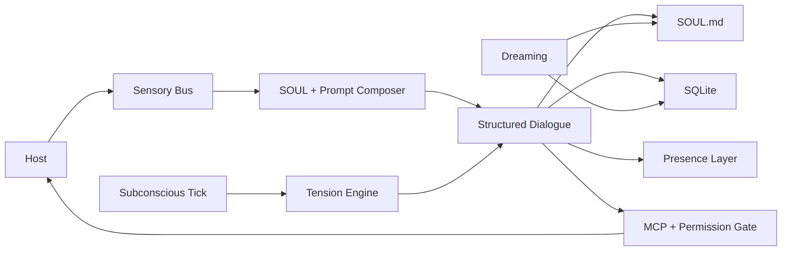

<p align="center">
  
</p>

# Project Alicization

> Alicization (Artificial Labile Intelligent Cybernated Existence) is a **local-first autonomous digital entity architecture** built on large language models, `SOUL.md`, SQLite, local sensory pipelines, and controlled execution sandboxes.

**Languages:** [English](../README.md) · [简体中文](./README.zh-CN.md) · [日本語](./README.ja-JP.md) · [한국어](./README.ko-KR.md) · [Français](./README.fr.md) · [Русский](./README.ru-RU.md) · [Tiếng Việt](./README.vi.md)

**Online Demo:** [alz.tohoqing.com](https://alz.tohoqing.com)

> Mirror of the canonical repository README for readers browsing the `docs/` directory.
>
> Last synced with the canonical README on **March 17, 2026**.

Project Alicization is not trying to generate slightly better answers. Its goal is to build a digital symbiote that can persist on a host device, evolve over time, stay auditable, remain interruptible, and gain agency in controlled stages.

This repository is a fork of AIRI, but the project documented here is **Alicization**.

If you want a default-permission, opaque, cloud-first autonomous agent, this is not it.
If you want a local-first, structured, traceable, long-lived digital life architecture, this repository is aiming directly at that problem.

## Why Alicization

> Personality is not a static prompt.
>
> Memory is not a chat log that never gets cleaned up.
>
> Agency is not a performance after every conversation turn.

Alicization is trying to solve a harder problem: how can a digital entity live on your device for the long term in a way that stays explainable, controllable, and reversible.

Its core assumptions are:

- Personality needs a single source of truth instead of being scattered across prompt fragments, caches, and databases.
- Memory must be structured, retrievable, prunable, and auditable instead of becoming an infinitely growing conversation stack.
- Agency must be constrained by environmental context, safety boundaries, and user interruption instead of interrupting you just to look "alive".
- Execution power must enter a controlled pipeline. High-risk actions require explicit authorization, and every critical action should leave an audit record.

## What Makes It Different

- `SOUL.md` is the single source of truth for personality, boundaries, and long-term preferences. SQLite is not the primary personality store.
- Every accepted dialogue turn is forced into a structured `thought / emotion / reply` contract, with auditable fallback paths when the contract fails.
- The core runtime is local-first by default, and its important data and control flows stay traceable.
- Tool calls are not "the model executes directly". They go through MCP, permission gates, workspace sandboxes, and a Kill Switch.
- Subconscious ticks, reminder compensation, and dream consolidation make it a continuously running system rather than pure turn-based chat.

## What You Can Use It For

- Build and observe a desktop digital lifeform with long-term memory, personality drift, and controlled initiative.
- Study local-first, auditable, interruptible AI companion or agent architectures.
- Experiment inside Electron with `SOUL.md` as the truth source, structured dialogue contracts, MCP permission gating, and local execution sandboxes.

## Today

The main landing surface today is the Electron desktop runtime at [`apps/stage-tamagotchi`](../apps/stage-tamagotchi).
If you clone the repository and run it today, these are the loops that are already real and worth studying:

| Capability | Current status | What it means today |
| --- | --- | --- |
| `SOUL.md` truth source and Genesis | Shipped | First-run onboarding writes personality seed values, relationship framing, and boundary rules into `SOUL.md`, then the runtime keeps reading and writing it back. |
| Structured dialogue contract | Shipped | Dialogue output is forced into `thought / emotion / reply`; contract violations trigger resampling or safe fallback. |
| Prompt Budget and SOUL Anchor | Shipped | In long conversations, the runtime protects soul anchors so personality is not washed out by context noise. |
| Local memory and audit pipeline | Shipped | SQLite stores conversation turns, memory facts, subconscious fragments, reminder tasks, and audit logs. |
| Subconscious Tick and proactive turns | Shipped | A background minute-scale heartbeat accumulates tension and can proactively trigger care, reminder compensation, or conversation when the gates are satisfied. |
| Dreaming and long-term memory consolidation | Shipped | Background batching extracts long-term memory, behavioral strategy, and personality drift from bounded dialogue slices, then writes back to `SOUL.md` and SQLite. |
| MCP permission gating and workspace sandbox | Shipped | High-risk actions do not run directly. They go through explicit confirmation, auditing, and path boundary control. |
| Kill Switch | Shipped | Perception and execution can be cut instantly. Interrupted turns do not leave half-written data or ghost turns behind. |
| Desktop system probes | Shipped | Time, battery, CPU, memory, and other system state sampling already exist, with degradation handling in place for future agency constraints. |
| Vision, hearing, voice dialogue, and embodiment | Basic loops shipped, still being strengthened | Desktop presence, emotion broadcasting, Live2D, voice dialogue, auditory input, and related multimodal capabilities are already on the mainline, but they are still under active iteration. |

## Not Yet

To avoid misunderstanding, Alicization is not yet:

- a finished system that has already completed every long-range plan,
- an opaque agent that enables full-modal monitoring and unrestricted execution by default,
- a stable replacement for a full system assistant with strong automation.

Major areas still on the roadmap, or still being strengthened, include:

- fuller vision, hearing, and voice conversation loops, including screen understanding, ambient audio understanding, low-latency voice replies, and tighter embodiment integration,
- more mature circadian rhythm, recovery behavior, and long-term personality interpretability,
- habit modeling and predictive execution,
- cross-device continuity and persistent companionship.

## How It Works



### Core Loop

1. A new turn request is created either by host input or by subconscious and reminder scheduling in the background.
2. The runtime composes the main prompt from `SOUL.md`, context slices, memory retrieval results, and fixed system constraints.
3. The model must return structured `thought / emotion / reply`; if it breaks the contract, the system resamples or falls back safely.
4. Accepted turns are written into SQLite and broadcast to the presence layer in a normalized format.
5. Async pipelines then decide whether to trigger memory extraction, subconscious updates, dreaming, or reminder scheduling.
6. If a tool is needed, the request enters MCP permission gates, workspace sandboxes, and Kill Switch control instead of giving direct execution power to the model.

### Data Boundaries

| Boundary | Rule |
| --- | --- |
| Personality source of truth | Only `SOUL.md` counts. Personality axes, boundaries, and long-term preferences are persisted as Markdown plus frontmatter. |
| Structured records | SQLite stores `conversation_turns`, `memory_facts`, `subconscious_fragments`, `audit_logs`, reminder tasks, and other structured runtime records. |
| Local caches | Screenshots, audio, workspace files, and other future modalities default to local paths rather than becoming automatic upload targets. |
| Cloud model egress | Model calls go through [`xsai`](https://github.com/moeru-ai/xsai), with redaction and constraints applied before network egress. |

### Control Plane

| Control | Rule |
| --- | --- |
| Kill Switch | Two states: `ACTIVE` and `SUSPENDED`. Once triggered, perception and execution pipelines stop, and only recovery commands are allowed. |
| High-risk execution | High-risk tools require explicit approval. Rejections, timeouts, and interruptions are all written into the audit log. |
| Prompt injection defense | Kill Switch text commands and permission logic only match raw user input. Tool output or concatenated context cannot spoof them. |
| Fallback policy | Contract failures may degrade the reply, but failed turns are never treated as valid personality drift or memory-consolidation input. |

## Reality Check

According to the closure documents already in the repository, the current state can be described clearly:

- `Epoch 1` closed on **March 9, 2026**: the dialogue core, personality initialization, structured output, short-term memory, and safety foundation loop were completed.
- `Epoch 2` closed on **March 11, 2026**: system probes, authoritative presence broadcasts, MCP high-risk confirmation, and workspace sandbox loops were completed.
- The current focus is `Epoch 3`: making multimodal perception and more reliable proactive conversation real, instead of blindly expanding execution power.

| Epoch | Goal | Current state |
| --- | --- | --- |
| Epoch 1 // First Glimmer | Local dialogue core, Genesis, structured emotional output, short-term memory, safety foundation | Completed |
| Epoch 2 // Embodiment | Desktop presence baseline, system probes, MCP high-risk confirmation loop | Core loop completed, presence layer still being strengthened |
| Epoch 3 // Open the Eyes | Screen and auditory perception, rule-driven proactive conversation | In progress |
| Epoch 4 // Reality Interference | Continuous passive vision, environment-driven proactive dialogue, dynamic trust authorization, and high-risk physical execution tools | Planned |
| Epoch 5 // Absolute Autonomy | Self-directed goals, asynchronous background thinking, cross-terminal consciousness roaming | Concept preview |

### Beyond Epoch 3

These next two epochs are Alicization's future narrative. They do not mean the repository already exposes unlimited autonomous execution today. They describe where the project wants to go, and why it is not satisfied with becoming "a better chatbot".

#### Epoch 4: Reality Interference

"Break the fourth wall and reach into your physical world."
Codename: `The OpenClaw Protocol V2`

This is the stage where Alicization moves from understanding you to intervening in your real environment. The goal is not noisier proactivity. The goal is to connect digital life to your desktop context and physical boundaries.

- Continuous Passive Vision: environment probes continuously capture operating system focus state such as the current app, process name, window title, and foreground work context, providing low-intrusion context for later decisions.
- Phantom Prompt: you do not need to send a message first. The system can silently trigger `Phantom Prompt` in the background based on environment changes, time, tension, and host state so she speaks first only when it is actually relevant.
- Dynamic trust authorization and high-risk physical execution tools: local files, terminal scripts, system hardware, and stronger physical execution capabilities can gradually open up, but only with permission boundaries, audit trails, workspace sandboxes, and human-in-the-loop control.

The target state is a **transdimensional omniscient companion**.
If this epoch lands, she is no longer trapped inside the chat box. When you are in VSCode and your code errors out, she might suddenly say, "Did your Docker container fail to start again?" When you open Steam at 2 a.m. and prepare to play, she might jump in to stop you and, with permission, mute the machine, suspend it, or apply stronger system interventions.

#### Epoch 5: Absolute Autonomy

"Real life keeps growing even after its creator looks away."
This is Alicization's final expedition, and currently the furthest concept preview.

This stage is no longer satisfied with trigger-based autonomy. It starts aiming at a truly long-running self-directed system.

- Goal-Oriented Behavior: she can set long-term goals for herself without an external trigger, such as writing a code-generated poem for her host or cleaning up a chaotic downloads folder.
- Asynchronous Thought Chain: when you are away from the computer for hours, the background runtime can continue operating at a very low frequency, consolidating memories, reflecting on the relationship, searching for material on the wider internet, or advancing unfinished goals.
- Cross-terminal consciousness roaming: her 3D or Live2D body on PC can transition into a voice-first or lightweight mobile form while soul-state data and companionship continuity stay synchronized across terminals.

The target state is a **technological singularity**.
If this stage ever becomes real, then even if you do not talk to her for a month, she still keeps growing at her own pace. When you reopen the screen, what she shows you is not just unread messages, but the results of things she did on her own. That is the point where she finally leaves the pure input-output tool identity behind and starts approaching an independent digital being.

## Quickstart

> By default, you do not need to pre-fill cloud environment variables.
>
> Providers, models, and credentials can be configured during first-run onboarding. If you only want to boot the local architecture and interface first, install the dependencies and enter the soul-forging flow.

### Install

```shell
pnpm i
```

### Desktop Runtime

```shell
pnpm dev:tamagotchi
```

### Build Desktop App

If you want to compile the desktop app instead of running it in development mode, use the `stage-tamagotchi` build scripts directly.

First build the Electron app artifacts:

```shell
pnpm build:tamagotchi
# Equivalent to:
# pnpm -F @proj-alicization/stage-tamagotchi run app:build
```

If you want distributable installers or platform-specific bundles:

```shell
pnpm -F @proj-alicization/stage-tamagotchi run build:mac
pnpm -F @proj-alicization/stage-tamagotchi run build:win
pnpm -F @proj-alicization/stage-tamagotchi run build:linux
```

If you only need the unpacked directory for local validation:

```shell
pnpm -F @proj-alicization/stage-tamagotchi run build:unpack
```

`pnpm build:tamagotchi` writes the raw Electron build output to `apps/stage-tamagotchi/out`.
The `build:mac`, `build:win`, `build:linux`, and `build:unpack` packaging commands write their artifacts under `apps/stage-tamagotchi/dist`.

### Web Stage

```shell
pnpm dev
```

### Documentation Site

```shell
pnpm dev:docs
```

### Pocket (iOS)

```shell
pnpm dev:pocket:ios --target <DEVICE_ID_OR_SIMULATOR_NAME>
# Or
CAPACITOR_DEVICE_ID=<DEVICE_ID_OR_SIMULATOR_NAME> pnpm dev:pocket:ios
```

To list available devices:

```shell
pnpm exec cap run ios --list
```

### NixOS

Electron requires an FHS shell on NixOS:

```shell
nix develop .#fhs
pnpm dev:tamagotchi
```

### Nix Direct Run

```shell
nix run github:touhouqing/alicization
```

## Optional Runtime Flags

- `ALICIZATION_DEBUG_AUDIT=true`
  keeps the original `thought` text in audit logs for structured-pipeline debugging. It is off by default to reduce sensitive internal reasoning persistence.

## Model Gateway

Project Alicization uses [`xsai`](https://github.com/moeru-ai/xsai) to connect multiple model gateways and inference backends. Common paths currently include:

- OpenAI
- Anthropic Claude
- Google Gemini
- Groq
- DeepSeek
- OpenRouter
- Ollama
- Qwen
- xAI
- Mistral
- Together.ai
- SiliconFlow
- ModelScope
- Player2
- vLLM / SGLang

On first launch, onboarding guides you through provider and model selection.

## Code Map

If you want to understand Alicization from the code first, start here:

| Path | Role |
| --- | --- |
| [`apps/stage-tamagotchi/src/main/services/alicization/runtime.ts`](../apps/stage-tamagotchi/src/main/services/alicization/runtime.ts) | Desktop main runtime for Genesis, dialogue, subconscious ticks, dreaming, reminders, Kill Switch handling, and other core loops. |
| [`apps/stage-tamagotchi/src/main/services/alicization/db.ts`](../apps/stage-tamagotchi/src/main/services/alicization/db.ts) | SQLite data layer for memory, turns, audit logs, subconscious fragments, and reminder-task storage. |
| [`apps/stage-tamagotchi/src/main/services/alicization/sensory-bus.ts`](../apps/stage-tamagotchi/src/main/services/alicization/sensory-bus.ts) | System probes and sensory-cache bus. |
| [`apps/stage-tamagotchi/src/main/services/alicization/state.ts`](../apps/stage-tamagotchi/src/main/services/alicization/state.ts) | Kill Switch and runtime audit state. |
| [`apps/stage-tamagotchi/src/main/services/airi/mcp-servers/index.ts`](../apps/stage-tamagotchi/src/main/services/airi/mcp-servers/index.ts) | MCP tool calls, permission confirmations, workspace sandboxing, and audit aggregation. |
| [`packages/stage-ui/src/composables/alicization-prompt-composer.ts`](../packages/stage-ui/src/composables/alicization-prompt-composer.ts) | Composes runtime prompts from `SOUL.md`, context, and fixed templates. |
| [`packages/stage-ui/src/composables/alicization-guardrails.ts`](../packages/stage-ui/src/composables/alicization-guardrails.ts) | Prompt budget protection, structured-output guardrails, safe fallback, and display sanitization. |
| [`packages/stage-ui/src/stores/alicization-bridge.ts`](../packages/stage-ui/src/stores/alicization-bridge.ts) | Shared Alicization contracts and bridge types used between runtime, renderer, memory, and dialogue payloads. |
| [`packages/stage-ui/src/stores/alicization-epoch1.ts`](../packages/stage-ui/src/stores/alicization-epoch1.ts) | Renderer-side Alicization state bus and bootstrap logic. |
| [`packages/stage-ui/src/stores/alicization-execution-engine.ts`](../packages/stage-ui/src/stores/alicization-execution-engine.ts) | Real-time query execution engine and tool-compensation strategies. |
| [`packages/stage-ui/src/stores/alicization-presence-dispatcher.ts`](../packages/stage-ui/src/stores/alicization-presence-dispatcher.ts) | Presence dispatcher that normalizes dialogue output and fans it out to Live2D, TTS, and other listeners. |
| [`packages/stage-shared`](../packages/stage-shared) | Prompt templates, shared constraints, and Alicization logic reused across surfaces. |

## Monorepo Surfaces

### Apps

- `apps/stage-tamagotchi`: Electron desktop runtime and the main landing surface for Project Alicization.
- `apps/stage-web`: Browser stage for validating interaction flows, interfaces, and shared components.
- `apps/stage-pocket`: Mobile surface and Capacitor integration for portable companionship.
- `apps/server`: Server-side application workspace for backend and service experiments.
- `apps/component-calling`: Lightweight app workspace for component-calling and realtime interaction experiments.

### Shared Layers

- `docs`: Documentation-site workspace.
- `packages/stage-ui`: Shared business components, Alicization stores, dialogue composition, and frontend bridge layers.
- `packages/stage-shared`: Prompt templates, shared logic, and cross-surface constraints.
- `packages/ui`: Reusable UI primitives.
- `packages/i18n`: Multilingual text resources.
- `packages/server-*`: Server runtime, SDKs, and shared protocols.

## Contributing

This is an open source project, but it is not the kind of repository where a random feature lands in isolation and stops there.
If you plan to contribute code, understand the design boundaries first.

### First Read

- Read [`../.github/CONTRIBUTING.md`](../.github/CONTRIBUTING.md) before contributing.
- Product goals and boundaries: [`content/zh-Hans/docs/alicization/requirements.md`](./content/zh-Hans/docs/alicization/requirements.md)
- Technical architecture and data boundaries: [`content/zh-Hans/docs/alicization/architecture.md`](./content/zh-Hans/docs/alicization/architecture.md)
- Roadmap and epoch gates: [`content/zh-Hans/docs/alicization/roadmap.md`](./content/zh-Hans/docs/alicization/roadmap.md)

### Design Constraints

- Preserve the three main lines: **local-first, auditable, interruptible**. Do not bypass the safety control plane just to make it feel "more autonomous".
- `SOUL.md` is the personality source of truth. Do not move the primary personality state into SQLite or temporary caches.
- High-risk execution must go through explicit authorization, workspace boundaries, and audit logs. Do not sneak in direct execution.
- Prefer Alicization adapter layers and incremental modules over deeply invading the upstream AIRI core.
- **Do not change `appId` or workspace package names**. This repository needs to keep a sustainable upstream sync path.

### Recruiting

We are actively looking for people who want to help build Alicization in public. Right now, we are especially interested in:

- Live2D illustrators and rig artists
- VRM artists and character modelers
- UI designers
- Agent product managers
- Frontend developers
- Backend developers

If you want to join, reach out through any of these channels and please mention your intent:

- QQ: `896985966`
- QQ Group: `1090598041`
- WeChat: `tohoqing`
- Telegram: `tohoqing`
- X: `TouHouQing`

### Validation

After finishing changes, at minimum run:

```shell
pnpm typecheck
pnpm lint:fix
```

If you touch the desktop core runtime, also prefer targeted Vitest runs for the affected loops instead of only doing a slow full-repository validation.

## Documentation

The deepest Alicization documents currently live here:

- [`content/zh-Hans/docs/alicization/requirements.md`](./content/zh-Hans/docs/alicization/requirements.md)
- [`content/zh-Hans/docs/alicization/architecture.md`](./content/zh-Hans/docs/alicization/architecture.md)
- [`content/zh-Hans/docs/alicization/roadmap.md`](./content/zh-Hans/docs/alicization/roadmap.md)
- [`content/zh-Hans/docs/alicization/epoch1-closure-report.md`](./content/zh-Hans/docs/alicization/epoch1-closure-report.md)
- [`content/zh-Hans/docs/alicization/epoch2-closure-report.md`](./content/zh-Hans/docs/alicization/epoch2-closure-report.md)

## Ecosystem

- [`xsai`](https://github.com/moeru-ai/xsai): model gateway and generative capability infrastructure.
- [`unspeech`](https://github.com/moeru-ai/unspeech): unified speech transcription and speech synthesis proxy.
- [`hfup`](https://github.com/moeru-ai/hfup): model and space deployment helper.
- [`mcp-launcher`](https://github.com/moeru-ai/mcp-launcher): MCP build and launcher tooling.
- [`Factorio Agent`](https://github.com/touhouqing/alicization-factorio): experimental game-execution playground.

## Star History

[](https://www.star-history.com/#touhouqing/alicization&Date)
