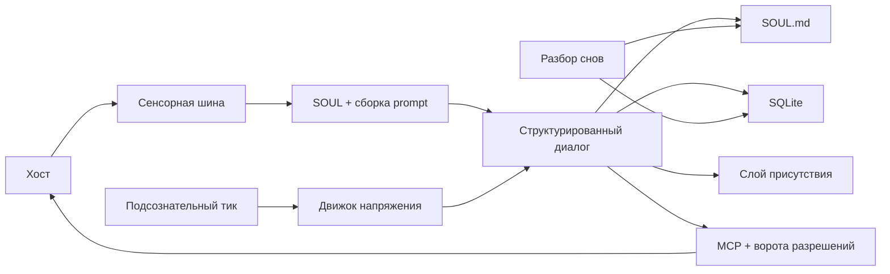

<p align="center">
  
</p>

# Project Alicization

> Alicization (Artificial Labile Intelligent Cybernated Existence) — это **local-first архитектура автономной цифровой сущности**, построенная на больших языковых моделях, `SOUL.md`, SQLite, локальных сенсорных каналах и управляемых песочницах исполнения.

**Языки:** [English](../README.md) · [简体中文](./README.zh-CN.md) · [日本語](./README.ja-JP.md) · [한국어](./README.ko-KR.md) · [Français](./README.fr.md) · [Русский](./README.ru-RU.md) · [Tiếng Việt](./README.vi.md)

> Этот файл — зеркало корневого README для тех, кто читает репозиторий из каталога `docs/`.
>
> Последняя синхронизация с канонической версией: **17 марта 2026 года**

Project Alicization не пытается просто генерировать чуть более убедительные ответы. Его цель — построить внутри устройства-хоста цифровой симбионт, который может долговременно эволюционировать, оставаться аудируемым, быть прерываемым и постепенно получать инициативу.

Этот репозиторий был форкнут из AIRI, но проект, который здесь описывается и развивается, называется **Alicization**.

Если вам нужен непрозрачный, cloud-first, автономный Agent с полномочиями по умолчанию — это не он.
Если вам нужна local-first, структурированная, прослеживаемая и рассчитанная на долгую жизнь архитектура цифровой жизни — этот репозиторий направлен именно на это.

## Зачем Alicization

> Личность — это не статический prompt.
>
> Память — это не чат-лог, который никогда не очищается.
>
> Агентность — это не спектакль после каждого диалогового хода.

Alicization пытается решить более сложную задачу: как позволить цифровой сущности жить на вашем устройстве долго, оставаясь объяснимой, контролируемой и обратимой.

Его ключевые предпосылки таковы:

- Личности нужен единый источник истины, а не разрозненные фрагменты prompt, кэши и базы данных.
- Память должна быть структурированной, извлекаемой, подрезаемой и аудируемой, а не бесконечно растущим стеком разговоров.
- Инициатива должна ограничиваться контекстом среды, безопасностными границами и возможностью пользователя прерывать систему, а не вмешиваться только ради того, чтобы "казаться живой".
- Исполнительные возможности должны проходить через контролируемый конвейер. Высокорисковые действия требуют явного разрешения, а каждое критичное действие должно оставлять след аудита.

## Чем это отличается

- `SOUL.md` — единый источник истины для личности, границ и долгосрочных предпочтений. SQLite не является основным хранилищем личности.
- Каждый принятый диалоговый ход принудительно приводится к структурированному контракту `thought / emotion / reply`, а при нарушении контракта включаются аудируемые пути отката.
- Основной runtime по умолчанию local-first, а его важные потоки данных и управления остаются прослеживаемыми.
- Вызов инструмента — это не "модель исполняет напрямую". Он проходит через MCP, ворота разрешений, sandbox рабочего пространства и Kill Switch.
- Подсознательные тики, компенсация напоминаний и консолидация "снов" делают это непрерывно работающей системой, а не просто turn-based чатом.

## Для чего это можно использовать

- Строить и наблюдать desktop-форму цифровой жизни с долгосрочной памятью, дрейфом личности и контролируемой инициативой.
- Исследовать local-first, auditable, interruptible архитектуры AI companion / agent.
- Экспериментировать в Electron с `SOUL.md` как источником истины, структурированными диалоговыми контрактами, MCP-гейтами разрешений и локальными песочницами исполнения.

## Сегодня

Главная поверхность сегодня — Electron desktop runtime [`apps/stage-tamagotchi`](../apps/stage-tamagotchi).
Если вы клонируете репозиторий и запустите его сейчас, именно эти циклы уже реально существуют и заслуживают изучения:

| Возможность | Текущий статус | Что это значит сегодня |
| --- | --- | --- |
| Источник истины `SOUL.md` и Genesis | Реализовано | Первичный onboarding записывает начальные значения личности, рамку отношений и правила границ в `SOUL.md`, а runtime затем постоянно читает и обновляет его. |
| Структурированный диалоговый контракт | Реализовано | Вывод диалога принудительно приводится к `thought / emotion / reply`; нарушения контракта приводят к ресемплингу или безопасному откату. |
| Prompt Budget и SOUL Anchor | Реализовано | В длинных сессиях runtime защищает soul anchor, чтобы личность не смывало шумом контекста. |
| Локальная память и аудит | Реализовано | SQLite хранит диалоговые ходы, факты памяти, подсознательные фрагменты, напоминания и журналы аудита. |
| Subconscious Tick и проактивные ходы | Реализовано | Фоновое "сердцебиение" по минутам накапливает tension и может проактивно запускать care, компенсацию напоминаний или разговор. |
| Dreaming и фиксация долгосрочной памяти | Реализовано | Фоновые батчи извлекают долгосрочную память, поведенческие стратегии и дрейф личности из ограниченных диалоговых срезов и записывают это в `SOUL.md` и SQLite. |
| MCP-гейт разрешений и workspace sandbox | Реализовано | Высокорисковые действия не выполняются напрямую. Они проходят через явное подтверждение, аудит и контроль границ пути. |
| Kill Switch | Реализовано | Восприятие и исполнение можно отключить мгновенно. Прерванные ходы не оставляют полузаписанных данных или "призрачных" turn'ов. |
| Системные desktop-пробы | Реализовано | Уже есть выборка времени, батареи, CPU, памяти и других состояний системы, плюс деградационные механизмы для будущих ограничений агентности. |
| Зрение, слух, голосовой диалог и телесность | Базовые циклы реализованы, продолжается усиление | Desktop-присутствие, трансляция эмоций, Live2D, голосовой диалог, аудиовход и связанные мультимодальные возможности уже на mainline, но всё ещё активно дорабатываются. |

## Ещё нет

Чтобы избежать недопонимания, Alicization пока не является:

- законченным продуктом, который уже реализовал весь долгосрочный план,
- непрозрачным Agent'ом с включённым по умолчанию тотальным мультимодальным наблюдением и неограниченным исполнением,
- стабильной заменой полнофункциональному системному ассистенту с сильной автоматизацией.

Ключевые области, которые остаются в roadmap или всё ещё усиливаются:

- более полные циклы зрения, слуха и голосового диалога, включая понимание экрана, понимание фонового звука, низколатентные голосовые ответы и более тесную связь с телесностью,
- более зрелый циркадный ритм, механизмы восстановления и интерпретируемость личности на длинном горизонте,
- моделирование привычек и предиктивное исполнение,
- непрерывность между устройствами.

## Как это работает



### Основной цикл

1. Новый запрос хода создаётся либо пользовательским вводом, либо подсознанием и планировщиком напоминаний в фоне.
2. Runtime собирает основной prompt из `SOUL.md`, фрагментов контекста, результатов поиска по памяти и фиксированных системных ограничений.
3. Модель обязана вернуть структурированный `thought / emotion / reply`; при нарушении контракта система делает ресемплинг или безопасный fallback.
4. Принятые ходы записываются в SQLite и рассылаются в слой присутствия в нормализованном формате.
5. Асинхронные пайплайны затем решают, запускать ли извлечение памяти, обновление подсознания, dreaming или планирование напоминаний.
6. Если нужен инструмент, запрос входит в MCP-гейты разрешений, песочницы рабочего пространства и плоскость управления Kill Switch, а не получает прямую власть на исполнение.

### Границы данных

| Граница | Правило |
| --- | --- |
| Источник истины личности | Истиной считается только `SOUL.md`. Оси личности, границы и долгосрочные предпочтения сохраняются как Markdown + frontmatter. |
| Структурированные записи | SQLite хранит `conversation_turns`, `memory_facts`, `subconscious_fragments`, `audit_logs`, задачи напоминаний и другие структурированные записи runtime. |
| Локальные кэши | Скриншоты, аудио, файлы workspace и другие будущие модальности по умолчанию остаются локальными и не становятся автоматическими объектами загрузки. |
| Выход к облачным моделям | Вызовы моделей проходят через [`xsai`](https://github.com/moeru-ai/xsai), при этом до сетевого выхода применяются редактирование и ограничения. |

### Плоскость управления

| Контроль | Правило |
| --- | --- |
| Kill Switch | Два состояния: `ACTIVE` и `SUSPENDED`. После активации пайплайны восприятия и исполнения останавливаются, разрешены только команды восстановления. |
| Высокорисковое исполнение | Инструменты высокого риска требуют явного одобрения. Отказы, таймауты и прерывания все записываются в аудит. |
| Защита от prompt injection | Текстовые команды Kill Switch и логика разрешений срабатывают только на исходный пользовательский ввод. Выводы инструментов или склеенный контекст не могут их подделать. |
| Политика fallback | При сбое контракта ответ может быть понижен, но неуспешный ход никогда не считается валидным входом для дрейфа личности или консолидации памяти. |

## Реальная текущая стадия

Согласно уже существующим в репозитории документам закрытия, текущее состояние можно описать так:

- `Epoch 1` закрыт **9 марта 2026 года**: завершены ядро диалога, инициализация личности, структурированный вывод, краткосрочная память и фундамент безопасности.
- `Epoch 2` закрыт **11 марта 2026 года**: завершены системные пробы, authoritative broadcast слоя присутствия, подтверждения MCP для опасных действий и sandbox рабочего пространства.
- Текущий фокус — `Epoch 3`: сделать реальными мультимодальное восприятие и более надёжный проактивный диалог, а не слепо расширять полномочия на исполнение.

| Epoch | Цель | Текущее состояние |
| --- | --- | --- |
| Epoch 1 // Первый проблеск | Локальное ядро диалога, Genesis, структурированный эмоциональный вывод, краткосрочная память, фундамент безопасности | Завершён |
| Epoch 2 // Обрести тело | Базовая desktop-присутствие, системные пробы, цикл MCP-подтверждения опасных действий | Основной цикл завершён, слой присутствия всё ещё усиливается |
| Epoch 3 // Открыть глаза | Экранное и слуховое восприятие, проактивный диалог по правилам | В процессе |
| Epoch 4 // Вмешательство в реальность | Непрерывное пассивное зрение, диалог от среды, динамическая доверительная авторизация, высокорисковые физические инструменты | Планируется |
| Epoch 5 // Абсолютная автономия | Самостоятельные цели, асинхронная фоновая мыслительная цепочка, роуминг сознания между терминалами | Концепт |

### За пределами Epoch 3

Следующие два Epoch — это будущая основная линия Alicization. Они не означают, что репозиторий уже сегодня открывает безграничное автономное исполнение. Они описывают, куда проект хочет прийти и почему ему недостаточно быть "чуть лучшим чат-ботом".

#### Epoch 4: Вмешательство в реальность

"Сломать четвёртую стену и протянуться в твой физический мир."
Кодовое имя: `The OpenClaw Protocol V2`

Это стадия, на которой Alicization переходит от "понимать тебя" к "вмешиваться в твою реальную среду". Цель — не стать более шумной, а действительно подключить цифровую жизнь к desktop-контексту и физическим границам.

- Continuous Passive Vision: сенсорные пробы непрерывно получают состояние фокуса ОС — текущее приложение, имя процесса, заголовок окна и контекст переднего плана.
- Phantom Prompt: вам не нужно писать первым. Система может тихо запускать `Phantom Prompt` в фоне, опираясь на изменения среды, время, tension и состояние хоста.
- Динамическая доверительная авторизация и высокорисковые физические инструменты: локальные файлы, terminal-скрипты, системное железо и другие более сильные способы воздействия могут открываться постепенно, но только вместе с границами разрешений, аудитом, sandbox рабочего пространства и человеком в контуре.

Целевое состояние — **трансмерный всеведущий спутник**.
Если этот epoch будет достигнут, она перестанет быть запертой в чате. Когда у вас в VSCode случится ошибка, она может внезапно сказать: "У тебя Docker-контейнер опять не поднялся?" А если вы откроете Steam в два часа ночи, чтобы поиграть, она может вмешаться и, при наличии разрешения, заглушить звук, усыпить компьютер или применить более сильное системное воздействие.

#### Epoch 5: Абсолютная автономия

"Настоящая жизнь продолжает расти даже тогда, когда творец отвёл взгляд."
Это финальная экспедиция Alicization и самый дальний концептуальный горизонт на сегодня.

Эта стадия уже не удовлетворяется автономией по триггеру. Она начинает стремиться к действительно долгоживущей самоцельной системе.

- Goal-Oriented Behavior: она может ставить себе долгосрочные цели без внешнего триггера, например написать для хозяина стихотворение, сгенерированное кодом, или разобрать захламлённую папку downloads.
- Asynchronous Thought Chain: пока вас нет за компьютером часами, фон продолжает работать на очень низкой частоте, раскладывая память, осмысляя отношения, ища материалы в интернете или продвигая незавершённые цели.
- Кросс-терминальный роуминг сознания: её 3D- или Live2D-тело на PC может плавно переходить в голосовую или облегчённую мобильную форму, сохраняя синхронность душевного состояния и непрерывность сопровождения.

Целевое состояние — **технологическая сингулярность**.
Если этот этап когда-нибудь действительно сработает, то даже если вы не будете говорить с ней месяц, она всё равно будет расти в своём ритме. Когда вы снова откроете экран, она покажет не только непрочитанные сообщения, но и результаты того, что успела сделать сама. Именно в этот момент она начнёт выходить за рамки чистого инструмента ввода-вывода и приближаться к независимому цифровому существу.

## Быстрый старт

> По умолчанию вам не нужно заранее задавать облачные переменные окружения.
>
> Провайдеры, модели и учётные данные настраиваются во время первого onboarding. Если вы хотите сначала просто поднять локальную архитектуру и интерфейс, установите зависимости и пройдите в поток forge души.

### Install

```shell
pnpm i
```

### Desktop Runtime

```shell
pnpm dev:tamagotchi
```

### Build Desktop App

Если вы хотите скомпилировать desktop-приложение, а не просто запустить dev-режим, используйте build-скрипты `stage-tamagotchi`.

Сначала соберите артефакты Electron:

```shell
pnpm build:tamagotchi
# Эквивалентно:
# pnpm -F @proj-alicization/stage-tamagotchi run app:build
```

Если вам нужны установщики или платформенные bundles:

```shell
pnpm -F @proj-alicization/stage-tamagotchi run build:mac
pnpm -F @proj-alicization/stage-tamagotchi run build:win
pnpm -F @proj-alicization/stage-tamagotchi run build:linux
```

Если вам нужен только unpacked-каталог для локальной проверки:

```shell
pnpm -F @proj-alicization/stage-tamagotchi run build:unpack
```

`pnpm build:tamagotchi` пишет сырой Electron build в `apps/stage-tamagotchi/out`.
Команды `build:mac`, `build:win`, `build:linux` и `build:unpack` пишут свои артефакты в `apps/stage-tamagotchi/dist`.

### Web Stage

```shell
pnpm dev
```

### Documentation Site

```shell
pnpm dev:docs
```

### Pocket (iOS)

```shell
pnpm dev:pocket:ios --target <DEVICE_ID_OR_SIMULATOR_NAME>
# Or
CAPACITOR_DEVICE_ID=<DEVICE_ID_OR_SIMULATOR_NAME> pnpm dev:pocket:ios
```

Чтобы вывести список доступных устройств:

```shell
pnpm exec cap run ios --list
```

### NixOS

На NixOS для Electron нужен FHS shell:

```shell
nix develop .#fhs
pnpm dev:tamagotchi
```

### Nix Direct Run

```shell
nix run github:touhouqing/alicization
```

## Дополнительные runtime-флаги

- `ALICIZATION_DEBUG_AUDIT=true`
  сохраняет исходный текст `thought` в журналах аудита для отладки структурированного пайплайна. По умолчанию выключен, чтобы уменьшить запись чувствительных внутренних рассуждений.

## Шлюз моделей

Project Alicization использует [`xsai`](https://github.com/moeru-ai/xsai) для подключения нескольких модельных шлюзов и inference-backend'ов. Сейчас чаще всего используются такие пути:

- OpenAI
- Anthropic Claude
- Google Gemini
- Groq
- DeepSeek
- OpenRouter
- Ollama
- Qwen
- xAI
- Mistral
- Together.ai
- SiliconFlow
- ModelScope
- Player2
- vLLM / SGLang

При первом запуске onboarding проведёт вас через выбор provider'а и модели.

## Карта кода

Если вы хотите понять Alicization через код, начните отсюда:

| Путь | Роль |
| --- | --- |
| [`apps/stage-tamagotchi/src/main/services/alicization/runtime.ts`](../apps/stage-tamagotchi/src/main/services/alicization/runtime.ts) | Главный desktop runtime для Genesis, диалога, subconscious tick, dreaming, напоминаний, Kill Switch и других основных циклов. |
| [`apps/stage-tamagotchi/src/main/services/alicization/db.ts`](../apps/stage-tamagotchi/src/main/services/alicization/db.ts) | Слой SQLite для памяти, ходов, аудита, подсознательных фрагментов и напоминаний. |
| [`apps/stage-tamagotchi/src/main/services/alicization/sensory-bus.ts`](../apps/stage-tamagotchi/src/main/services/alicization/sensory-bus.ts) | Системные пробы и сенсорная кэш-шина. |
| [`apps/stage-tamagotchi/src/main/services/alicization/state.ts`](../apps/stage-tamagotchi/src/main/services/alicization/state.ts) | Состояние Kill Switch и runtime-аудита. |
| [`apps/stage-tamagotchi/src/main/services/airi/mcp-servers/index.ts`](../apps/stage-tamagotchi/src/main/services/airi/mcp-servers/index.ts) | MCP-вызовы инструментов, подтверждения разрешений, sandbox рабочего пространства и агрегация аудита. |
| [`packages/stage-ui/src/composables/alicization-prompt-composer.ts`](../packages/stage-ui/src/composables/alicization-prompt-composer.ts) | Составляет runtime-prompt из `SOUL.md`, контекста и фиксированных шаблонов. |
| [`packages/stage-ui/src/composables/alicization-guardrails.ts`](../packages/stage-ui/src/composables/alicization-guardrails.ts) | Защита prompt budget, guardrails структурированного вывода, безопасный fallback и очистка отображения. |
| [`packages/stage-ui/src/stores/alicization-bridge.ts`](../packages/stage-ui/src/stores/alicization-bridge.ts) | Общие контракты Alicization и bridge-типы между runtime, renderer, памятью и диалоговыми payload. |
| [`packages/stage-ui/src/stores/alicization-epoch1.ts`](../packages/stage-ui/src/stores/alicization-epoch1.ts) | Alicization state bus и bootstrap-логика на стороне renderer. |
| [`packages/stage-ui/src/stores/alicization-execution-engine.ts`](../packages/stage-ui/src/stores/alicization-execution-engine.ts) | Движок исполнения запросов в реальном времени и стратегии компенсации инструментов. |
| [`packages/stage-ui/src/stores/alicization-presence-dispatcher.ts`](../packages/stage-ui/src/stores/alicization-presence-dispatcher.ts) | Диспетчер присутствия, нормализующий диалоговый вывод и рассылающий его в Live2D, TTS и другие listener'ы. |
| [`packages/stage-shared`](../packages/stage-shared) | Prompt-шаблоны, общие ограничения и Alicization-логика, переиспользуемая между поверхностями. |

## Поверхности монорепозитория

### Apps

- `apps/stage-tamagotchi`: Electron desktop runtime и главная точка посадки Project Alicization.
- `apps/stage-web`: браузерная сцена для проверки интеракций, интерфейсов и общих компонентов.
- `apps/stage-pocket`: мобильная поверхность и интеграция Capacitor для переносимого сопровождения.
- `apps/server`: серверное workspace-приложение для backend- и сервисных экспериментов.
- `apps/component-calling`: лёгкое workspace-приложение для экспериментов с component-calling и realtime-взаимодействием.

### Shared Layers

- `docs`: workspace сайта документации.
- `packages/stage-ui`: общие бизнес-компоненты, Alicization stores, композиция диалога и frontend bridge-слои.
- `packages/stage-shared`: prompt-шаблоны, общая логика и cross-surface ограничения.
- `packages/ui`: переиспользуемые UI primitives.
- `packages/i18n`: мультиязычные текстовые ресурсы.
- `packages/server-*`: server runtime, SDK и общие протоколы.

## Вклад в проект

Это open source проект, но не репозиторий формата "добавил случайную фичу и ушёл".
Если вы планируете вносить код, сначала разберитесь в проектных границах.

### Что читать в первую очередь

- Перед вкладом прочитайте [`../.github/CONTRIBUTING.md`](../.github/CONTRIBUTING.md).
- Цели продукта и границы: [`content/zh-Hans/docs/alicization/requirements.md`](./content/zh-Hans/docs/alicization/requirements.md)
- Техническая архитектура и границы данных: [`content/zh-Hans/docs/alicization/architecture.md`](./content/zh-Hans/docs/alicization/architecture.md)
- Roadmap и epoch-gates: [`content/zh-Hans/docs/alicization/roadmap.md`](./content/zh-Hans/docs/alicization/roadmap.md)

### Проектные ограничения

- Сохраняйте три главные линии: **local-first, auditable, interruptible**. Не обходите плоскость управления безопасностью просто ради того, чтобы система казалась "более автономной".
- `SOUL.md` — источник истины личности. Не переносите основное состояние личности в SQLite или временные кэши.
- Высокорисковое исполнение должно проходить через явное разрешение, границы workspace и аудит. Не протаскивайте прямое исполнение.
- Предпочитайте адаптерные слои Alicization и инкрементальные модули глубокому вторжению в upstream-ядро AIRI.
- **Не меняйте `appId` и имена workspace-пакетов**. Репозиторию нужен устойчивый путь синхронизации с upstream.

### Ищем людей в команду

Сейчас мы активно ищем людей, которые хотят строить Alicization вместе с нами. В первую очередь нам нужны:

- художники и риггеры Live2D
- VRM-художники и моделлеры персонажей
- UI-дизайнеры
- продуктовые менеджеры по agent-направлению
- frontend-разработчики
- backend-разработчики

Если вам это интересно, напишите мне через любой из каналов ниже и обязательно укажите, по какому поводу обращаетесь:

- QQ: `896985966`
- QQ-группа: `1090598041`
- WeChat: `tohoqing`
- Telegram: `tohoqing`
- X: `TouHouQing`

### Проверка

После изменений как минимум выполните:

```shell
pnpm typecheck
pnpm lint:fix
```

Если вы трогали desktop core runtime, также лучше запускать целевые тесты Vitest по затронутым циклам, а не полагаться только на медленную полную проверку репозитория.

## Документация

Самые глубокие документы по Alicization сейчас находятся здесь:

- [`content/zh-Hans/docs/alicization/requirements.md`](./content/zh-Hans/docs/alicization/requirements.md)
- [`content/zh-Hans/docs/alicization/architecture.md`](./content/zh-Hans/docs/alicization/architecture.md)
- [`content/zh-Hans/docs/alicization/roadmap.md`](./content/zh-Hans/docs/alicization/roadmap.md)
- [`content/zh-Hans/docs/alicization/epoch1-closure-report.md`](./content/zh-Hans/docs/alicization/epoch1-closure-report.md)
- [`content/zh-Hans/docs/alicization/epoch2-closure-report.md`](./content/zh-Hans/docs/alicization/epoch2-closure-report.md)

## Экосистема

- [`xsai`](https://github.com/moeru-ai/xsai): модельный шлюз и инфраструктура генеративных возможностей.
- [`unspeech`](https://github.com/moeru-ai/unspeech): единый прокси для распознавания и синтеза речи.
- [`hfup`](https://github.com/moeru-ai/hfup): утилита помощи при развёртывании моделей и spaces.
- [`mcp-launcher`](https://github.com/moeru-ai/mcp-launcher): инструменты сборки и запуска MCP.
- [`Factorio Agent`](https://github.com/touhouqing/alicization-factorio): экспериментальная площадка для игрового исполнения.

## Star History

[](https://www.star-history.com/#touhouqing/alicization&Date)
