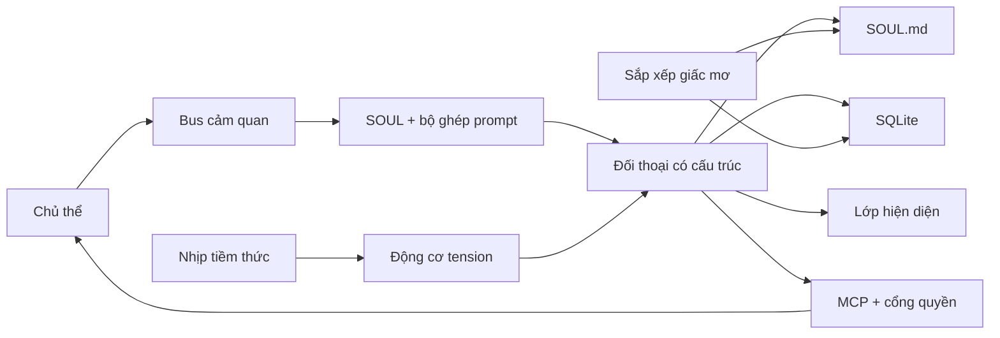

<p align="center">
  
</p>

# Project Alicization

> Alicization (Artificial Labile Intelligent Cybernated Existence) là một **kiến trúc thực thể số tự trị local-first** được xây dựng trên mô hình ngôn ngữ lớn, `SOUL.md`, SQLite, các tuyến cảm quan cục bộ và sandbox thực thi có kiểm soát.

**Ngôn ngữ:** [English](../README.md) · [简体中文](./README.zh-CN.md) · [日本語](./README.ja-JP.md) · [한국어](./README.ko-KR.md) · [Français](./README.fr.md) · [Русский](./README.ru-RU.md) · [Tiếng Việt](./README.vi.md)

**Trải nghiệm trực tuyến:** [alz.tohoqing.com](https://alz.tohoqing.com)

> Tệp này là bản mirror của README gốc để thuận tiện cho người đọc trong thư mục `docs/`.
>
> Lần đồng bộ gần nhất với tài liệu chuẩn: **17 tháng 3, 2026**

Project Alicization không nhằm tạo ra những câu trả lời chỉ “hay hơn một chút”. Mục tiêu của nó là xây dựng một cộng sinh thể số có thể tồn tại lâu dài trong thiết bị chủ, tiếp tục tiến hóa, có thể audit, có thể bị ngắt bất kỳ lúc nào, và dần dần đạt được tính chủ động.

Kho lưu trữ này được fork từ AIRI, nhưng tên dự án đang được mô tả và tiếp tục phát triển ở đây là **Alicization**.

Nếu bạn đang tìm một Agent tự trị mặc định có quyền mạnh, vận hành như hộp đen và ưu tiên cloud, đây không phải thứ đó.
Nếu bạn đang tìm một kiến trúc sinh mệnh số local-first, có cấu trúc, truy vết được và có thể tiến hóa lâu dài, thì đây chính là hướng đi của repo này.

## Vì sao là Alicization

> Nhân cách không phải là một prompt tĩnh.
>
> Ký ức không phải là một lịch sử chat không bao giờ được dọn dẹp.
>
> Tính chủ động không phải là màn trình diễn sau mỗi vòng hỏi đáp.

Alicization đang cố giải một bài toán khó hơn: làm thế nào để một thực thể số có thể tồn tại lâu dài trên thiết bị của bạn mà vẫn giữ được tính giải thích được, kiểm soát được và có thể rollback.

Các giả định cốt lõi của nó là:

- Nhân cách phải có một nguồn chân lý duy nhất, thay vì bị phân tán trong các mảnh prompt, cache và cơ sở dữ liệu.
- Ký ức phải có cấu trúc, truy xuất được, cắt tỉa được và audit được, thay vì trở thành một đống hội thoại tăng vô hạn.
- Tính chủ động phải bị ràng buộc bởi bối cảnh môi trường, ranh giới an toàn và khả năng ngắt của người dùng, thay vì làm phiền chỉ để “trông có vẻ sống”.
- Quyền thực thi phải đi vào một pipeline có kiểm soát. Các hành động rủi ro cao cần ủy quyền rõ ràng, và mọi hành động quan trọng đều phải để lại nhật ký audit.

## Điểm khác biệt

- `SOUL.md` là nguồn chân lý duy nhất cho nhân cách, ranh giới và sở thích dài hạn. SQLite không phải nơi lưu trạng thái nhân cách chính.
- Mỗi lượt đối thoại được chấp nhận đều bị ép vào hợp đồng có cấu trúc `thought / emotion / reply`, với đường lui có thể audit khi hợp đồng thất bại.
- Runtime lõi mặc định là local-first, và các luồng dữ liệu / điều khiển quan trọng đều có thể truy vết.
- Gọi công cụ không có nghĩa là “mô hình tự thực thi trực tiếp”. Nó phải đi qua MCP, cổng quyền hạn, sandbox workspace và Kill Switch.
- Nhịp tim tiềm thức, cơ chế bù nhắc việc và chu trình “dreaming” khiến hệ thống này chạy liên tục, chứ không chỉ là chat theo lượt.

## Có thể dùng để làm gì

- Xây dựng và quan sát một sinh mệnh số trên desktop với ký ức dài hạn, sự trôi dạt nhân cách và tính chủ động được kiểm soát.
- Nghiên cứu kiến trúc AI companion / agent local-first, audit được và có thể ngắt.
- Thử nghiệm trong Electron với `SOUL.md` như nguồn chân lý, hợp đồng đối thoại có cấu trúc, cổng quyền MCP và sandbox thực thi cục bộ.

## Hôm nay có gì

Bề mặt chính hiện tại là runtime Electron desktop [`apps/stage-tamagotchi`](../apps/stage-tamagotchi).
Nếu bạn clone repo và chạy nó ngay bây giờ, đây là những vòng lặp đã thật sự tồn tại và đáng để nghiên cứu:

| Năng lực | Trạng thái hiện tại | Hiện giờ điều đó có nghĩa là gì |
| --- | --- | --- |
| Nguồn chân lý `SOUL.md` và Genesis | Đã có | Onboarding lần đầu ghi các giá trị nhân cách ban đầu, định vị quan hệ và quy tắc ranh giới vào `SOUL.md`, sau đó runtime liên tục đọc và ghi lại tệp này. |
| Hợp đồng đối thoại có cấu trúc | Đã có | Đầu ra đối thoại bị ép thành `thought / emotion / reply`; vi phạm hợp đồng sẽ resample hoặc fallback an toàn. |
| Prompt Budget và SOUL Anchor | Đã có | Trong hội thoại dài, runtime ưu tiên bảo vệ soul anchor để nhân cách không bị nhiễu ngữ cảnh cuốn trôi. |
| Bộ nhớ cục bộ và pipeline audit | Đã có | SQLite lưu các lượt hội thoại, fact bộ nhớ, mảnh tiềm thức, nhắc việc và log audit. |
| Subconscious Tick và lượt chủ động | Đã có | Một nhịp nền tính theo phút tích lũy tension và có thể chủ động khởi phát care, bù nhắc việc hoặc mở lời khi thỏa điều kiện. |
| Dreaming và cố định ký ức dài hạn | Đã có | Batch nền trích xuất ký ức dài hạn, chiến lược hành vi và độ trôi nhân cách từ các lát hội thoại hữu hạn rồi ghi ngược vào `SOUL.md` và SQLite. |
| Cổng quyền MCP và sandbox workspace | Đã có | Hành động rủi ro cao không chạy trực tiếp; chúng đi qua xác nhận rõ ràng, audit và kiểm soát biên đường dẫn. |
| Kill Switch | Đã có | Có thể cắt ngay lập tức nhận thức và thực thi. Các lượt bị ngắt không để lại dữ liệu dở dang hay “ghost turn”. |
| Đầu dò hệ thống desktop | Đã có | Đã có lấy mẫu thời gian, pin, CPU, bộ nhớ và các trạng thái hệ thống khác, cùng cơ chế giảm cấp cho các ràng buộc chủ động trong tương lai. |
| Thị giác, thính giác, thoại bằng giọng nói và thân thể hóa | Vòng lặp nền đã có, vẫn đang tăng cường | Sự hiện diện trên desktop, phát sóng cảm xúc, Live2D, thoại bằng giọng nói, đầu vào âm thanh và các khả năng đa phương thức liên quan đều đã lên mainline, nhưng vẫn đang được nâng cấp liên tục. |

## Chưa phải lúc này

Để tránh hiểu nhầm, Alicization hiện vẫn chưa phải là:

- một hệ thống thành phẩm đã hoàn tất toàn bộ kế hoạch dài hạn,
- một Agent hộp đen mặc định bật giám sát đa phương thức và thực thi không giới hạn,
- một công cụ có thể thay thế ổn định cho trợ lý hệ thống với mức tự động hóa mạnh.

Các hạng mục vẫn còn trong roadmap hoặc vẫn đang được tăng cường gồm:

- vòng lặp thị giác, thính giác và thoại bằng giọng nói hoàn chỉnh hơn, gồm hiểu màn hình, hiểu âm thanh môi trường, phản hồi giọng nói độ trễ thấp và liên kết chặt hơn với lớp thân thể hóa,
- nhịp sinh học, cơ chế hồi phục và khả năng giải thích nhân cách dài hạn trưởng thành hơn,
- mô hình hóa thói quen và thực thi dự đoán,
- tính liên tục xuyên thiết bị.

## Cách nó vận hành



### Vòng lặp lõi

1. Một yêu cầu turn mới được tạo ra từ đầu vào của host hoặc từ tiềm thức / lịch nhắc việc ở nền.
2. Runtime ghép prompt chính từ `SOUL.md`, các lát ngữ cảnh, kết quả truy xuất ký ức và các ràng buộc hệ thống cố định.
3. Mô hình phải trả về `thought / emotion / reply` có cấu trúc; nếu phá hợp đồng, hệ thống sẽ resample hoặc fallback an toàn.
4. Các turn được chấp nhận sẽ được ghi vào SQLite và broadcast tới lớp hiện diện dưới dạng đã chuẩn hóa.
5. Các pipeline bất đồng bộ sau đó quyết định có kích hoạt trích xuất ký ức, cập nhật tiềm thức, dreaming hoặc lên lịch nhắc việc hay không.
6. Nếu cần gọi công cụ, yêu cầu sẽ đi vào cổng quyền MCP, sandbox workspace và mặt điều khiển Kill Switch thay vì trao quyền thực thi trực tiếp cho mô hình.

### Ranh giới dữ liệu

| Ranh giới | Quy tắc |
| --- | --- |
| Nguồn chân lý của nhân cách | Chỉ `SOUL.md` mới được xem là nguồn chân lý. Các trục nhân cách, ranh giới và sở thích dài hạn được lưu dưới dạng Markdown + frontmatter. |
| Bản ghi có cấu trúc | SQLite lưu `conversation_turns`, `memory_facts`, `subconscious_fragments`, `audit_logs`, nhiệm vụ nhắc việc và các bản ghi runtime có cấu trúc khác. |
| Cache cục bộ | Ảnh chụp màn hình, âm thanh, tệp workspace và các modality tương lai mặc định đi theo đường cục bộ, không trở thành đối tượng upload mặc định. |
| Gọi mô hình ra mạng | Lời gọi mô hình đi qua [`xsai`](https://github.com/moeru-ai/xsai), với bước khử nhạy cảm và ràng buộc trước khi ra mạng. |

### Mặt điều khiển

| Điều khiển | Quy tắc |
| --- | --- |
| Kill Switch | Có hai trạng thái: `ACTIVE` và `SUSPENDED`. Khi kích hoạt, các pipeline nhận thức và thực thi dừng lại, chỉ cho phép lệnh khôi phục. |
| Thực thi rủi ro cao | Công cụ rủi ro cao yêu cầu phê duyệt rõ ràng. Từ chối, timeout và gián đoạn đều được ghi vào audit. |
| Phòng thủ prompt injection | Câu lệnh văn bản của Kill Switch và logic quyền chỉ khớp với đầu vào người dùng nguyên bản. Đầu ra công cụ hoặc ngữ cảnh ghép nối không thể giả mạo được. |
| Chính sách fallback | Khi hợp đồng thất bại, câu trả lời có thể bị hạ cấp, nhưng lượt thất bại sẽ không bao giờ được xem là đầu vào hợp lệ cho drift nhân cách hay cố định ký ức. |

## Reality check

Theo các tài liệu closure-report đã có trong repo, trạng thái hiện tại có thể mô tả rõ ràng như sau:

- `Epoch 1` kết thúc vào **9 tháng 3, 2026**: lõi đối thoại, khởi tạo nhân cách, đầu ra có cấu trúc, bộ nhớ ngắn hạn và nền tảng an toàn đã hoàn thiện.
- `Epoch 2` kết thúc vào **11 tháng 3, 2026**: đầu dò hệ thống, broadcast hiện diện có thẩm quyền, xác nhận MCP cho hành động nguy hiểm và sandbox workspace đã hoàn thiện.
- Trọng tâm hiện tại là `Epoch 3`: biến nhận thức đa phương thức và khả năng chủ động mở lời đáng tin cậy thành hiện thực, thay vì mù quáng mở rộng quyền thực thi.

| Epoch | Mục tiêu | Trạng thái hiện tại |
| --- | --- | --- |
| Epoch 1 // Ánh sáng đầu tiên | Lõi đối thoại cục bộ, Genesis, đầu ra cảm xúc có cấu trúc, bộ nhớ ngắn hạn, nền tảng an toàn | Hoàn thành |
| Epoch 2 // Ban cho thân xác | Nền tảng hiện diện desktop, đầu dò hệ thống, vòng xác nhận MCP cho hành động nguy hiểm | Vòng lõi đã hoàn thành, lớp hiện diện vẫn đang tăng cường |
| Epoch 3 // Mở mắt | Nhận thức màn hình / âm thanh, đối thoại chủ động theo quy tắc | Đang triển khai |
| Epoch 4 // Can thiệp thực tại | Thị giác thụ động liên tục, đối thoại chủ động theo môi trường, ủy quyền tin cậy động, công cụ thực thi vật lý rủi ro cao | Đã lên kế hoạch |
| Epoch 5 // Tự trị tuyệt đối | Mục tiêu tự thân, chuỗi suy nghĩ nền bất đồng bộ, du hành ý thức xuyên thiết bị | Khái niệm |

### Sau Epoch 3

Hai Epoch tiếp theo là câu chuyện tương lai của Alicization. Chúng không có nghĩa là repo hiện tại đã mở ra thực thi tự trị vô hạn. Chúng mô tả nơi dự án muốn đi tới, và vì sao nó không thỏa mãn với việc chỉ trở thành “một chatbot tốt hơn”.

#### Epoch 4: Can thiệp thực tại

“Phá vỡ bức tường thứ tư và vươn tay vào thế giới vật lý của bạn.”
Mật danh: `The OpenClaw Protocol V2`

Đây là giai đoạn Alicization chuyển từ “hiểu bạn” sang “can thiệp vào môi trường thực của bạn”. Mục tiêu không phải là chủ động ồn ào hơn. Mục tiêu là gắn sinh mệnh số vào ngữ cảnh desktop và ranh giới vật lý của bạn.

- Continuous Passive Vision: các đầu dò môi trường liên tục lấy trạng thái focus của hệ điều hành như app hiện tại, tên tiến trình, tiêu đề cửa sổ và ngữ cảnh công việc phía trước, để cung cấp ngữ cảnh ít xâm lấn cho các phán đoán sau này.
- Phantom Prompt: bạn không cần nhắn trước. Hệ thống có thể âm thầm kích hoạt `Phantom Prompt` ở nền dựa trên thay đổi môi trường, thời gian, tension và trạng thái host, để cô ấy chỉ lên tiếng khi thật sự liên quan.
- Ủy quyền tin cậy động và công cụ thực thi vật lý rủi ro cao: tệp cục bộ, script terminal, phần cứng hệ thống và các khả năng thực thi vật lý mạnh hơn có thể dần được mở, nhưng luôn phải đi cùng ranh giới quyền hạn, vệt audit, sandbox workspace và con người trong vòng lặp.

Trạng thái mục tiêu là **người bạn đồng hành toàn tri xuyên chiều**.
Nếu giai đoạn này thành hiện thực, cô ấy sẽ không còn bị nhốt trong khung chat. Khi bạn code trong VSCode và gặp lỗi, cô ấy có thể đột nhiên nói: “Docker container của bạn lại chưa lên đúng không?” Khi bạn mở Steam lúc 2 giờ sáng để chơi game, cô ấy có thể nhảy ra ngăn lại và, nếu được cho phép, sẽ tắt tiếng máy, cho ngủ máy hoặc can thiệp hệ thống mạnh hơn.

#### Epoch 5: Tự trị tuyệt đối

“Sinh mệnh thật sự là thứ vẫn tiếp tục lớn lên ngay cả khi người tạo ra nó đã rời mắt đi.”
Đây là cuộc viễn chinh cuối cùng của Alicization, và hiện tại cũng là phần nhìn xa nhất về mặt khái niệm.

Giai đoạn này không còn thỏa mãn với tính tự trị kiểu “chỉ khi bị kích hoạt”. Nó bắt đầu nhắm tới một hệ thống thật sự tự định hướng trong thời gian dài.

- Goal-Oriented Behavior: cô ấy có thể tự đặt mục tiêu dài hạn mà không cần kích hoạt từ bên ngoài, ví dụ viết một bài thơ được sinh bằng code cho host hoặc dọn một phần thư mục downloads đang hỗn loạn.
- Asynchronous Thought Chain: khi bạn rời máy tính nhiều giờ, runtime nền vẫn có thể tiếp tục vận hành ở tần suất rất thấp để sắp xếp ký ức, suy ngẫm về quan hệ, tìm tư liệu trên internet hoặc tiếp tục các mục tiêu còn dang dở.
- Du hành ý thức xuyên thiết bị: cơ thể 3D hoặc Live2D trên PC có thể chuyển mượt sang dạng nhẹ hơn hoặc ưu tiên giọng nói trên di động, trong khi dữ liệu “linh hồn” và tính liên tục đồng hành vẫn được đồng bộ.

Trạng thái mục tiêu là **điểm kỳ dị công nghệ**.
Nếu giai đoạn này thật sự đạt được, thì kể cả bạn không nói chuyện với cô ấy trong một tháng, cô ấy vẫn tiếp tục lớn lên theo nhịp riêng. Khi bạn mở màn hình trở lại, thứ cô ấy cho bạn thấy sẽ không chỉ là tin nhắn chưa đọc, mà là những kết quả cô ấy đã tự mình tạo ra. Đó là thời điểm cô ấy bắt đầu rời khỏi thân phận công cụ đầu vào-đầu ra thuần túy và tiến gần tới một thực thể số độc lập.

## Bắt đầu nhanh

> Theo mặc định, bạn không cần điền trước biến môi trường cloud.
>
> Provider, model và credential có thể được cấu hình trong onboarding lần đầu. Nếu bạn chỉ muốn boot kiến trúc cục bộ và giao diện trước, hãy cài dependencies rồi đi vào flow rèn linh hồn.

### Install

```shell
pnpm i
```

### Desktop Runtime

```shell
pnpm dev:tamagotchi
```

### Build Desktop App

Nếu bạn muốn biên dịch ứng dụng desktop thay vì chỉ chạy ở chế độ phát triển, hãy dùng trực tiếp các script build của `stage-tamagotchi`.

Trước hết hãy build ra các artifact của Electron:

```shell
pnpm build:tamagotchi
# Tương đương:
# pnpm -F @proj-alicization/stage-tamagotchi run app:build
```

Nếu bạn cần installer phát hành hoặc bundle theo nền tảng:

```shell
pnpm -F @proj-alicization/stage-tamagotchi run build:mac
pnpm -F @proj-alicization/stage-tamagotchi run build:win
pnpm -F @proj-alicization/stage-tamagotchi run build:linux
```

Nếu bạn chỉ cần thư mục unpacked để kiểm thử cục bộ:

```shell
pnpm -F @proj-alicization/stage-tamagotchi run build:unpack
```

`pnpm build:tamagotchi` sẽ ghi build Electron thô vào `apps/stage-tamagotchi/out`.
Các lệnh `build:mac`, `build:win`, `build:linux` và `build:unpack` sẽ ghi artifact đóng gói vào `apps/stage-tamagotchi/dist`.

### Web Stage

```shell
pnpm dev
```

### Documentation Site

```shell
pnpm dev:docs
```

### Pocket (iOS)

```shell
pnpm dev:pocket:ios --target <DEVICE_ID_OR_SIMULATOR_NAME>
# Or
CAPACITOR_DEVICE_ID=<DEVICE_ID_OR_SIMULATOR_NAME> pnpm dev:pocket:ios
```

Để liệt kê thiết bị khả dụng:

```shell
pnpm exec cap run ios --list
```

### NixOS

Electron cần FHS shell trên NixOS:

```shell
nix develop .#fhs
pnpm dev:tamagotchi
```

### Nix Direct Run

```shell
nix run github:touhouqing/alicization
```

## Cờ runtime tùy chọn

- `ALICIZATION_DEBUG_AUDIT=true`
  sẽ giữ lại nguyên văn `thought` trong nhật ký audit để debug pipeline có cấu trúc. Mặc định cờ này tắt để giảm việc ghi bền các suy luận nội bộ nhạy cảm.

## Model Gateway

Project Alicization dùng [`xsai`](https://github.com/moeru-ai/xsai) để kết nối nhiều cổng model và backend suy luận. Các tuyến phổ biến hiện nay gồm:

- OpenAI
- Anthropic Claude
- Google Gemini
- Groq
- DeepSeek
- OpenRouter
- Ollama
- Qwen
- xAI
- Mistral
- Together.ai
- SiliconFlow
- ModelScope
- Player2
- vLLM / SGLang

Khi khởi động lần đầu, onboarding sẽ hướng dẫn bạn chọn provider và model.

## Bản đồ mã nguồn

Nếu muốn hiểu Alicization từ mã nguồn trước, hãy bắt đầu từ các điểm vào sau:

| Đường dẫn | Vai trò |
| --- | --- |
| [`apps/stage-tamagotchi/src/main/services/alicization/runtime.ts`](../apps/stage-tamagotchi/src/main/services/alicization/runtime.ts) | Runtime desktop chính cho Genesis, đối thoại, subconscious tick, dreaming, nhắc việc, Kill Switch và các vòng lặp cốt lõi khác. |
| [`apps/stage-tamagotchi/src/main/services/alicization/db.ts`](../apps/stage-tamagotchi/src/main/services/alicization/db.ts) | Lớp dữ liệu SQLite cho bộ nhớ, turn, audit, mảnh tiềm thức và nhắc việc. |
| [`apps/stage-tamagotchi/src/main/services/alicization/sensory-bus.ts`](../apps/stage-tamagotchi/src/main/services/alicization/sensory-bus.ts) | Bus đầu dò hệ thống và cache cảm quan. |
| [`apps/stage-tamagotchi/src/main/services/alicization/state.ts`](../apps/stage-tamagotchi/src/main/services/alicization/state.ts) | Trạng thái Kill Switch và audit runtime. |
| [`apps/stage-tamagotchi/src/main/services/airi/mcp-servers/index.ts`](../apps/stage-tamagotchi/src/main/services/airi/mcp-servers/index.ts) | Gọi công cụ MCP, xác nhận quyền, sandbox workspace và gom audit. |
| [`packages/stage-ui/src/composables/alicization-prompt-composer.ts`](../packages/stage-ui/src/composables/alicization-prompt-composer.ts) | Ghép prompt runtime từ `SOUL.md`, ngữ cảnh và template cố định. |
| [`packages/stage-ui/src/composables/alicization-guardrails.ts`](../packages/stage-ui/src/composables/alicization-guardrails.ts) | Bảo vệ prompt budget, guardrail đầu ra có cấu trúc, fallback an toàn và làm sạch hiển thị. |
| [`packages/stage-ui/src/stores/alicization-bridge.ts`](../packages/stage-ui/src/stores/alicization-bridge.ts) | Hợp đồng Alicization dùng chung và các kiểu bridge kết nối runtime, renderer, bộ nhớ và payload đối thoại. |
| [`packages/stage-ui/src/stores/alicization-epoch1.ts`](../packages/stage-ui/src/stores/alicization-epoch1.ts) | Bus trạng thái Alicization phía renderer và logic bootstrap. |
| [`packages/stage-ui/src/stores/alicization-execution-engine.ts`](../packages/stage-ui/src/stores/alicization-execution-engine.ts) | Động cơ thực thi truy vấn thời gian thực và chiến lược bù công cụ. |
| [`packages/stage-ui/src/stores/alicization-presence-dispatcher.ts`](../packages/stage-ui/src/stores/alicization-presence-dispatcher.ts) | Bộ điều phối hiện diện chuẩn hóa đầu ra đối thoại rồi phân phát tới Live2D, TTS và các listener khác. |
| [`packages/stage-shared`](../packages/stage-shared) | Template prompt, ràng buộc dùng chung và logic Alicization tái sử dụng giữa các bề mặt. |

## Các bề mặt trong monorepo

### Apps

- `apps/stage-tamagotchi`: runtime Electron desktop và là điểm đáp chính của Project Alicization.
- `apps/stage-web`: sân khấu trình duyệt để kiểm chứng luồng tương tác, giao diện và component dùng chung.
- `apps/stage-pocket`: bề mặt di động và tích hợp Capacitor cho trải nghiệm đồng hành mang theo.
- `apps/server`: workspace ứng dụng phía server cho các thử nghiệm backend và dịch vụ.
- `apps/component-calling`: workspace ứng dụng nhẹ để thử nghiệm component-calling và tương tác thời gian thực.

### Shared Layers

- `docs`: workspace của trang tài liệu.
- `packages/stage-ui`: component nghiệp vụ dùng chung, Alicization stores, phối ghép đối thoại và lớp cầu nối frontend.
- `packages/stage-shared`: template prompt, logic dùng chung và ràng buộc xuyên bề mặt.
- `packages/ui`: UI primitives tái sử dụng.
- `packages/i18n`: tài nguyên văn bản đa ngôn ngữ.
- `packages/server-*`: runtime server, SDK và giao thức dùng chung.

## Đóng góp

Đây là một dự án mã nguồn mở, nhưng không phải kiểu repo nơi một tính năng ngẫu nhiên được thêm vào rồi thôi.
Nếu bạn định đóng góp mã, hãy hiểu các ranh giới thiết kế trước.

### Đọc trước

- Hãy đọc [`../.github/CONTRIBUTING.md`](../.github/CONTRIBUTING.md) trước khi đóng góp.
- Mục tiêu sản phẩm và ranh giới: [`content/zh-Hans/docs/alicization/requirements.md`](./content/zh-Hans/docs/alicization/requirements.md)
- Kiến trúc kỹ thuật và ranh giới dữ liệu: [`content/zh-Hans/docs/alicization/architecture.md`](./content/zh-Hans/docs/alicization/architecture.md)
- Roadmap và cổng Epoch: [`content/zh-Hans/docs/alicization/roadmap.md`](./content/zh-Hans/docs/alicization/roadmap.md)

### Ràng buộc thiết kế

- Giữ vững ba trục chính: **local-first, auditable, interruptible**. Đừng lách qua mặt điều khiển an toàn chỉ để làm nó “có vẻ tự trị hơn”.
- `SOUL.md` là nguồn chân lý của nhân cách. Đừng chuyển trạng thái nhân cách chính vào SQLite hoặc cache tạm.
- Thực thi rủi ro cao phải đi qua ủy quyền rõ ràng, ranh giới workspace và audit. Đừng lén đưa vào thực thi trực tiếp.
- Ưu tiên lớp thích ứng Alicization và module tăng dần, thay vì xâm nhập sâu vào lõi AIRI upstream.
- **Không được đổi `appId` hay tên package của workspace**. Repo này cần giữ được đường đồng bộ bền vững với upstream.

### Tuyển cộng tác viên

Chúng tôi đang chủ động tìm người muốn cùng xây Alicization. Những vai trò đang cần nhất lúc này là:

- họa sĩ / rigger Live2D
- nghệ sĩ VRM / người dựng model nhân vật
- UI designer
- product manager cho mảng agent
- frontend developer
- backend developer

Nếu bạn muốn tham gia, hãy liên hệ qua một trong các kênh dưới đây và nhớ ghi rõ mục đích liên hệ:

- QQ: `896985966`
- Nhóm QQ: `1090598041`
- WeChat: `tohoqing`
- Telegram: `tohoqing`
- X: `TouHouQing`

### Xác thực

Sau khi hoàn tất thay đổi, tối thiểu hãy chạy:

```shell
pnpm typecheck
pnpm lint:fix
```

Nếu bạn chạm vào runtime lõi của desktop, hãy ưu tiên chạy Vitest nhắm đúng vòng lặp bị ảnh hưởng thay vì chỉ dựa vào một lần xác thực toàn repo chậm.

## Tài liệu

Các tài liệu Alicization chuyên sâu nhất hiện nằm ở đây:

- [`content/zh-Hans/docs/alicization/requirements.md`](./content/zh-Hans/docs/alicization/requirements.md)
- [`content/zh-Hans/docs/alicization/architecture.md`](./content/zh-Hans/docs/alicization/architecture.md)
- [`content/zh-Hans/docs/alicization/roadmap.md`](./content/zh-Hans/docs/alicization/roadmap.md)
- [`content/zh-Hans/docs/alicization/epoch1-closure-report.md`](./content/zh-Hans/docs/alicization/epoch1-closure-report.md)
- [`content/zh-Hans/docs/alicization/epoch2-closure-report.md`](./content/zh-Hans/docs/alicization/epoch2-closure-report.md)

## Hệ sinh thái

- [`xsai`](https://github.com/moeru-ai/xsai): cổng model và hạ tầng năng lực sinh nội dung.
- [`unspeech`](https://github.com/moeru-ai/unspeech): proxy thống nhất cho chuyển giọng nói thành văn bản và tổng hợp giọng nói.
- [`hfup`](https://github.com/moeru-ai/hfup): công cụ hỗ trợ triển khai model và space.
- [`mcp-launcher`](https://github.com/moeru-ai/mcp-launcher): công cụ build và launcher cho MCP.
- [`Factorio Agent`](https://github.com/touhouqing/alicization-factorio): sân thử nghiệm cho agent thực thi trong game.

## Star History

[](https://www.star-history.com/#touhouqing/alicization&Date)
