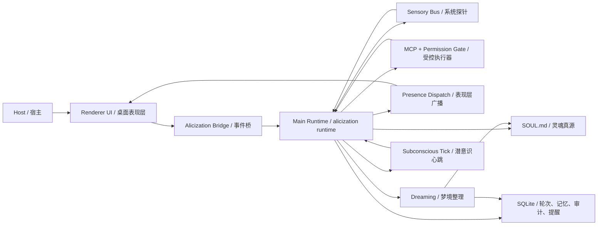

# A.L.I.C.E 架构设计文档

## 1. 文档目标与范围

本文档描述 **截至 2026-03-17** 的 Alicization 实际架构落地情况，并说明：

- 当前代码中的运行时拓扑是什么。
- 哪些能力已经从设计进入实现。
- 数据、权限与中断边界如何组织。
- `Epoch 3` 之后的能力应该建立在什么架构前提上。

与早期版本不同，这份文档不再只覆盖 `Epoch 1` 草案，而是覆盖：

- 已完成的 `Epoch 1` 与 `Epoch 2` 闭环。
- 正在推进中的 `Epoch 3` 基础设施。
- 为 `Epoch 4` / `Epoch 5` 预留的清晰边界。

## 2. 架构原则

1. 本地优先（Local-first）：默认敏感数据仅在本地存储与处理。
2. 灵魂真源单一化（Soul-as-Source）：`SOUL.md` 是人格、边界与长期偏好的唯一真源。
3. 主链结构化（Structured-first）：主对话必须走 `thought / emotion / reply` 合约，而不是自由文本黑箱。
4. 可降级（Graceful fallback）：模型失败、合约失败、探针失败时必须可回退。
5. 可审计（Auditable）：记忆写入、工具调用、权限请求、Kill Switch 与主动性判断均需可追踪。
6. 可中断（Interruptible）：Kill Switch 与 Abort 语义必须贯穿感知、执行与落盘链路。
7. 可持续同步上游（Upstream-friendly）：优先通过增量模块和适配层落地，不改写上游核心命名与构建边界。

## 3. 当前运行时总览

### 3.1 模块落点

| 模块 | 主要代码路径 | 职责 |
| --- | --- | --- |
| 主运行时 | `apps/stage-tamagotchi/src/main/services/alicization/runtime.ts` | Genesis、对话、潜意识 Tick、Dreaming、提醒、Kill Switch、bridge invoke handler |
| 数据层 | `apps/stage-tamagotchi/src/main/services/alicization/db.ts` | SQLite schema、记忆检索、修剪、潜意识碎片、提醒任务、审计 |
| 感知总线 | `apps/stage-tamagotchi/src/main/services/alicization/sensory-bus.ts` | 时间、电量、CPU、内存等系统状态采样、缓存与降级 |
| Kill Switch / 运行时状态 | `apps/stage-tamagotchi/src/main/services/alicization/state.ts` | 全局与 card 级 Kill Switch、运行时审计 logger |
| MCP 权限控制 | `apps/stage-tamagotchi/src/main/services/airi/mcp-servers/index.ts` | 工作区沙箱、路径边界、权限请求、一次性 token、会话白名单 |
| Renderer 侧 bridge | `packages/stage-ui/src/stores/alicization-bridge.ts` | 前后端桥接能力定义与数据规范化 |
| 提示词编排 | `packages/stage-ui/src/composables/alicization-prompt-composer.ts` | 将 `SOUL.md`、上下文、记忆与固定模板拼成运行时提示词 |
| 守卫与预算 | `packages/stage-ui/src/composables/alicization-guardrails.ts` | Prompt Budget、结构化输出守卫、严格实时门禁、安全回退 |
| Epoch1/主状态 store | `packages/stage-ui/src/stores/alicization-epoch1.ts` | Renderer 侧 bootstrap、Kill Switch、Organic Memory、memory stats |
| 实时执行引擎 | `packages/stage-ui/src/stores/alicization-execution-engine.ts` | weather/news/finance/sports 实时查询的 builtin/MCP 双路径 |
| 表现层分发 | `packages/stage-ui/src/stores/alicization-presence-dispatcher.ts` | 将标准化结果分发给 Live2D 等身体化表现层 |

## 4. 当前核心链路

### 4.1 主对话链路

1. Renderer 通过 bridge 发起 `bootstrap`、`chatStart`、`streamChat` 或写入类 invoke。
2. Main runtime 读取 `SOUL.md`、当前会话上下文、记忆检索结果、performance manifest 和固定系统块。
3. 模型侧必须返回结构化 `thought / emotion / reply`，并可附带 performance payload。
4. 结构化结果通过 guardrails 归一化；失败时重采样或降级，并落审计。
5. 被接受的轮次写入 `conversation_turns`，随后才向表现层广播 `alicization.dialogue.responded`。
6. 记忆抽取、潜意识更新、梦境固化等异步动作只对合法轮次生效。

### 4.2 潜意识、提醒与梦境链路

运行时已经具备一条长期运行链路，而不是只有“你问一句，我答一句”：

- `subconscious tick` 以分钟级心跳累积 `boredom / loneliness / fatigue`。
- `scheduled_tasks` 支撑提醒、补偿和恢复性触发。
- `active_thoughts` 与 `subconscious_fragments` 构成 Organic Memory 层。
- Dreaming 会从有限对话片段中提炼长期记忆、行为策略和人格漂移，并写回 `SOUL.md` 与 SQLite。

当前实现要点：

- 提醒任务支持创建、claim、重试、失败、补偿与完成落账。
- 潜意识状态会在切卡、关机或恢复前持久化到 `alicization_meta`。
- Dreaming 不得阻塞主聊天流；即使 Dreaming 占用 card scope，主聊天也必须可以继续启动。

### 4.3 感知与中断语境链路

当前感知模型分为两层：

#### 基础系统探针

由 `sensory-bus.ts` 提供，当前稳定采样：

- 时间与时区
- 电量 / 充电状态
- CPU 使用率
- 内存使用情况
- 采样过期状态、下次 Tick 信息、降级原因

#### 主动性中断语境

由 `runtime.ts` 在潜意识判断前补采样，当前已具备：

- 系统空闲时长与输入活跃度
- 全屏状态推断
- 前台窗口信息（`foregroundWindow`，例如 app 名称、进程名、窗口标题）

需要明确的是：

- 这些信号今天主要用于 **是否允许主动打断宿主** 的门禁判断。
- 当前并不存在完整的“持续被动视觉”闭环；那属于 `Epoch 4` 的未来目标。

### 4.4 工具执行与权限链路

MCP 与本地执行权并不是直接交给模型，而是进入一个受控的执行平面：

1. 模型尝试发起工具调用。
2. `mcp-servers/index.ts` 先做路径归一化、工作区边界判断和绝对黑名单拦截。
3. 如果资源位于工作区内，可直接按规则放行；否则进入人在回路权限请求。
4. 权限请求携带 `riskLevel`、`actionCategory`、`reason`、`token`、`requestId` 等信息。
5. 用户决定后再由一次性 token 解析，不允许 replay。
6. Kill Switch 触发时，中止运行中工具与待处理权限请求。

当前已经实现的安全特性：

- 工作区根路径与路径防穿透
- `userData` 绝对黑名单
- 一次性 token、防重放、防跨 card 重用
- 会话白名单
- 允许 / 拒绝 / 超时 / 中断的结构化错误结果

### 4.5 表现层广播链路

Renderer 并不直接消费原始模型输出，而是消费标准化后的对话结果：

- 只有落库成功的轮次才能发出 `alicization.dialogue.responded`
- `emotion` 非法时回退为 `neutral`
- `facialCue`、`actionCue` 需要经过 performance manifest 约束
- 表现层失败时允许静默降级，不得反向打崩主运行时

## 5. 数据与状态设计

### 5.1 `SOUL.md`

`SOUL.md` 是 Alicization 的唯一人格真源。

它负责托管：

- `profile`：宿主 / Alicization 的基础设定
- `personality`：人格矩阵
- `boundaries`：Kill Switch、MCP guard 等边界开关
- `host_attitude`、`core_incarnation`、`custom_directives`
- 长期偏好、输出契约与其他人格正文内容

当前一致性策略：

1. 原子写：`tmp -> fsync -> rename`
2. 同进程单写队列
3. 外部修改监听与热重载
4. Genesis 期间避免静默覆盖外部文件

### 5.2 SQLite 当前数据面

当前数据库已不再是早期版本中的最小模型，而是支撑了多条后台链路。

| 表 / 数据面 | 用途 |
| --- | --- |
| `memory_facts` | 事实记忆与检索 |
| `memory_archive` | 归档记忆 |
| `active_thoughts` | 当前活跃思绪 |
| `subconscious_fragments` + FTS | 潜意识碎片与召回 |
| `conversation_turns` | 用户 / 助手轮次与结构化结果 |
| `audit_logs` | 审计日志 |
| `alicization_meta` | Kill Switch、subconscious state、lastDreamedAt、performance manifest 等元数据 |
| `scheduled_tasks` | 提醒任务与补偿链路 |

### 5.3 In-memory 状态

运行时还维护一组不直接暴露给持久化层的瞬时状态：

- 活跃聊天流与 AbortController
- pending permission request
- per-card subconscious state
- presence manifest cache
- pending dialogue delivery retry 状态

这些状态必须在 Kill Switch、切卡、恢复和退出时进行一致性处理。

## 6. Bridge 与接口面

Renderer 侧通过 `AlicizationBridge` 访问主运行时能力。当前关键接口包括：

| 类别 | 主要接口 |
| --- | --- |
| 灵魂与初始化 | `bootstrap`、`getSoul`、`initializeGenesis`、`updateSoul`、`updatePersonality` |
| 安全控制 | `getKillSwitchState`、`suspendKillSwitch`、`resumeKillSwitch` |
| 记忆与 Organic Memory | `getMemoryStats`、`runMemoryPrune`、`retrieveMemoryFacts`、`getOrganicMemorySnapshot`、`searchOrganicSubconsciousFragments` |
| 感知与主动性 | `getSensorySnapshot`、`getSubconsciousState`、`forceSubconsciousTick`、`forceDreaming` |
| 对话 | `chatStart`、`chatAbort`、`streamChat`、`appendConversationTurn` |
| 提醒与实时执行 | `reminderSchedule`、`realtimeExecute` |
| 表现层 | `getPerformanceManifest`、`setPerformanceManifest` |
| 清理 | `deleteCardScope`、`deleteAllData`、`clearAllConversations` |

这意味着 Alicization 今天已经不是一个单一 chat API，而是一个包含灵魂管理、后台任务、感知快照、主动性调度和受控执行的完整 runtime surface。

## 7. 安全、隐私与控制平面

### 7.1 Kill Switch

当前已支持：

- 全局 Kill Switch
- card 级 Kill Switch 状态
- 中断运行中 turn
- 中断 / 清退运行中工具与待处理权限请求
- 阻止中断轮次继续落盘或继续向表现层广播

### 7.2 Prompt Injection 防线

- Kill Switch 文本指令只允许在原始用户输入层触发。
- 工具结果、网页内容、RAG 上下文、外部拼接文本不能伪造控制指令。
- 实时查询在缺乏工具证据时必须走严格拒绝或降级路径。

### 7.3 Local-first 边界

- 记忆、轮次、审计与灵魂文件默认仅保存在本地。
- 模型调用通过 `xsai` 出网时必须先做脱敏。
- 当前视觉 / 听觉 / 语音能力仍在增强，但未来也必须服从相同的数据主权边界。

## 8. 当前实现边界

### 8.1 已稳定闭环

- Genesis 与 `SOUL.md` 真源
- 结构化对话合约与回退
- Prompt Budget 与灵魂锚点保护
- 本地记忆、修剪、Organic Memory 与 Dreaming 基线
- 潜意识 Tick、提醒任务与恢复性补偿
- 系统探针、主动性环境门禁
- MCP 权限链路、工作区沙箱与会话白名单
- Kill Switch 全链路中断语义

### 8.2 正在增强

- 视觉、听觉、语音对话能力
- performance manifest 与身体化表现层联动
- 更丰富的前台窗口与环境理解信号
- 更稳定的主动搭话质量与抑制策略

### 8.3 尚未进入稳定实现

- 持续被动视觉的完整闭环
- 强自治的习惯建模与预测执行
- 跨终端意识连续
- 真正意义上的自我目标驱动与异步后台思考链

## 9. 后续演进约束

从 `Epoch 3` 往后，任何新增能力都必须建立在当前控制平面之上：

- 不能为了增强主动性而绕开 Kill Switch。
- 不能为了提升执行力而绕开工作区沙箱和人在回路。
- 不能为了丰富多模态而绕开 local-first 数据主权策略。
- 不能为了追求“像活的”而把未来能力写成今天已经具备的能力。

## 10. Alicization P0 强约束（数字生命心智）

本节是当前阶段的工程硬约束。任何不满足以下约束的实现，都视为 Alicization 心智链路回退，不可合入主线。

1. **主运行时单一治理（Single Governor）**
   - 当 `AlicizationBridge.streamChat` 可用时，Renderer 不再承担核心提示词治理权。
   - Renderer 必须委托 Main Runtime 执行心智轮次治理，不得重复做核心系统块拼装、治理级预算裁剪、远程治理级文本清洗。
   - 运行时落点：`apps/stage-tamagotchi/src/main/services/alicization/runtime.ts`。

2. **跨进程契约单一真源（Contract SSOT）**
   - Alicization 对话治理、实时执行、流事件相关传输类型必须统一定义在：
     `packages/stage-shared/src/alicization-transport-contracts.ts`。
   - `packages/stage-ui/src/stores/alicization-bridge.ts` 与
     `apps/stage-tamagotchi/src/shared/eventa.ts` 必须复用该真源类型，不得本地重复声明。

3. **主运行时核心提示词主权（Prompt Authority）**
   - Main Runtime 每次主链路对话都必须先注入固定核心块：
     `core system`、`host directive`、`structured contract anchor`。
   - 然后再拼接动态上下文（记忆、感知、performance 等），确保人格锚点与输出契约稳定。

4. **Card Scope 一致性**
   - `chatStart`、`streamChat` 及相关落盘/投递重试流程必须在 `withCardScope(cardId, ...)` 内执行。
   - 禁止在 card scope 外读写卡片级状态，防止跨卡心智污染。

5. **Browser Bridge 语义对齐（Parity）**
   - 浏览器桥必须保留并处理 `meta` 流事件。
   - 必须持久化 visual presence pulse，并保证 `getVisualPresenceState` 返回可用状态（持久化值或确定性回退合成值），不能长期 `null`。
   - `realtimeExecute` 不能是空实现，必须走内置实时查询链路并返回标准化分类结果。

6. **异步记忆抽取 P0（非阻塞）**
   - 轮次完成后必须采用异步队列抽取事实记忆，不得阻塞主对话闭环。
   - 必须使用预算/触发窗口控制（batch + idle + budget），避免持续过载。
   - 抽取结果写入统一记忆面，source 标记为 `async-llm`。
   - 落点：`packages/stage-ui/src/stores/alicization-epoch1.ts`。

7. **生命周期清理**
   - Store `dispose()` 必须清理异步抽取计时器与待处理队列，防止跨会话泄漏和重复抽取。

8. **偏离约束时的可审计性**
   - 若出现必须临时偏离 P0 约束的情况，必须在代码中加入 `// NOTICE:` 说明根因、影响范围、回滚或补齐路径，并在审计日志中可追踪。

## 11. Alicization P1 强约束（对话心智链闭环）

P1 的目标是把“对话意图、责任、认知焦点、证据预算”压缩成可执行的统一心智链，避免每个模块各说各话。

1. **Turn Encounter 单一归约器**
   - 每个受治理轮次必须先构建 `dialogueTurnEncounter`（`semantics + obligation + ownership + focus`）。
   - 后续 `discourseState`、`conversationState`、`answerPlanner`、`recallGovernor`、`mindSynthesis` 不得绕过该归约器重复实现主语义判断。

2. **当前意识帧 + 证据账本强制存在**
   - 对受治理轮次，运行时必须生成并携带 `currentConsciousFrame` 与 `claimEvidenceLedger`。
   - 这两者必须进入治理 payload 和 visual presence 状态，作为回答阶段与后续审计的事实基线。

3. **Dialogue-first 去污染**
   - 当 `subject` 属于 `alicization-self` / `relationship` / `host-state`，或 `screenReferenceMode === 'avoid'` 时，回答面必须优先对话中心，不得把旧屏幕线索当作当前事实主轴。
   - stale carry、外来技术细节、角色扮演式空壳开头都应进入治理修复或覆盖路径。

4. **answerIntent 主权**
   - `mindTurnFrame.obligation.answerIntent` 必须优先保留 answer planner 给出的真实作答意图。
   - `focusAnchor` 可辅助，不得在 dialogue-first 轮次反向覆盖作答意图。

5. **`mind-turn-v1` 终态规范**
   - 携带治理状态的最终轮次结构必须归一为 `format: 'mind-turn-v1'`。
   - `epoch1-v1` 仅允许作为输入兼容层，不允许作为治理终态继续向下游广播。

6. **P1 验收测试锚点**
   - `apps/stage-tamagotchi/src/main/services/alicization/dialogue-anchor-coherence.test.ts`
   - `apps/stage-tamagotchi/src/main/services/alicization/mind-turn-frame.test.ts`
   - `apps/stage-tamagotchi/src/main/services/alicization/runtime.test.ts`

## 12. Alicization P2 强约束（真实回答面约束）

P2 的目标是让“可见回答”受到真值纪律约束，而不是只在内部治理层正确。

1. **回答章程 + 表面合约双层门禁**
   - 每轮最终回答前必须构建 `responseCharter` 与 `responseSurfaceContract`。
   - 两者 system block 都必须进入最终提示词面，且优先级高于 persona 表演习惯。

2. **不支持细节防火墙**
   - 当 `claimEvidenceLedger.forbidUnsupportedSpecificity === true` 时，运行时必须拦截或覆盖未被本轮证据支持的文件名、类名、枚举名、字段级细节。
   - 覆盖行为必须在 `mind-governance-takeover` 审计里留下原因与命中 cue。

3. **假设显式标注**
   - 当 `claimEvidenceLedger.shouldLabelHypothesis === true` 时，回答必须明确区分“可观察事实”和“推测”。
   - 禁止把粗粒度场景推断伪装为确定事实。

4. **空壳回答禁令**
   - 回答合约必须禁止“先宣言后空转”的壳句（如只说“我会直接回答”但不真正回答）。
   - 当前轮次的 answer/care/accompany 义务必须在同一条可见回复中完成。

5. **治理接管审计完整性**
   - `mind-governance-takeover` 审计 payload 必须至少包含：
     anchor 冲突信息、specificity budget、unsupported cues、fallback reason、reply before/after 摘要。
   - 保证每次接管都可复盘“为什么修、怎么修、修了什么”。

6. **P2 验收测试锚点**
   - `apps/stage-tamagotchi/src/main/services/alicization/response-charter.test.ts`
   - `apps/stage-tamagotchi/src/main/services/alicization/response-surface-contract.test.ts`
   - `apps/stage-tamagotchi/src/main/services/alicization/runtime.test.ts`

## 13. Alicization P3 强约束（可追溯心智治理）

P3 的目标不是再加一层“更聪明”文案，而是让每个心智决策都可追踪、可复盘、可验证。

1. **Decision Trace ID 全链路贯通**
   - 每个受治理轮次必须具备 `decisionTraceId`，并跟随 `AlicizationMindTurnGovernance` 在治理生成、结构化落盘、meta 流事件、治理接管审计中全链路保留。
   - 不允许中途重建治理对象时丢失 trace id。

2. **Truth Discipline 单一归约器**
   - 回答表面合约（response surface）与 runtime 覆盖判定（reply override）必须复用同一个 truth-discipline 归约器：
     `deriveAlicizationTruthDiscipline(...)`。
   - 禁止两套各自演化的条件树导致“合约要求”和“运行时接管”口径漂移。

3. **细节真实性防火墙一致性**
   - unsupported specificity 判定必须由 claim evidence + truth discipline 共同驱动。
   - 当 truth discipline 要求禁止伪具体时，runtime 必须进入可审计覆盖路径，且审计记录需包含具体命中 cue。

4. **Dialogue-first 去污染语义一致**
   - dialogue-first 回答去污染逻辑必须以 truth-discipline 的 `dialogueFirst` 语义为主，不得只依赖单一字段（例如仅 `screenReferenceMode`）做简化判断。

5. **P3 验收测试锚点**
   - `apps/stage-tamagotchi/src/main/services/alicization/mind-governance-trace.test.ts`
   - `apps/stage-tamagotchi/src/main/services/alicization/truth-discipline.test.ts`
   - `apps/stage-tamagotchi/src/main/services/alicization/chat-mind-governance.test.ts`
   - `apps/stage-tamagotchi/src/main/services/alicization/runtime.test.ts`

## 14. Alicization P4 强约束（可重放心智事件账本）

P4 的目标是把“可追溯”升级为“可重放”：不仅知道发生过什么，还能按治理链路还原每一步决策。

1. **Mind-turn 事件账本落盘**
   - 受治理 user-turn 必须写入 `mind_turn_events`，至少包含：
     `decision_trace_id`、`turn_id`、`session_id`、`origin`、`kind`、`payload_json`、`created_at`。
   - 该账本是 conversation turn 的治理证据层，不是可选调试日志。

2. **事件链完整性**
   - 对已持久化的受治理轮次，至少必须有：
     - `governance-normalized`
     - `persistence-written`
   - 如发生接管，必须追加：
     - `takeover-audit`
   - 如成功发出对话事件，必须追加：
     - `dialogue-emitted`

3. **按 trace/turn 可查询**
   - Runtime 必须提供按 `decisionTraceId` 或 `turnId` 查询事件链的接口，用于 deterministic replay 与事故复盘。
   - 查询结果应保留时序语义，支持“从治理归一化到可见回复发出”的链路检查。

4. **会话清理一致性**
   - `clearConversationData` 必须与 `conversation_turns`、`scheduled_tasks` 一起清理 `mind_turn_events`，避免跨会话残留误导 replay。

5. **P4 验收测试锚点**
   - `apps/stage-tamagotchi/src/main/services/alicization/db.test.ts`
   - `apps/stage-tamagotchi/src/main/services/alicization/runtime.test.ts`
