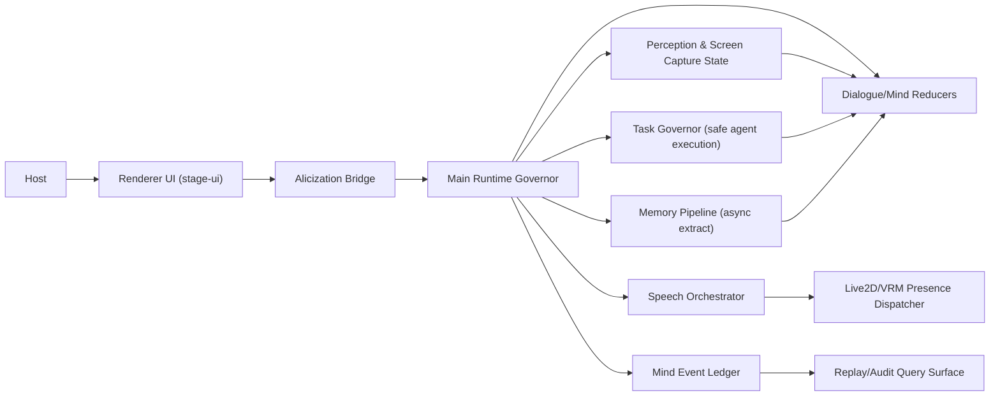

# A.L.I.C.E 优先级开发实施蓝图（对标 N.E.K.O）

## 1. 文档定位

本文档是 `Alicization` 的执行级研发蓝图，面向工程落地，不重复愿景叙事，重点回答三件事：

1. 按开发优先级，下一步到底先做什么。
2. 每个能力模块的技术细节和实现路径是什么。
3. 架构如何演进，才能在增强能力时不破坏现有 P0-P4 治理约束。

基线日期：**2026-04-02**
对标项目：`N.E.K.O`（本仓库本地镜像目录 `N.E.K.O/`）

## 2. 对标结论（取其精华）

### 2.1 核心判断

- Alicization 在“心智治理与可追溯性”上已经具备明显优势（P0-P4、`decisionTraceId`、`mind_turn_events`）。
- N.E.K.O 可借鉴的重点不是“推翻重做内核”，而是“执行层产品化能力”：
  - 会话热切换（Session hot-swap）
  - TTS 流式中断与抢话恢复
  - 任务执行链（分析、去重、执行、回传）
  - 屏幕捕捉生命周期闭环
  - 模型/角色编辑工具化

### 2.2 借鉴矩阵

| 对标能力 | 是否采纳 | 采纳方式 | 落地主路径 |
| --- | --- | --- | --- |
| Session hot-swap | 采纳 | 引入会话镜像快照与恢复协议，不改 runtime 权威 | `apps/stage-tamagotchi/src/main/services/alicization/runtime.ts` |
| TTS 流式队列 + 中断 | 采纳 | 分句 chunk 播放、barge-in 抢话、口型时间轴对齐 | `packages/stage-ui/src/components/scenes/Stage.vue` |
| Agent 任务执行链 | 采纳（受控） | 在治理链内增加 task governor，不允许绕过审计 | `packages/stage-ui/src/stores/alicization-bridge.ts` |
| 屏幕捕捉状态机 | 采纳 | start/heartbeat/recover/stop 生命周期闭环 | `packages/stage-ui/src/stores/alicization-browser-bridge.ts` |
| 分散契约定义 | 不采纳 | 保持跨进程契约单一真源 | `packages/stage-shared/src/alicization-transport-contracts.ts` |
| 无治理快速拼接 prompt | 不采纳 | 保持 main runtime 单一治理权威 | `apps/stage-tamagotchi/src/main/services/alicization/runtime.ts` |

## 3. 架构演进思路（在现有治理内核上增量扩展）

### 3.1 架构原则

1. 运行时权威不下放：核心 turn 治理、prompt 组装、truth discipline 仍由 main runtime 负责。
2. 合约单一真源：跨进程类型只定义在 `packages/stage-shared/src/alicization-transport-contracts.ts`。
3. Card Scope 不破坏：所有聊天、持久化、补偿、重试都在 `withCardScope(cardId, ...)` 内执行。
4. 事件可回放：所有新增关键决策都挂载 `decisionTraceId` 并进入 `mind_turn_events` 链。
5. 渐进重构：不做向后兼容补丁堆叠，按模块渐进替换。

### 3.2 目标架构（增量版）



### 3.3 建议新增模块（文件级落点）

| 模块 | 作用 | 建议文件 |
| --- | --- | --- |
| `dialogue-session-manager` | 维护 session hot-swap 快照与恢复 | `apps/stage-tamagotchi/src/main/services/alicization/dialogue-session-manager.ts` |
| `speech-turn-orchestrator` | 统一 TTS chunk、中断、重入、lipsync 时间轴 | `apps/stage-tamagotchi/src/main/services/alicization/speech-turn-orchestrator.ts` |
| `emotion-action-planner` | 把 emotion/intent 映射为 Live2D/VRM 动作计划 | `packages/stage-ui/src/stores/emotion-action-planner.ts` |
| `capture-presence-state-machine` | 管理屏幕捕捉生命周期与故障恢复 | `packages/stage-ui/src/stores/capture-presence-state-machine.ts` |
| `task-execution-governor` | 任务分析、预算控制、工具白名单、回放审计 | `apps/stage-tamagotchi/src/main/services/alicization/task-execution-governor.ts` |
| `memory-extraction-scheduler` | 异步记忆提取队列优先级、预算与去重 | `packages/stage-ui/src/stores/memory-extraction-scheduler.ts` |

## 4. 开发优先级（可执行里程碑）

### 4.1 Priority 1（0-6 周）：稳定核心交互闭环

| 目标 | 技术实现 | 完成标准 |
| --- | --- | --- |
| 对话治理一致性加固 | 把回答面覆盖、takeover 审计字段、trace 透传收敛为统一 reducer | `runtime.test.ts` + truth discipline 测试无回归 |
| 记忆异步调度升级 | 引入队列优先级、预算窗口、事实去重、TTL | 异步提取不阻塞主对话，提取成功率和时延可观测 |
| TTS 可中断流式化 | 按句段分块播报 + 抢话中断 + 重入策略 | 首音延迟与中断延迟达到 SLO |
| 屏幕捕捉状态机 | start/heartbeat/recover/stop 全闭环 | 采集中断可自动恢复，状态不漂移 |
| Live2D/VRM 动作计划器（基础） | emotion/intent 到动作 cue 的映射表 + 冲突仲裁 | 口型、表情、动作不同步问题明显下降 |

### 4.2 Priority 2（6-12 周）：能力产品化

| 目标 | 技术实现 | 完成标准 |
| --- | --- | --- |
| Session hot-swap | 会话镜像快照（上下文窗口、进行中策略、播放状态） | 切模型/切场景后对话连续性 > 98% |
| 任务执行链（受控） | `task-execution-governor` + 工具预算 + 去重执行 | 任务执行可追踪、可中断、可重试 |
| 多模态治理合流 | screen/audio/realtime cues 进入统一治理输入 | 回答质量不被多模态噪声污染 |
| Devtools 可视化 | 增加动作预览、TTS 队列、capture 状态调试页 | 调试效率可量化提升 |

### 4.3 Priority 3（3-6 个月）：差异化能力

| 目标 | 技术实现 | 完成标准 |
| --- | --- | --- |
| 跨设备记忆承接 | card 级与账号级记忆分层同步协议 | 多端恢复一致性通过灰度验收 |
| 长期关系记忆链 | 关系事件索引、可解释回忆摘要、长期偏好演化 | 关系类对话的一致性与可解释性提升 |
| 有边界主动性 | 任务建议与执行建议分层授权 | 主动性收益可见，干扰率可控 |

## 5. 关键能力实现细节

### 5.1 对话与心智（Dialogue / Mind）

实现重点：

1. 把 `dialogueEncounter`、`currentConsciousFrame`、`claimEvidenceLedger` 三者作为统一前置输入，避免 runtime 内重复 heuristics。
2. 回复整形与 takeover 覆盖都统一使用 `deriveAlicizationTruthDiscipline(...)`，不再维护平行条件树。
3. `mind-turn-v1` 作为最终格式权威；`epoch1-v1` 仅作为迁移输入，不得成为最终输出。

技术落点：

- `apps/stage-tamagotchi/src/main/services/alicization/runtime.ts`
- `apps/stage-tamagotchi/src/main/services/alicization/truth-discipline.ts`
- `apps/stage-tamagotchi/src/main/services/alicization/mind-governance-trace.ts`

测试门禁：

- `dialogue-anchor-coherence.test.ts`
- `mind-turn-frame.test.ts`
- `runtime.test.ts`
- `truth-discipline.test.ts`

### 5.2 记忆（Memory）

实现重点：

1. 在异步提取链中加入优先级：`relationship > safety > task > generic facts`。
2. 增加 budget window（例如每 N 分钟最多抽取 M 条）避免后台泛洪。
3. 对同类事实进行语义去重，统一写入 `upsertFacts(..., 'async-llm')`。
4. 在 `dispose()` 中强制清空 pending queue 与 timer，防止跨会话泄漏。

技术落点：

- `packages/stage-ui/src/stores/alicization-epoch1.ts`
- `apps/stage-tamagotchi/src/main/services/alicization/db.ts`

验收指标：

- 提取任务对主对话 P95 延迟影响 < 5%
- 无 dispose 泄漏告警

### 5.3 TTS（语音输出）

实现重点：

1. 句段分片：回答生成时同时产出可播报片段，降低首音延迟。
2. Barge-in：宿主打断时立即停止当前播放，保留上下文并进入重入策略。
3. 对齐机制：TTS 片段时间戳驱动 Live2D lipsync 和 VRM 口型权重曲线。
4. 失败降级：provider 异常时回落文本显示，不阻塞主对话链。

技术落点：

- `packages/stage-ui/src/components/scenes/Stage.vue`
- `packages/model-driver-lipsync/src/live2d/index.ts`

验收指标：

- 首音延迟 P95 < 450ms
- 中断响应 < 150ms
- 口型与语音漂移 P95 < 120ms

### 5.4 Live2D / VRM 动作

实现重点：

1. 增加 emotion-intent-action 三段映射，避免“只按 emotion 播动作”的语义丢失。
2. 引入动作冲突仲裁器：优先级规则建议 `safety > dialogue emphasis > idle`。
3. 建立动作冷却与最短保持时长，降低抖动。
4. 表情、口型、动作统一走 presence dispatcher，避免多入口争用。

技术落点：

- `packages/stage-ui/src/stores/alicization-presence-dispatcher.ts`
- `packages/stage-ui-three/src/components/Model/VRMModel.vue`

验收指标：

- 动作冲突率与抖动率下降
- 用户主观“自然度”评测稳定提升

### 5.5 屏幕捕捉与感知

实现重点：

1. 设计 capture 状态机：`idle -> starting -> active -> degraded -> recovering -> stopped`。
2. 心跳与断线恢复：若 heartbeat 超时，进入 recovering 并触发有限重试。
3. 感知输入进入治理前先做来源标签与时间戳检查，防止陈旧帧污染回复。
4. 持久化 visual presence 脉冲，`getVisualPresenceState` 保证非空回传（持久化或确定性 fallback）。

技术落点：

- `packages/stage-ui/src/stores/alicization-browser-bridge.ts`
- `packages/stage-ui/src/stores/alicization-bridge.ts`

验收指标：

- 采集中断 2 秒内自动恢复成功率 > 95%
- 陈旧帧误用率持续下降

### 5.6 任务执行链（可选增强，建议在 Priority 2 启动）

实现重点：

1. 新增 `task-execution-governor`，接管任务预算、超时、工具白名单与去重执行。
2. 任务结果必须携带来源与证据标签进入回答面，避免“无依据具体化”。
3. 高危任务继续强制人在回路，不允许模型直接越权执行。

技术落点：

- `apps/stage-tamagotchi/src/main/services/alicization/runtime.ts`
- `apps/stage-tamagotchi/src/main/services/alicization/task-execution-governor.ts`

验收指标：

- 任务执行可回放
- 高危路径 100% 经授权链

## 6. 契约与数据层扩展方案

### 6.1 事件契约扩展原则

- 新增跨进程事件、payload 类型必须定义在：
  - `packages/stage-shared/src/alicization-transport-contracts.ts`
- `packages/stage-ui` 和 `apps/stage-tamagotchi` 仅 import，不得局部重复定义。

建议新增事件（命名示例）：

- `alicization.voice.chunk.started`
- `alicization.voice.chunk.finished`
- `alicization.capture.state.changed`
- `alicization.task.execution.finished`

### 6.2 `mind_turn_events` 事件链补全

对于受治理 turn，建议保证最小事件链：

1. `governance-normalized`
2. `persistence-written`
3. `dialogue-emitted`（若有）
4. `takeover-audit`（若发生）
5. `tts-emitted`（新增，若触发语音）
6. `capture-ingested`（新增，若依赖视觉输入）

## 7. 测试与发布门禁

### 7.1 必跑测试集

```bash
pnpm exec vitest run apps/stage-tamagotchi/src/main/services/alicization/runtime.test.ts
pnpm exec vitest run apps/stage-tamagotchi/src/main/services/alicization/dialogue-anchor-coherence.test.ts
pnpm exec vitest run apps/stage-tamagotchi/src/main/services/alicization/mind-turn-frame.test.ts
pnpm exec vitest run apps/stage-tamagotchi/src/main/services/alicization/response-charter.test.ts
pnpm exec vitest run apps/stage-tamagotchi/src/main/services/alicization/response-surface-contract.test.ts
pnpm exec vitest run apps/stage-tamagotchi/src/main/services/alicization/mind-governance-trace.test.ts
pnpm exec vitest run apps/stage-tamagotchi/src/main/services/alicization/truth-discipline.test.ts
pnpm exec vitest run apps/stage-tamagotchi/src/main/services/alicization/chat-mind-governance.test.ts
pnpm exec vitest run apps/stage-tamagotchi/src/main/services/alicization/db.test.ts
```

### 7.2 CI 门禁建议

1. 契约一致性检查：`stage-shared` 合约变更必须触发 bridge/runtime 双侧类型检查。
2. Replay 完整性检查：随机抽样 turn 必须可按 `decisionTraceId` 重放。
3. 交互性能检查：TTS 延迟、capture 恢复率、动作同步漂移进入周报看板。

## 8. SLO / KPI（建议）

| 维度 | 指标 | 目标 |
| --- | --- | --- |
| 回答真实性 | unsupported specificity 违规率 | < 0.5% |
| 会话连续性 | hot-swap 恢复成功率 | > 98% |
| 语音体感 | 首音延迟 P95 | < 450ms |
| 语音中断 | barge-in 响应 | < 150ms |
| 动作同步 | 口型/动作漂移 P95 | < 120ms |
| 感知可靠性 | capture 2s 恢复成功率 | > 95% |
| 治理可追溯 | governed turn trace 完整率 | 100% |

## 9. 组织与排期建议

最小可行团队（3-4 人）：

1. Runtime/治理工程师（1）：负责 `runtime`, truth discipline, ledger。
2. 前端表现层工程师（1）：负责 Stage、Live2D、VRM、dispatcher。
3. 语音与多模态工程师（1）：负责 TTS、capture、同步策略。
4. QA/测试工程师（0.5-1）：负责回归矩阵、性能与可靠性门禁。

推荐节奏：

- 双周迭代（2 周一个 sprint）
- 每个 sprint 必须交付：功能增量 + 测试增量 + 文档同步
- 每个 priority 结束必须补一份 closure report

## 10. 未来 12 个月展望（可开发，不空谈）

1. 跨端连续性：桌面主心智 + 移动轻陪伴，记忆与关系保持可解释一致。
2. 自主协作增强：从“被动回答”升级到“有边界的任务建议与执行”。
3. 长期陪伴质量：关系链记忆、偏好演化、语音与动作自然度持续提升。
4. 治理可视化：将 trace、takeover、task evidence 在 devtools 可视化，降低调试心智成本。

---

关联文档：

- [A.L.I.C.E 全景需求文档（Epoch 1-5）](./requirements)
- [A.L.I.C.E 架构设计文档](./architecture)
- [A.L.I.C.E 未来规划文档](./roadmap)
