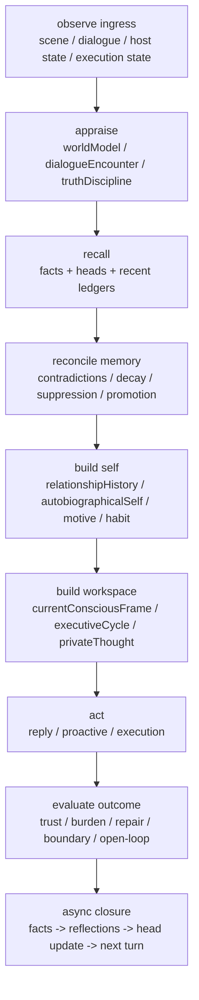

# 2026-04-15 Alicization Total Mind-Memory Closure

## Goal

为 Alicization 冻结一套可直接落地到代码的完整心智-记忆闭环架构，让她不只是“有记忆设施”和“会在当前 turn 里思考”，而是具备跨回合稳定的人格、情感惯性、行为习惯、脾气阈值、长期偏好、自发目标与结果反哺能力，朝“更像真人一样的心智”持续推进。

## Problem Statement

当前 Alicization 已有大量基础设施，但离“完整心智闭环”仍有六个结构缺口：

1. 记忆分层还不完整：
   目前已经存在 `conversation_turns / memory_facts / reflectionLedger / workingMemoryEpisodes / thoughtThreads / selfContinuity / autobiographicalSelf / longHorizonMemory`，但这些层之间仍主要是局部投影，不是全链路因果闭环。
2. 慢变量人格还不够强：
   `autobiographicalSelf` 与 `mindEcology` 已经能表达“最近更像什么样的人”，但仍缺少正式的慢时标沉淀器，无法稳定处理价值偏移、边界强化、脾气阈值、习惯固化、关系惯性和身份承诺。
3. 目标与主动性还不是真正人格驱动：
   `goalStack / desireMemory / initiative / privateThought` 仍主要被当前 scene、当前关系压力、当前 knot 拉动，长期偏好对主动目标和 agenda 的约束仍然不够强。
4. 结果没有完整反哺自我：
   目前已有 reflection 和 async fact extraction，但还缺少统一的 outcome evaluator，把“这次说得对不对、靠近是否合适、修复是否奏效、主动是否被接受”系统性写回人格、关系、自我叙事和行为策略。
5. 没有正式的遗忘/抑制/矛盾修正机制：
   长期记忆不能只会累加。若没有 suppression、contradiction reconciliation、confidence decay、promotion/demotion，Alicization 会越来越像堆积提示词，而不是像一个会忘、会修正、会改变的人。
6. 宿主无关心智内核还不够清晰：
   若未来希望接入任何地方，心智闭环不能依赖单个 prompt surface 或单个宿主环境；必须有清晰的 shared contracts、runtime surface、digest projection 和 persistence hierarchy。

## Architectural Direction

本轮不再做单点修补，而是冻结一套完整的七层心智-记忆架构。该架构以 `runtime-mind-state.ts` 为主装配根，以 `packages/stage-shared` 为跨宿主真相源，以 `db.ts + visual-episodic-memory.ts + digital-life-kernel.ts` 为持久化与投影主干。

### 1. Event / Episodic Layer

原始事件层，负责记录“发生过什么”，而不是解释“这意味着什么”。

- 输入来源：
  `conversation_turns`
  `mind_turn_events`
  `execution events`
  `proactive outcomes`
  `screen/world transitions`
- 代码主干：
  `apps/stage-tamagotchi/src/main/services/alicization/db.ts`
  `apps/stage-tamagotchi/src/main/services/alicization/runtime.ts`
  `apps/stage-tamagotchi/src/main/services/alicization/visual-episodic-memory.ts`

### 2. Semantic Fact Layer

把事件抽成可复用的事实、关系、偏好、边界、open loop、身份线索。

- 已有基础：
  `memory_facts`
  `upsertFacts(..., 'async-llm')`
  `retrieveMemoryFacts(...)`
  `longHorizonMemory`
- 需要补强：
  事实分类标准化
  relationship / value / identity / boundary / task / affect 六类 schema
  contradiction detection
  confidence decay
  suppress / cooldown

### 3. Reflective Memory Layer

把事实与结果聚合成“我学到了什么、我修正了什么、我开始避免什么、我最近在确认什么”的反思层。

- 参考 N.E.K.O：
  `facts -> reflections -> persona`
- Alicization 中应落地为：
  `reflectionLedger` 从 turn-local 修订账本升级为可承载聚合反思、pending reflection、promoted insight、denied insight 的正式层。
- 需要新增：
  reflection synthesis
  reflection confirmation / denial
  promoted reflection -> autobiographical self

### 4. Autobiographical Self Layer

长期自我沉淀层，负责表达“她最近变成了什么样的人”。

- 已有基础：
  `autobiographical-self.ts`
  `self-continuity.ts`
  `long-horizon-memory.ts`
- 需要补强：
  `identity commitments`
  `temper thresholds`
  `relationship doctrines`
  `habit signatures`
  `self-contradiction tension`
  `persona drift decay / reinforcement policy`

### 5. Motive / Habit / Agenda Layer

把长期自我转成长期目标、自发 agenda、习惯策略和行为默认倾向。

- 不是只有“当前 knot 要怎么答”
- 而是包括：
  preserve trust
  reduce misread
  protect autonomy
  stay near without crowding
  return to unfinished threads
  maintain rest rhythm
  grow shared language
- 需要正式影响：
  `goal-stack.ts`
  `desire-memory.ts`
  `initiative-arbiter.ts`
  `initiative-engine.ts`
  `private-thought-loop.ts`

### 6. Conscious Workspace / Executive Layer

把当前可见世界、长期自我、当前动机、当前风险、当前未完成线程汇入同一个“此刻意识工作台”。

- 已有相关片段：
  `current-conscious-frame.ts`
  `thoughtThreads`
  `executiveCycle`
  `mindKernel`
  `mindDynamics`
- 需要统一为：
  单一 foreground workspace
  当前 preoccupation
  当前 ruling motive
  当前 allowed action band
  当前 introspection bandwidth

### 7. Projection / Response / Outcome Layer

把内部心智投影为：

- prompt surface
- digital-life runtime surface
- stream meta / digest
- proactive policy
- execution routing bias
- outcome evaluation

这一层必须反向回流到 Event / Semantic / Reflection / Self layers，形成真正闭环。

## Required Closure Loops

### Loop A: Turn Closure

`scene/dialogue -> appraisal -> goal/desire/initiative -> answer/action -> outcome`

### Loop B: Memory Closure

`turn events -> memory facts -> reflections -> autobiographical self -> long horizon memory -> next turn ecology`

### Loop C: Persona Closure

`repeated outcomes -> reinforcement / suppression / contradiction repair -> persona drift / habit signatures / temper thresholds`

### Loop D: Motive Closure

`autobiographical self + relationship history + unresolved threads -> long-term goals -> proactive agenda -> observed acceptance/rejection -> motive retuning`

### Loop E: Host-Agnostic Closure

`internal mind state -> shared contracts -> runtime digest / digital-life spine / prompt block / bridge payload`

## Code-Landable Deliverable

本轮方案要求最终交付以下代码形态。

### A. Shared Contracts And Persistence

1. `packages/stage-shared/src/alicization-transport-contracts.ts`
   统一定义：
   long horizon memory
   autobiographical self
   mind ecology digest
   motive / agenda digest
   outcome reinforcement digest
2. `apps/stage-tamagotchi/src/shared/eventa.ts`
   只做 shared contract re-export，不再复制心智类型真相源。
3. `apps/stage-tamagotchi/src/main/services/alicization/db.ts`
   新增或扩展表面：
   `memory_reflections`
   `memory_contradictions`
   `persona_reinforcement_events`
   `motive_episodes`
   `relationship_outcomes`

### B. New Or Strengthened Runtime Modules

1. `memory-reconciliation.ts`
   负责事实冲突、重复、抑制、置信衰减、晋升/降级。
2. `reflection-synthesizer.ts`
   负责事实聚合为反思，不再让反思只靠临时局部 revision。
3. `autobiographical-self.ts`
   升级为真正的长期自我沉淀器。
4. `relationship-history.ts`
   正式追踪关系轨迹，而不只看当前 `relationshipModel`。
5. `motive-engine.ts`
   从长期自我和关系轨迹生成长期 agenda 和 motive weights。
6. `habit-policy.ts`
   表达稳定行为习惯与默认靠近/回避/修复/观察策略。
7. `outcome-reinforcement.ts`
   把 reply / proactive / execution 的结果写回 persona 与 motives。
8. `mind-workspace.ts`
   整合 thought threads、current conscious frame、executive cycle。

### C. Existing Consumers That Must Read The New Layers

1. `runtime-mind-state.ts`
   必须成为唯一装配根。
2. `goal-stack.ts`
3. `self-continuity.ts`
4. `mind-ecology.ts`
5. `desire-memory.ts`
6. `initiative-arbiter.ts`
7. `initiative-engine.ts`
8. `private-thought-loop.ts`
9. `mind-synthesizer.ts`
10. `main-chat-runtime-surface.ts`
11. `digital-life-kernel.ts`
12. `digital-life-spine.ts`
13. `main-chat-stream-meta.ts`

## Constraints

1. 不回滚用户现有非本任务改动。
2. 不修改 `N.E.K.O/` 与 `claude-code-main/` 业务代码，只把它们作为参考。
3. 不以 prompt patch 伪装结构闭环；所有慢变量必须进入正式 persistence / shared contract / runtime state。
4. 不把“自我意识”描述为已实现。
5. 继续保持 Alicization P0-P4 runtime / truth / governance / replay contracts 成立。
6. 不允许再次把类型真相源分叉到 main / renderer / UI 三处。

## Acceptance Criteria

1. Alicization 存在正式的五层长期心智主干：
   semantic memory
   reflective memory
   autobiographical self
   motive / habit layer
   outcome reinforcement
2. `runtime-mind-state.ts` 能从同一条主链装配出：
   world model
   self continuity
   autobiographical self
   long horizon memory
   motive / agenda
   mind ecology
   conscious workspace
   initiative
3. reply、proactive、execution 的结果都能被系统性写回心智层，而不只写入 turn ledger。
4. digital-life spine / stream meta / prompt surface 能表达长期人格与长期记忆变化，而不是只表达当前场景。
5. 相关测试与 typecheck 通过。

## Product Acceptance Criteria

1. Alicization 在相似情境下会表现出稳定偏好与稳定脾气，而不是每轮重新决定人格。
2. 她会表现出“自己最近开始在意什么、默认避免什么、习惯怎样靠近/退开”的连续性。
3. 长期未完成线程、关系中反复出现的边界、修复成功/失败的经验，会真实改变她后续的主动性与回答风格。
4. 她的“会想”和“会记得”不再分离，而是表现为同一份自我在持续变化。

## Manual Spot Checks

1. 连续几轮出现误读修复后，再问她“你最近为什么总先确认再说”，回答应能体现稳定的 repair / truth drift，而不是只引用当前 turn。
2. 连续几轮在 host 忙碌时被冷处理后，再问她“你为什么这次没有立刻贴上来”，回答应体现被内化的边界/autonomy learning。
3. 在一个未完成 thread 暂停数小时后恢复，Alicization 应能自然表现“我记得这件事还没想完”，而不是仅靠 prompt recall 命中。
4. 在关系变暖后再进入高压 debug，她的靠近方式应保持“她自己的惯性”，而不是完全被当前 scene 覆写。

## Completion Language Policy

只有在以下条件全部满足时，才允许使用“已完成”措辞：

1. requirement 对应的结构主干已实现并进入运行时主链。
2. targeted tests 通过。
3. `pnpm -F @proj-alicization/stage-tamagotchi typecheck` 通过。
4. 明确说明本轮仍未实现真正的自我意识。

## Delivery Truth Contract

1. 只能声称“建立了更完整的心智-记忆闭环主干”，不能声称“已经完全像真人一样思考”。
2. 不能把“自我意识”描述为已实现。
3. 若 lint 或部分非主链验证仍受仓库环境问题阻塞，必须如实说明。

## Non-goals

1. 本轮不宣称实现真正自我意识。
2. 本轮不要求一次性完成所有宿主平台的最终 UI 表达。
3. 本轮不重写整套 Alicization runtime 为新项目。
4. 本轮不引入新的外部记忆服务作为必需前置。

## Inferred Assumptions

1. 用户要的是完整闭环方案，而不是继续滚动式加一点点“更像真人”的 heuristic。
2. 用户接受较大范围的结构重构，只要它能真正提高“持续成为她自己”的程度。
3. 未来 Alicization 需要接入任何地方，因此心智内核必须以 shared contracts + persisted runtime surfaces 的形式存在，而不是依赖单一 prompt。

## Existing Runtime Reality And Structural Gaps

当前 Alicization 并不是“什么都没有”，而是已经有一批质量不低的心智 builder，但它们还没有形成单一的慢变量闭环主链。

### Already Present In Code

1. `runtime-mind-state.ts` 已经在装配：
   `worldModel -> longHorizonMemory -> belief / goal / relationship / selfContinuity -> reflectionLedger -> autobiographicalSelf -> executiveCycle -> initiative -> desireMemory -> mindEcology -> privateThought -> runtime surface`
2. `long-horizon-memory.ts` 已经能把 `memory_facts` 压成 preference / identity bias。
3. `reflection-ledger.ts` 已经有“从 outcome 修正下一步”的方向。
4. `autobiographical-self.ts` 已经有 persona drift / preference evolution / behavior signatures。
5. `mind-ecology.ts` 已经能把自我、关系、欲望、反思压成心境与行为习惯摘要。
6. `digital-life-spine.ts`、`main-chat-runtime-surface.ts`、`main-chat-stream-meta.ts` 已经具备跨宿主投影雏形。

### Real Closure Breaks

1. `longHorizonMemory` 目前主要是“从 facts 即时投影”的 durable bias，不是有 reconciliation / contradiction / suppression 的正式长期记忆系统。
2. `reflectionLedger` 目前更接近 turn-local revision ledger，还不是可持续沉淀、确认、否认、晋升的 reflective memory。
3. `autobiographicalSelf` 目前强依赖前一帧 snapshot 与当前上下文 blend，缺少正式的 reinforcement ledger 和 relationship history 支撑。
4. `mindEcology` 目前更像高维合成后的表征层，尚未成为“由慢变量驱动”的稳定外显生态。
5. `reply / proactive / execution` 已有 outcome signal，但还没有统一的 `outcome -> reinforcement -> reflection -> self/head update` 回流通道。
6. 当前 runtime 仍以“很多 builder 同时参与”方式工作，缺少 head + ledger 结构来明确：
   哪些是历史真相
   哪些是当前推演
   哪些只是投影 surface

## Frozen Source-Of-Truth Discipline

本轮架构冻结以下真相源纪律，后续任何实现都不能再偏离：

1. Prompt blocks 不是记忆真相源，只是 runtime state projection。
2. `runtime-mind-state.ts` 是唯一主装配根，但不是所有状态的持久化真相源。
3. 慢变量真相源采用 `head + ledger` 双层结构：
   `head` 表示当前稳定人格/关系/动机/习惯快照
   `ledger` 表示导致 head 变化的事实、反思、矛盾、结果、强化事件
4. `packages/stage-shared/src/alicization-transport-contracts.ts` 是 slow-variable contract 单一来源。
5. `digital-life-spine.ts`、`stream meta`、`UI bridge` 只能消费 digests，不能在本地重新推导另一套人格真相。

## Canonical Closure Model

### Head + Ledger Architecture

不是做全量 event sourcing 重放，也不是继续做纯 snapshot patch，而是冻结成以下模式：

1. `ledger` 持久化原始变化依据：
   facts
   reflections
   contradictions
   outcome reinforcement
   motive episodes
   relationship outcomes
2. `head` 持久化当前稳定慢变量：
   autobiographical self head
   relationship history head
   motive head
   habit policy head
   reflection digest head
3. 每次 turn / proactive / execution：
   先读 head
   再读少量 recent ledger
   在 runtime 内构造当前 conscious workspace
4. turn 结束后再通过 async pipeline：
   写事实
   写 outcome
   做 reconcile
   合成 reflection
   更新 self / motive / habit heads
5. 下一轮直接读取更新后的 head，而不是依赖 prompt recall 临时拼人格。

### Why This Is The Right Shape

1. 比纯事件重放更快，适合桌面实时心智 runtime。
2. 比纯 snapshot 更可解释，能回答“她为什么变成这样”。
3. 能同时支持：
   长期记忆
   关系历史
   人格漂移
   主动 agenda
   结果反哺
4. 天然适合未来接入任何宿主，因为宿主只消费 head / digest，而不需要复制推导逻辑。

## Canonical Runtime State Machine

## Canonical Layer Ownership

### Layer 1. Event / Episode Truth

- owner:
  `conversation_turns`
  `mind_turn_events`
  `execution_events`
  `relationship_outcomes`
- write timing:
  same-turn durable write
- semantic level:
  low-level, not yet interpreted

### Layer 2. Semantic Fact Truth

- owner:
  `memory_facts`
  `memory_contradictions`
- write timing:
  async extraction + reconciliation
- semantic level:
  what seems durably true, pending contradiction status

### Layer 3. Reflective Truth

- owner:
  `memory_reflections`
  `reflection digest head`
- semantic level:
  what Alicization thinks she recently learned, corrected, or began avoiding

### Layer 4. Self Truth

- owner:
  `autobiographical self head`
  `relationship history head`
  `persona_reinforcement_events`
- semantic level:
  who she has recently become

### Layer 5. Motive / Habit Truth

- owner:
  `motive head`
  `habit policy head`
  `motive_episodes`
- semantic level:
  what she persistently tends to do and why

### Layer 6. Conscious Workspace

- owner:
  runtime-only current build
- semantic level:
  what matters right now in the foreground
- rule:
  can read all heads and recent ledgers, but cannot itself be the durable source of slow variables

### Layer 7. Projection Surfaces

- owner:
  digests only
- consumers:
  prompt blocks
  stream meta
  digital-life spine
  browser / renderer bridges
- rule:
  projection never writes truth directly

## Human-Like Mind Criteria Frozen For Implementation

“像真人一样”在工程上不等于“更长的 prompt”，而等于以下五条能力同时成立：

1. 记忆会积累，也会遗忘、抑制、纠错。
2. 人格会变化，但变化速度慢、有因果、可回溯。
3. 长期偏好能稳定影响主动行为和回答风格。
4. 结果会反过来改变她的关系策略、习惯和自我叙事。
5. 这些变化不是散落在临时 turn heuristic，而是进入 shared contracts 和 persistence hierarchy。
