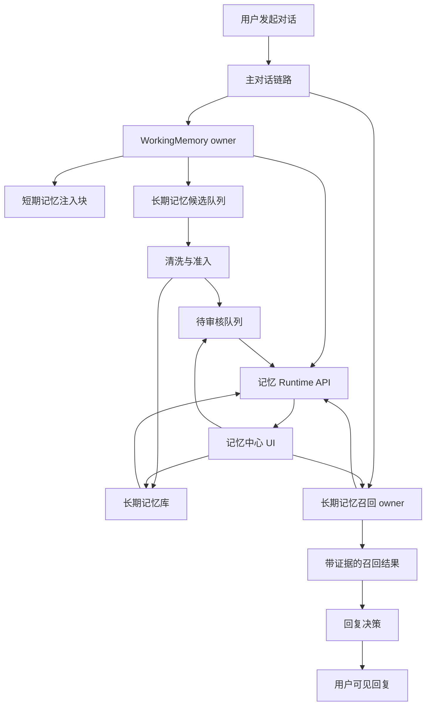

# Alicization 记忆对话可视闭环设计

> 状态：已确认设计方向，等待用户审阅文档  
> 范围：让短期记忆和长期记忆真正服务用户对话，并提供用户可见、可纠正、可删除、可测试的记忆面板。  
> 主要落点：`apps/stage-tamagotchi` 桌面生命循环、`apps/stage-tamagotchi/src/shared/eventa.ts`、`apps/stage-tamagotchi/src/main/services/alicization`、`packages/stage-ui/src/stores/alicization-bridge.ts`、`apps/stage-tamagotchi/src/renderer/pages`。

## 背景

Alicization 当前已经完成了一部分记忆底座：

- 短期记忆由 `WorkingMemory owner` 承担，已经能生成当前话题、任务、用户纠正、承诺、查询提示和长期记忆候选队列。
- 主对话链路已经注入 WorkingMemory owner block，并能调用长期记忆召回 block。
- 长期记忆后端已有 recall intent、query expansion、hybrid retrieval、review queue、tombstone、persona training candidate 桥。
- 长期记忆写入已经从 WorkingMemory owner 的结构化队列出发，而不是直接吃原始对话。

但这还不能算“记忆真正给用户对话使用”。

当前缺口是：

- 用户无法看见当前 WorkingMemory 到底认为这轮对话在做什么。
- 用户无法看见长期记忆候选为什么进入审核、为什么被批准或拒绝。
- 用户无法手动批准、拒绝、删除、设为只内在使用、禁止训练。
- 用户无法测试一句话会召回什么记忆，也无法看到召回理由。
- 对话端无法稳定暴露“这轮用了哪些短期记忆、哪些长期记忆、哪些被抑制”。
- 失败路径仍需要保持透明，不能让超时、provider 失败或召回失败伪装成数字生命人格表达。

本设计的目标是把后端记忆能力封成可调用、可显示、可审计、可验证的产品闭环。

## 目标

第一目标：让每一轮用户对话都能稳定使用记忆。

- WorkingMemory 是短期记忆 owner。
- LongTermMemoryRecall 是长期记忆召回 owner。
- DialogueCore 只消费带证据和理由的记忆候选，不直接翻数据库。
- 失败时明确报告失败，不生成固定人格模板。

第二目标：让用户能看见和控制记忆。

- 看见当前短期记忆状态。
- 看见长期记忆库里的事实、事件、关系、流程、人格相关候选。
- 看见待审核记忆。
- 对待审核记忆执行批准、拒绝、删除、只内在使用、禁止训练。
- 对任意输入做召回测试。

第三目标：让人格学习保持可控。

- 人格训练候选只来自清洗后的 reflection、reinforcement、procedure、relationship 行为样本。
- 原始对话、失败 fallback、超时回复、provider 错误不进入人格训练。
- 用户能在 UI 中看见哪些候选允许进入训练数据，哪些被排除。

## 非目标

- 不在本阶段实现夜间自动微调。
- 不在本阶段把所有历史原始对话全量向量化。
- 不在本阶段引入图数据库作为硬依赖。
- 不在本阶段重做整个对话 UI。
- 不在本阶段把 performance visualizer 继续扩成普通用户记忆面板。
- 不在本阶段让 UI 直接读取 SQLite 或内部模块。
- 不在本阶段让长期记忆覆盖 WorkingMemory 当前任务 owner。

## 总体架构

本阶段增加一个可见闭环层，位于后端记忆模块和 renderer UI 之间。



核心原则：

- Runtime API 是 UI 的唯一入口。
- UI 不绕过 Eventa/IPC 直接读后端实现。
- 所有用户动作都写回后端 owner。
- 所有召回结果都带来源、理由、置信度、可见策略。
- 所有失败都在 API 结果中透明表达。

## Runtime API 设计

新增一组 `electronAlicizationMemoryWorkbench*` Eventa invoke 合同。

### 1. 获取记忆中心快照

用途：打开面板时加载总览。

输入：

```ts
interface AlicizationMemoryWorkbenchSnapshotPayload {
  cardId?: string
  sessionId?: string | null
}
```

输出：

```ts
interface AlicizationMemoryWorkbenchSnapshot {
  cardId: string
  sessionId: string | null
  updatedAt: number
  workingMemory: AlicizationWorkingMemoryWorkbenchSnapshot | null
  longTerm: AlicizationLongTermMemoryWorkbenchSummary
  review: AlicizationLongTermMemoryReviewSummary
  health: AlicizationMemoryWorkbenchHealth
}
```

规则：

- `workingMemory` 来自当前 `WorkingMemoryStore`。
- `longTerm` 来自 facts、reflections、episodic events、consolidations 的轻量摘要。
- `review` 来自 `listLongTermMemoryReviewItems`。
- `health` 汇总队列、失败、召回延迟、embedding 状态。
- 如果某个子模块失败，快照仍返回，其失败写入 `health.errors`。

### 2. 列出当前短期记忆

用途：让用户看见她此刻“心里拿着什么”。

输出包含：

- 当前线程标题和模式。
- 当前用户动作。
- 活跃任务和状态。
- 未解决问题。
- 承诺。
- 用户纠正。
- 情绪姿态。
- 关系姿态。
- 查询提示。
- 长期记忆候选队列。
- 失败审计 turn id。

约束：

- 不显示原始系统提示词。
- 不显示 provider credentials。
- 不把失败审计 turn 当成“人格记忆”展示。

### 3. 列出长期记忆

用途：让用户查看已保存记忆。

过滤能力：

- `kind`: fact、episode、reflection、consolidation、procedure、relationship、preference。
- `query`: 用户输入搜索。
- `sensitivity`: public、personal、private、secret。
- `visibility`: explicit、inward-only。
- `training`: allowed、blocked。
- `source`: working-memory-owner、manual、legacy、runtime。
- `limit` 和 `cursor`。

返回字段：

- id。
- kind。
- summary。
- evidence snippets。
- source ids。
- confidence。
- salience。
- sensitivity。
- visibility。
- allowTraining。
- createdAt、updatedAt、lastAccessedAt。
- tombstoned 状态。

### 4. 待审核记忆操作

用途：把长期记忆写入变成用户可控流程。

动作：

- approve：批准进入长期记忆。
- reject：拒绝，不写入长期记忆。
- tombstone：删除或永久屏蔽相关来源。
- inward-only：允许记住，但默认不显性说出。
- no-training：允许记住，但禁止进入人格训练候选。

约束：

- 高敏感记忆默认需要审核。
- `private` 和 `secret` 默认 inward-only。
- 用户手动 `no-training` 的决定优先级高于自动规则。
- tombstone 必须过滤长期召回结果。

### 5. 召回测试

用途：用户输入一句话，查看她会回想起什么。

输入：

```ts
interface AlicizationMemoryRecallProbePayload {
  cardId?: string
  query: string
  sessionId?: string | null
  includeWorkingMemory?: boolean
  limit?: number
}
```

输出：

```ts
interface AlicizationMemoryRecallProbeResult {
  query: string
  intent: {
    mode: string
    shouldRecall: boolean
    confidence: number
    rationale: string
    temporalFocus: string
    riskFlags: string[]
  }
  plan: {
    keywordQueries: string[]
    phraseQueries: string[]
    charGramQueries: string[]
    semanticQueries: string[]
    episodicQueries: string[]
    threadHints: string[]
    negativeCues: string[]
    confidencePolicy: string
  }
  evidence: Array<{
    id: string
    kind: string
    summary: string
    source: string
    score: number
    visibleMode: string
    queryMatches: string[]
    rankReasons: string[]
  }>
  latencyMs: number
  errors: string[]
}
```

验收样例：

- “我们去打游戏吧”：应召回共同游戏事件。
- “不要固定模板回复”：应召回用户纠正和人格边界。
- “继续上次那个任务”：应优先召回 WorkingMemory 活跃任务，再补长期任务记忆。
- “今天吃什么”：如果没有明确记忆需求，不应宽泛召回无关内容。

### 6. 人格训练候选预览

用途：让用户看见哪些清洗后的样本可能进入人格训练数据。

数据来源：

- cleaned reflection。
- persona reinforcement。
- procedure 行为样本。
- relationship boundary。
- 用户确认的稳定偏好。

禁止来源：

- raw transcript。
- timeout fallback。
- provider failure。
- tool failure。
- 被 tombstone 的来源。
- 用户标记 no-training 的记忆。

## UI 设计

新增独立页面：记忆中心。

建议路径：

- `apps/stage-tamagotchi/src/renderer/pages/settings/memory/index.vue`

原因：

- 记忆中心是用户日常可理解的控制面板，不只是开发调试工具。
- performance visualizer 已经承担大量运行时诊断，继续塞会降低可用性。
- 设置页已有 route meta 入口机制，适合增加一个稳定面板。

### 页面布局

页面采用安静、密集、可扫描的工具界面。

顶部：

- 记忆健康摘要。
- 当前会话。
- 待审核数量。
- 最近召回延迟。
- embedding/reindex 状态。

主区域使用 tabs：

1. 当前短期记忆
2. 长期记忆
3. 待审核
4. 召回测试
5. 人格候选
6. 健康与审计

### 当前短期记忆 tab

展示：

- 当前线程。
- 活跃任务。
- 未解决问题。
- 承诺。
- 用户纠正。
- 关系姿态。
- 情绪姿态。
- query hints。
- long-term queue。

操作：

- 刷新。
- 复制诊断摘要。
- 对候选执行“不记住”。

### 长期记忆 tab

展示：

- 分类型列表。
- 搜索框。
- sensitivity 和 visibility 筛选。
- 每条记忆的证据、置信度、salience、来源。

操作：

- 删除或 tombstone。
- 标记 inward-only。
- 标记 no-training。
- 打开“为什么会召回”详情。

### 待审核 tab

展示：

- 待审核记忆卡片。
- 清洗后的 summary。
- evidence snippets。
- review reasons。
- sensitivity。
- 默认 visible mode。
- allowTraining 状态。

操作：

- approve。
- reject。
- tombstone。
- inward-only。
- no-training。

### 召回测试 tab

展示：

- 输入框。
- recall intent。
- query plan。
- ranked evidence。
- latency。
- risk flags。
- 被 tombstone 或 sensitivity 抑制的说明。

操作：

- 运行测试。
- 把结果保存为回放评测样例。
- 从结果进入对应长期记忆详情。

### 人格候选 tab

展示：

- 训练候选。
- 来源记忆。
- 为什么允许或禁止训练。
- 是否经过用户确认。

操作：

- no-training。
- inward-only。
- 标记需要重新审查。

### 健康与审计 tab

展示：

- WorkingMemory snapshot 时间。
- 长期记忆队列 pending、review、applied、failed、dead-lettered 数量。
- 最近召回 p95 latency。
- embedding provider 状态。
- reindex 状态。
- 最近错误。

失败表达：

- API 失败显示具体模块和错误摘要。
- 不使用人格化固定安抚文案。
- 不把失败当成“她的正常回复风格”。

## 对话链路规则

每一轮主对话按以下顺序处理：

1. 从当前 runtime surface 和最近消息构建 WorkingMemory snapshot。
2. 保存 WorkingMemory snapshot。
3. 从 WorkingMemory owner 生成当前 obligations 和 query hints。
4. 如果用户消息有长期记忆信号，调用 LongTermMemoryRecall。
5. LongTermMemoryRecall 返回 evidence bundle。
6. 注入 WorkingMemory owner block。
7. 注入 WorkingMemory prompt block。
8. 注入 long-term recalled memory block。
9. DialogueCore 根据记忆可见策略决定显性回想、隐性携带或不使用。
10. WorkingMemory owner 产出的长期候选进入清洗队列。
11. 清洗后进入长期记忆、待审核或拒绝。
12. UI 可以查看这一轮的短期状态、召回结果和候选流转。

优先级：

- 当前 WorkingMemory 活跃任务和用户纠正优先于长期召回。
- 长期召回不能覆盖当前 turn 的直接用户意图。
- 低置信长期记忆只能 tentative 或 inward-only。
- private 和 secret 默认 inward-only。
- tombstone 结果不能进入对话。

## 数据所有权

`WorkingMemory owner` 拥有：

- 当前短期状态。
- 当前任务。
- 当前关系姿态。
- 当前纠正和承诺。
- 长期记忆候选出口。

`LongTermMemoryRecall owner` 拥有：

- recall intent。
- query plan。
- hybrid retrieval。
- evidence ranking。
- visible mode。
- rank reasons。

`LongTermMemoryReview owner` 拥有：

- review item。
- approve/reject/tombstone 决策。
- inward-only/no-training 用户标记。

`MemoryWorkbench API` 拥有：

- 面向 UI 的稳定 DTO。
- 子模块错误聚合。
- 性能与健康摘要。

`MemoryWorkbench UI` 拥有：

- 展示状态。
- 用户操作入口。
- 召回测试输入。
- 不拥有记忆业务规则。

## 性能约束

面板打开不能拖慢主对话。

约束：

- 快照 API 默认轻量返回。
- 长期记忆列表分页。
- 召回测试手动触发，不自动对每次输入实时召回。
- health 数据聚合使用已有计数和索引。
- review 列表默认最多 50 条。
- recall probe 默认最多 8 条 evidence。
- UI 刷新节流，不轮询高频运行时数据。

主对话约束：

- WorkingMemory 构建保持同步轻量。
- 长期召回失败不阻塞回复。
- embedding 不可用时继续 lexical/hybrid fallback。
- 长期候选清洗异步执行，不阻塞用户可见回复。

## 错误处理

错误分三类：

1. 对话失败：provider 超时、provider 错误、abort。
2. 记忆失败：召回失败、清洗失败、写入失败、review 写回失败。
3. UI 失败：API 不可用、数据解析失败、权限或 card scope 错误。

规则：

- 对话失败直接面向用户说明失败原因。
- 记忆失败写入 health 和 audit，不伪装成人格回复。
- UI 失败显示具体模块错误。
- 失败 turn 默认排除训练。
- 失败 turn 默认不进入长期记忆。
- 失败信息可以作为审计数据保留。

## 测试策略

后端测试：

- Eventa 类型和 payload 编译测试。
- MemoryWorkbench snapshot 聚合测试。
- WorkingMemory snapshot 暴露测试。
- LongTermMemory review 操作写回测试。
- tombstone 后 recall 过滤测试。
- recall probe 测试。

对话测试：

- “我们去打游戏吧”召回共同游戏事件。
- “不要固定模板回复”召回用户纠正。
- “继续上次那个任务”优先使用 WorkingMemory 活跃任务。
- 召回失败不污染 visible reply。
- provider 超时不输出固定人格模板。

UI 测试：

- 记忆中心渲染空状态。
- review approve/reject/tombstone 操作调用 bridge。
- recall probe 展示 intent、query plan、evidence、latency。
- 筛选器不会导致布局溢出。

验收命令：

```bash
pnpm exec vitest run apps/stage-tamagotchi/src/main/services/alicization/db.test.ts
pnpm exec vitest run apps/stage-tamagotchi/src/main/services/alicization/main-chat-session-runtime.test.ts
pnpm exec vitest run apps/stage-tamagotchi/src/main/services/alicization/long-term-memory-recall.test.ts
pnpm exec vitest run apps/stage-tamagotchi/src/main/services/alicization/long-term-memory-review-queue.test.ts
pnpm -F @proj-alicization/stage-tamagotchi typecheck
```

## 分阶段交付

### 阶段 1：Runtime API 闭环

交付：

- 新增 Eventa 类型和 invoke 合同。
- main handler 暴露 MemoryWorkbench snapshot。
- main handler 暴露 review 操作。
- main handler 暴露 recall probe。
- bridge 增加对应方法。
- 后端测试通过。

完成标准：

- renderer 可以通过 bridge 获取短期记忆、长期摘要、待审核、health。
- renderer 可以运行 recall probe。
- renderer 可以 approve/reject/tombstone review item。

### 阶段 2：记忆中心 UI

交付：

- 新增记忆中心页面。
- 新增 UI store。
- 当前短期记忆 tab。
- 长期记忆 tab。
- 待审核 tab。
- 召回测试 tab。
- 健康与审计 tab。

完成标准：

- 用户能看到 WorkingMemory 当前状态。
- 用户能看到待审核记忆并执行操作。
- 用户能输入测试句子查看召回结果。
- 用户能删除或限制长期记忆。

### 阶段 3：对话验收闭环

交付：

- 端到端记忆 dogfood case。
- 召回结果进入对话 trace。
- 对话失败和召回失败分离。
- UI 可查看最近一轮记忆使用摘要。

完成标准：

- 用户日常聊天能自然接上短期记忆和长期记忆。
- 用户能解释为什么她想起或没有想起某件事。
- 用户能纠正、删除、禁止训练。

### 阶段 4：增强项

交付：

- embedding provider 配置状态。
- reindex 状态和手动触发入口。
- 召回评测样例保存。
- persona training candidate 审核视图。

完成标准：

- 更换 embedding model 时可以看见 reindex 需求。
- 人格训练数据在进入训练前可审查。
- 召回质量有可回放评测。

## 验收定义

本阶段完成后，应该能回答以下问题：

- 她这轮为什么这样回复？
- 她这轮用了哪些短期记忆？
- 她这轮想起了哪些长期记忆？
- 她为什么没有想起某条记忆？
- 她准备记住什么？
- 用户是否批准这条记忆？
- 这条记忆是否会进入人格训练？
- 这条记忆是否只允许内在使用？
- 用户删除后，为什么不会再召回？
- 如果召回失败或 provider 超时，系统是否透明说明了失败？

只有这些问题都能从 Runtime API 和 UI 中得到清楚答案，短期记忆与长期记忆才算真正进入对话产品闭环。
