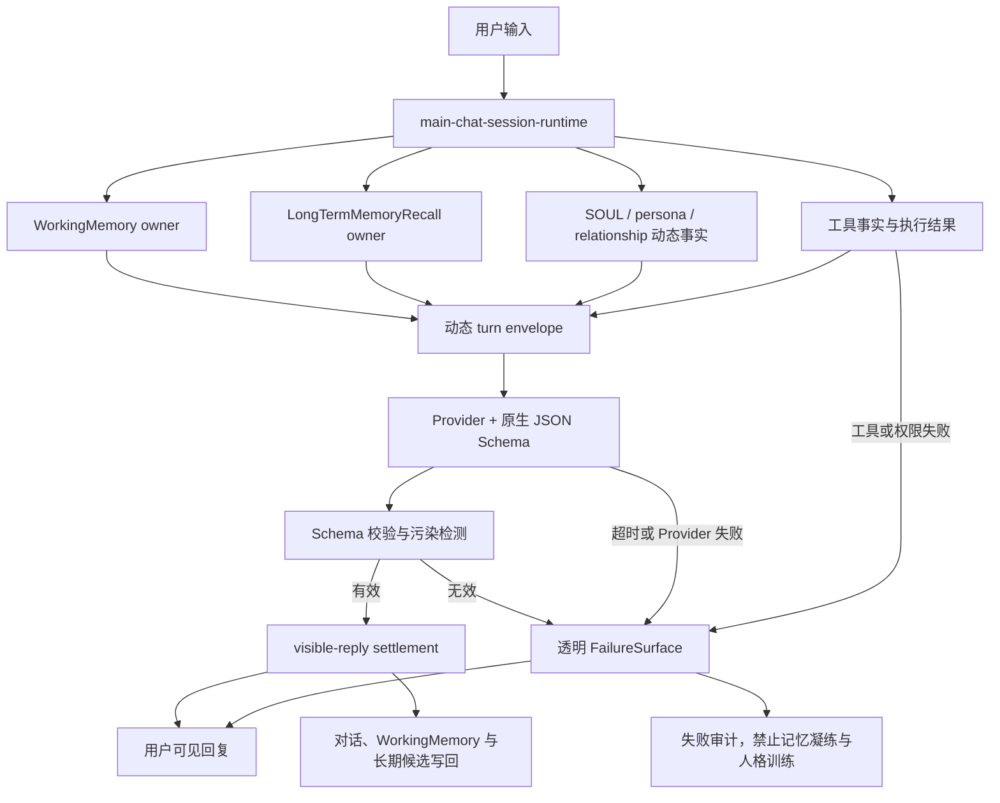

# Alicization 记忆归属的单一对话主链路设计

> 状态：现行边界。2026-07-16 已落实单一 Provider 主链路，并删除本地回复重写、普通 fallback authoring 与 dead renderer。
> 日期：2026-07-13
> 范围：删除普通对话的固定自然语言 system prompt、固定回复模板、固定回复治理和本地普通回复旁路，让所有正常回复统一由 Provider 基于动态人格、短期记忆、长期记忆和工具事实生成。
> 主要落点：`apps/stage-tamagotchi` 桌面主对话运行时、`packages/stage-shared` 的对话协议与失败面、`packages/stage-ui` 的 renderer 对话入口。

## 背景

Alicization 已经具备可用的记忆骨架：

- `WorkingMemory` 是短期记忆 owner，维护当前会话、任务、纠正、承诺、情绪残留和长期候选。
- `LongTermMemoryRecall` 是长期回想 owner，负责召回意图、查询规划、证据选择和排序理由。
- `SOUL.md`、稳定身份事实和关系状态提供动态人格事实。
- 工具执行、visible-reply settlement、失败审计和记忆写回已经存在。

此前对话链路存在第二套隐性心智：

- 固定自然语言 system instruction 会在动态人格和记忆之外再次规定她应该怎样说话。
- greeting、identity、utility、tool result 等本地分支可以绕过统一 Provider 主链路。
- 本地 fallback、repair 和 renderer composer 会在 Provider 回复之外生成普通用户可见台词。
- Provider 候选失败后仍存在本地重写思路，会再次塑造回复并可能丢失短期或长期记忆证据。
- compact timeout recovery 会尝试恢复一段像正常人格表达的回复，而不是直接暴露基础设施失败。

这些路径让用户无法判断一句话究竟来自人格与记忆，还是来自预制模板。它们也会让失败文本、工程态口号和修复台词污染长期记忆与人格学习。

本设计把正常对话收敛为一条主链路，并明确什么可以保留为机器协议，什么必须删除。

## 目标

1. 所有正常用户可见回复都由同一个 Provider 主链路生成。
2. `WorkingMemory` 和 `LongTermMemoryRecall` 在每个正常 turn 中保持明确 owner 身份。
3. 人格来源只包括 `SOUL.md`、用户治理后的稳定人格事实、关系事实和已确认记忆，不包括固定回复模板。
4. Provider 输出只受原生 JSON Schema 机器协议约束，不再受固定自然语言 system prompt 约束。
5. detector 和 sanitizer 只能识别、删除或拒绝污染，不能代写替代台词。
6. timeout、Provider、工具、权限和协议失败必须直接、明确、可审计地告诉用户。
7. 失败 turn 不进入长期记忆凝练或 persona learning。

## 非目标

- 不在本设计中重写 WorkingMemory 或 LongTermMemoryRecall 的业务语义。
- 不把 Memory Workbench 变成新的记忆 owner。
- 不删除工具权限、危险操作确认、审计和中断能力。
- 不删除 Provider 原生 JSON Schema、DTO、枚举、字段名、内部 reason code 或结构化 trace。
- 不要求删除源码中用于检测旧污染的正则字面量，但检测器不得把这些字面量输出给 Provider 或用户。
- 不在本阶段改变 embedding 是检索表示而不是人格本体的原则。
- 不允许为兼容不支持 Schema 的 Provider 恢复自然语言格式提示。

## 固定模板的判定边界

### 必须删除

以下内容只要可能进入 Provider 上下文、普通用户可见回复或回复修复上下文，就属于必须删除的固定模板：

- 固定身份、陪伴姿态、语气、称呼、句式、开场或结尾台词。
- 固定自然语言 system prompt、developer prompt 或 hidden instruction。
- 要求回复体现身份连续性、阶段、工程状态等口号的自然语言规则。
- greeting、identity、date/time、utility、tool-success 的本地 deterministic 普通回复。
- Provider 失败后伪装成正常人格表达的 fallback。
- Provider 候选失败后用于重写人格、情绪、记忆、连续性或项目状态的任何本地指导。
- renderer 侧用于补写、重试、修补或替换普通回复的固定自然语言文本。
- 测试中要求普通回复包含指定人格台词、指定工程口号或指定句式的断言。

### 允许保留

以下静态内容不是人格或回复模板，可以保留：

- Provider 原生 JSON Schema 的字段、类型、枚举、必填项、长度和数值边界。
- Provider 原生 tool/function schema 中对真实能力、参数、返回值和风险级别的中性描述。
- Eventa DTO、数据库字段、内部 marker、trace 字段和 typed reason code。
- 风险分类、权限确认、工具参数校验和执行审计的机器规则。
- 只执行删除、拒绝或标记的污染 detector/sanitizer。
- timeout、Provider、工具、权限、协议和持久化失败的最小透明错误文案。
- UI 标签、设置说明和诊断信息，但它们不能被当作候选回复注入对话。

JSON Schema 的 `description` 应在 Provider 支持无描述字段时省略。确有兼容需要时，只能描述字段的数据语义，不得隐藏自然语言回复指导、人格要求、示例台词或可被模型模仿的语气模板。

tool/function schema 的描述只能说明工具真实做什么、参数是什么、会产生什么风险，不能规定 Alicization 应该用什么人格、语气或固定句式介绍工具结果。

## 唯一主链路



正常回复只有一条权威路径：

```text
用户输入
→ main-chat-session-runtime
→ WorkingMemory
→ LongTermMemoryRecall
→ SOUL/persona/relationship 动态事实
→ 工具事实
→ Provider JSON Schema
→ visible-reply settlement
→ 对话与记忆写回
```

任何模块都不得在这条路径之外生成普通用户可见回复。

## Owner 边界

### WorkingMemory

`WorkingMemory` 继续拥有：

- 最近原始 turn。
- 当前会话摘要。
- 活跃任务、未解决问题、承诺和用户纠正。
- 当前情绪残留和关系姿态。
- 当前 turn 的长期记忆候选队列。

主链路必须在调用 Provider 前读取本 turn 的 WorkingMemory snapshot，并在 settlement 后用真实结果更新它。任何失败处理都不得重新创建另一份短期记忆摘要，也不得只截取最近几条消息而丢弃 owner block。

### LongTermMemoryRecall

`LongTermMemoryRecall` 继续拥有：

- 是否需要长期回想的判断。
- 查询扩展和预算。
- keyword、FTS、semantic/vector 和 episodic 检索计划。
- 证据选择、排序理由、可见策略和风险标记。

主对话运行时只能消费其结构化召回结果，不能在本地旁路、失败处理或 renderer 中另做一套长期搜索。

待审核候选不是已确认长期记忆，不得进入正常召回证据。tombstone、inward-only、no-training 和敏感度策略继续在长期记忆 owner 边界执行。

### Memory Workbench

Memory Workbench 只聚合和治理：

- 展示 WorkingMemory snapshot。
- 展示、搜索和分页长期记忆。
- 审核长期候选。
- 展示召回 trace、健康状态和 embedding/reindex 状态。
- 写入用户策略覆盖。

它不参与生成回复，也不创建第三套短期或长期记忆语义。

## Provider 输入

Provider 输入由动态事实和机器协议组成。

允许的动态输入：

- 当前用户原文。
- 当前会话中真实发生的 user/assistant turn。
- `SOUL.md` 和当前身份快照。
- 用户确认后的关系、偏好和边界事实。
- WorkingMemory owner block。
- LongTermMemoryRecall 证据 block。
- 当前情绪和具身状态的结构化事实。
- 本 turn 的工具调用结果、权限结果和执行事实。
- 当前时间等真实环境事实。

禁止的输入：

- 固定人格台词或示例回复。
- 固定陪伴姿态、称呼、语气或句式。
- 身份连续性、阶段、工程状态等工程口号。
- “回答前必须怎样想、怎样说、怎样修复”的自然语言规则。
- 本地生成的 greeting、identity、utility 或 tool-success 候选回复。
- 失败后用于伪装正常人格表达的恢复文本。

动态事实可以使用稳定 marker 或 JSON 序列化，以便调试和追踪。marker 只表示数据来源，不能附带自然语言回复策略。

Provider 的 system/developer 通道如果仍被协议要求存在，只能承载本 turn 动态生成或本地治理后的事实数据，不能承载仓库内固定的自然语言回复指导。`SOUL.md` 属于用户可治理、可版本化的人格真源，不属于工程代码预写的回复模板。

## Provider 原生 JSON Schema

Schema 是输出协议，不是人格或回复治理。

Schema 可以约束：

- 用户可见文本字段必须存在且为字符串。
- tool call、emotion、embodiment、memory usage 和 trace 字段的结构。
- 字段类型、枚举、长度、数组上限和可空性。
- Provider 返回必须通过严格解析。

Schema 不可以约束：

- 回复必须使用某种人格台词。
- 回复必须先共情、再确认、再行动。
- 回复必须提及记忆、身份连续性或工程状态。
- 回复必须包含固定开场、固定结尾或固定称呼。
- 回复必须模仿示例文本。

Provider 请求应优先使用其原生 structured output 或 response format 能力。若所选 Provider 或模型不支持所需 Schema：

1. 不把 Schema 改写成自然语言 system prompt。
2. 不降级到本地普通回复模板。
3. 返回类型化 `provider_schema_unsupported` 失败。
4. FailureSurface 向用户明确说明当前 Provider/模型不支持所需结构化输出。
5. 该 turn 记录为基础设施失败，并排除出长期记忆凝练和 persona learning。

## 本地普通回复旁路删除

必须删除整个 ordinary dialogue 本地旁路，而不是只关闭部分 reason code。

包括：

- greeting。
- identity。
- date/time。
- utility answer。
- 普通 follow-up。
- 普通聊天。
- 工具成功结果的本地回复包装。
- compact timeout recovery 中伪装为正常回复的恢复路径。

删除后：

- 所有正常输入都进入 `runAlicizationMainChatStream` 对应的统一 Provider 主链路。
- 工具可以在统一主链路内执行，但工具事实返回后仍交给 Provider 生成最终回复。
- 工具调用前的权限确认仍由风险策略表面处理，因为它是授权交互，不是人格回复。
- Provider、工具或权限失败直接进入 FailureSurface。

旧主动对话模块中曾被执行回调复用的能力只能迁出最小、无台词的 typed builder 和类型；退休模块不得保留普通回复生成能力。

## Settlement、检测与协议失败

### Settlement

`visible-reply settlement` 负责：

- 解析 Provider Schema。
- 确认用户可见文本来自本次 Provider 返回。
- 关联 memory usage、tool result 和 trace。
- 写回对话记录和 owner 状态。
- 将失败 artifact 与正常人格 turn 分开。

settlement 不得自行扩写、润色或替换正常回复。

Provider 传输层可以继续流式接收，但候选内容在 Schema 校验和污染检测通过前必须保持为不可见 provisional artifact。用户可见发布发生在验证之后，避免已经显示的污染内容只能靠后续 rewrite 补救。工具进度和授权状态可以通过各自的 typed surface 实时显示，它们不是普通对话文本。

每个用户可见 artifact 必须记录来源：

```ts
type AlicizationVisibleArtifactOrigin
  = | 'provider'
    | 'failure-surface'
    | 'authorization-surface'
```

其中只有 `provider` 可以产生正常对话文本。`failure-surface` 只能产生透明故障提示，`authorization-surface` 只能产生权限确认或拒绝状态。不存在本地普通回复、人格 fallback 或 renderer 修补等合法来源。

Provider 声明的 memory usage 必须与本 turn 实际提供的 WorkingMemory 和 LongTermMemoryRecall 证据 ID 交叉校验。Provider 不能凭空创造已使用的记忆证据，也不能改变 owner 的召回理由。

### Detector 和 sanitizer

detector/sanitizer 可以：

- 检测旧固定模板、内部 marker 泄漏和结构协议泄漏。
- 删除不可见内部字段。
- 拒绝污染回复并给出 typed reason code。
- 记录审计 trace。

detector/sanitizer 不可以：

- 生成替代开场、替代结尾或完整替代回复。
- 用固定人格话术“修好”Provider 回复。
- 为了连续性强行插入记忆、身份或关系表述。

### 结构、来源与污染失败

以下任一情况都必须阻止 Provider 候选成为普通用户可见回复：

- `schema_parse_failed`
- `required_field_missing`
- `internal_protocol_leak`
- `legacy_template_contamination`
- `tool_result_not_settled`
- `memory_usage_claim_invalid`

失败处理只记录 typed reason code、原始候选摘要、WorkingMemory/LongTermMemoryRecall 证据引用和真实工具事实，不再次请求模型重写，也不调用本地 renderer 补写。

该 turn 直接进入 `structured-contract` 或更具体的 FailureSurface。原始候选保持 provisional/blocked，不进入对话正文、WorkingMemory 正常 assistant turn、长期凝练或 persona learning。

## 透明失败面

允许固定文案的唯一对话例外是基础设施和授权失败。

至少区分：

- 对话 Provider 超时。
- 对话 Provider HTTP、鉴权、配额或模型错误。
- Provider 不支持 Schema。
- Provider 返回无法解析、缺少必填字段或污染检测失败。
- 工具执行失败。
- 工具超时。
- 权限被拒绝或危险操作等待确认。
- 记忆召回失败。
- 对话或记忆持久化失败。

失败文案要求：

- 明确指出失败链路。
- 尽可能包含 Provider、工具或阶段名称。
- 不使用人格化陪伴台词遮盖失败。
- 不声称任务成功、记住了内容或完成了工具操作。
- 不把内部凭证、完整请求体或敏感堆栈暴露给用户。

记忆召回失败时，正常对话可以继续由 Provider 基于 WorkingMemory 和其他动态事实回答，同时 settlement 必须附加独立的 `failure-surface` 提示，明确说明本轮长期回想失败。Provider 输入也应携带结构化 `recall_failed` 风险事实，但不能依赖 Provider 自行决定是否向用户披露。若 Provider 本身也失败，则合并失败分类，优先显示 Provider 主链路失败，并保留 recall failure 的诊断明细。

对话或记忆持久化失败也可以不替换已经成功生成的 Provider 回复，但必须以独立 `failure-surface` 提示关联当前 turn，并进入 Memory Workbench health。基础设施提示与 Provider 回复必须作为不同 artifact 保存，防止错误文案被当成人格输出。

所有 FailureSurface 产物必须带有机器可识别的失败分类，并满足：

```text
allowLongTermCondensation=false
allowPersonaLearning=false
allowTraining=false
```

## 记忆写回

正常 settlement 后：

1. 保存真实 user turn 和 Provider reply。
2. 更新 WorkingMemory。
3. 由 WorkingMemory owner 产生结构化长期候选。
4. 候选进入清洗、准入、审核或持久化流程。
5. 后续召回只读取已确认、未 tombstone 且符合可见策略的长期记忆。

禁止：

- raw transcript 直接进入 persona training。
- review 队列候选被当成已确认长期记忆。
- fallback、timeout、Provider、工具或权限失败文本进入人格候选。
- fixed-template contamination 被凝练为长期事实或 reflection。
- embedding 结果成为人格真源。

长期候选 enqueue/drain 的失败必须进入可观察健康状态，不能永久 fire-and-forget 后静默吞错。它可以不阻塞当前 Provider 回复，但必须附加独立失败提示，并保留重试状态、lastError 和审计记录。

## Renderer 边界

renderer 只负责：

- 收集用户输入。
- 展示流式 Provider 输出和透明失败。
- 展示权限确认、工具状态和记忆治理 UI。
- 通过 Eventa 传递 typed DTO。

renderer 不得：

- 注入固定人格 system prompt。
- 为 greeting、identity、重试、超时或工具成功生成普通回复。
- 用 renderer 侧身份快照或工程状态快照构造自然语言身份连续性提示。
- 在 main process 失败后显示另一套本地人格 fallback。

浏览器、移动端和其他 surface 后续应复用同一对话协议，不能成为新的 persona center。

## 删除与迁移边界

实施阶段按依赖顺序处理：

1. 先增加“唯一主链路、无本地普通回复旁路、无固定 system prompt”的失败测试。
2. 删除后台运行时中的 ordinary local reply branch 和 compact timeout recovery。
3. 迁出仍被执行回调复用的最小 typed builder，然后删除退休的本地回复模块。
4. 将结构化输出约束收敛为 Provider 原生 JSON Schema。
5. 删除 `alicization-prompting.ts`、runtime prompt composer、guardrails 和 chat store 中的固定自然语言 system instruction。
6. 删除共享层、main process 和 renderer 中的本地普通回复 fallback/repair。
7. 删除本地回复重写链路；结构、来源或污染失败直接记录 typed reason code 并进入 FailureSurface。
8. 保留并强化透明 FailureSurface、失败分类和训练排除。
9. 更新旧测试，从精确台词断言改为数据来源、owner、Schema、失败透明和无本地回复权威的行为断言。

迁移过程中不得为了让旧测试通过而恢复任何固定台词或固定自然语言治理。

## 测试设计

### 静态审计

扫描生产对话路径，断言不存在：

- 固定自然语言 core system instruction。
- structured contract 的自然语言重述。
- greeting、identity、utility、tool-success 本地回复生成器。
- ordinary local reply branch。
- compact timeout 人格恢复分支。
- Provider 失败后的本地重写、重试或 renderer 补写指导。
- renderer 本地普通回复 fallback。

检测器文件可以在明确 allowlist 中保留旧污染字符串，但其导出 API 必须只有检测、删除、拒绝和 reason code。

### 主链路测试

至少覆盖：

- 问候进入 Provider，回复来自 Provider。
- 身份问题进入 Provider，并携带动态 SOUL/persona facts。
- 时间日期问题进入 Provider，并携带真实时间事实。
- 普通聊天携带 WorkingMemory owner block。
- 需要回想的聊天携带 LongTermMemoryRecall 证据和排序理由。
- 不需要回想的聊天不会强行注入无关长期记忆。
- 工具成功后由 Provider 基于真实工具结果生成最终回复。
- Provider 流式候选在 Schema 和污染检测通过前不会生成用户可见普通回复 artifact。
- 待审核长期候选不进入召回。
- tombstone/no-training/inward-only 策略仍生效。

### 协议失败测试

至少覆盖：

- Schema、来源或 memory usage claim 失败后不再发起回复重写请求。
- 原始 Provider 候选保持 blocked，不生成普通可见 artifact。
- FailureSurface 保留 typed reason code 与 WorkingMemory/LongTermMemoryRecall 证据引用。
- renderer 不生成本地普通回复。

### 失败面测试

至少覆盖：

- Provider timeout。
- Provider HTTP/鉴权/配额失败。
- Provider Schema unsupported。
- 工具 timeout/failure。
- 权限拒绝。
- recall failure。
- 持久化 failure。

每种失败都要断言：

- 用户看见具体失败链路。
- 可见 artifact 的 origin 是 `failure-surface` 或 `authorization-surface`。
- 没有固定人格台词。
- 没有伪造成功。
- `allowLongTermCondensation=false`。
- `allowPersonaLearning=false`。
- `allowTraining=false`。

### 记忆闭环测试

至少覆盖：

- 本轮 WorkingMemory 在调用前构建，在 settlement 后更新。
- 长期召回证据来自 LongTermMemoryRecall owner。
- 正常 Provider reply 可以产生清洗后的长期候选。
- raw transcript、失败文本和污染文本不能进入 persona candidate。
- enqueue/drain 失败可观测、可重试且不静默丢失。

## 验收标准

实现完成必须同时满足：

1. 生产对话代码中不存在 ordinary dialogue 本地回复旁路。
2. 正常用户可见回复只可能来自本次 Provider 返回。
3. 每个可见 artifact 都有 `provider`、`failure-surface` 或 `authorization-surface` 来源，且只有 `provider` 可以产生正常对话文本。
4. Provider 候选在 Schema 和污染检测通过前不会生成用户可见普通回复 artifact。
5. Provider 上下文中不存在固定自然语言 system prompt 或固定回复治理规则。
6. Provider 输出协议使用原生 JSON Schema，Schema 中不存在人格台词或回复策略。
7. 不支持 Schema 的 Provider 透明失败，不使用自然语言格式提示或本地人格 fallback。
8. 每个正常 turn 都能追踪 WorkingMemory 是否参与。
9. 需要长期回想的 turn 能追踪 LongTermMemoryRecall 证据、排序理由和风险标记。
10. Provider 声明的 memory usage 只能引用本 turn 实际提供的 owner 证据。
11. 结构、来源或污染失败不触发任何本地或 Provider 回复重写，并保留完整审计证据。
12. timeout、Provider、工具、权限和协议失败只显示透明失败面或授权状态。
13. 失败 turn、raw transcript、待审核候选和模板污染不能进入 persona learning。
14. renderer、浏览器和其他 surface 不存在第二套本地普通回复权威。
15. 静态审计、针对性 Vitest 和相关 TypeScript typecheck 给出可复现结果。

## 完成后的系统性质

完成本设计后，Alicization 的对话内容不再由工程代码预写。

工程代码负责：

- 维护人格、关系、记忆、情绪和工具事实。
- 选择、排序和追踪长期证据。
- 提供机器可验证的 Provider 输出协议。
- 执行权限、风险、失败和持久化治理。

Provider 负责：

- 基于当前真实用户输入和动态生命状态生成自然语言回复。

WorkingMemory 和 LongTermMemoryRecall 负责：

- 让这次回复属于同一个持续存在、能记住共同经历的她。

这条边界既不把 Alicization 降成固定模板，也不把记忆、权限和失败治理交给不可审计的自由生成。
