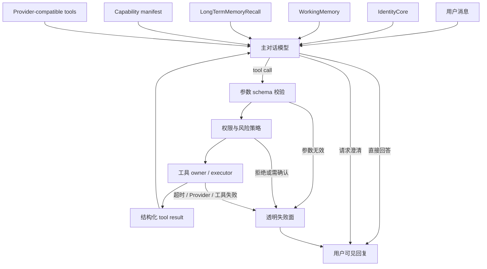

# Alicization 主模型工具意图设计

> 状态：等待用户审阅
> 日期：2026-08-05
> 范围：退役基于自然语言正则的执行意图路由，让主对话模型结合人格、短期记忆、长期记忆和真实工具能力，自主决定直接回答、澄清或调用工具。

## 背景

Alicization 当前有一套确定性的自然语言执行路由。

`packages/stage-shared/src/alicization-execution-intent.ts` 目前超过一千行，包含数十组中英文文字模式，用于推断：

- 用户是在普通对话、询问能力，还是要求执行任务
- 应调用 CLI、Codex、Claude Code、OpenClaw、浏览器还是桌面工具
- 是否必须启用工具
- 是否必须等待工具结果
- 是否强制指定一个工具
- URL、应用名、选择器、输入内容和后续动作等工具参数

这些规则不直接生成回复，但会在主模型理解用户之前改变对话路径。真实故障已经证明这种边界不可靠：

1. 用户询问“你可以使用codex吗”。
2. 文字规则将能力询问误判为执行请求。
3. renderer 和 main runtime 强制启用工具并等待 `executor_run_codex`。
4. Provider 在生成任何 token 前拒绝工具请求。
5. 用户只看到透明但无用的“回复流失败”。

这个故障不是单个词表缺失，而是架构责任放错位置：程序正在用持续扩张的固定规则解释开放式自然语言。

## 目标

让同一个主对话模型承担当前 turn 的自然语言理解和工具选择。

该模型同时接收：

- IdentityCore / persona kernel
- WorkingMemory 短期记忆
- LongTermMemoryRecall 长期记忆证据
- 当前用户消息
- 当前会话和执行连续性
- 真实可用的工具定义与能力状态

主模型自主选择：

- 直接回答
- 询问澄清
- 不采取行动
- 调用一个工具
- 按工具结果继续推理
- 向用户透明说明能力不可用或执行失败

确定性程序只负责机器边界：

- 能力事实
- 工具协议
- 参数校验
- 权限与风险
- 调用预算
- 中断与超时
- 执行审计
- 透明失败面

## 非目标

- 不删除工具系统。
- 不删除危险操作确认和权限控制。
- 不允许模型绕过工具参数 schema。
- 不允许模型直接把自然语言当 shell 命令执行。
- 不把工具调用权交给另一个没有人格和记忆的独立路由模型。
- 不用新的关键词词表替换旧关键词词表。
- 不让模型在 Provider 不支持工具时伪装已经执行。
- 不让错误、超时或工具输出进入人格训练数据。

## 核心原则

### 1. 主模型拥有自然语言意图

程序不得根据普通用户措辞推断“这是 Codex 请求”“这是浏览器请求”或“这是桌面点击请求”。

包括以下表达在内的开放式自然语言都应先进入主模型：

- 能力询问
- 礼貌请求
- 含问号的执行请求
- 省略主语的命令
- 上下文相关的“继续”
- 含有工具名称的闲聊
- 含有文件名、URL、应用名或命令片段的讨论

工具名称、命令、路径、URL 和动作词可以成为模型上下文中的事实，但不能成为程序强制路由的依据。

### 2. 工具选择属于人格与记忆主链路

工具选择不能成为 DialogueCore 之前的独立决策中心。

同一个主模型应结合：

- 她是谁
- 当前与用户的关系
- 当前任务和承诺
- 最近对话上下文
- 长期经验和过去失败
- 当前可用工具
- 风险和授权状态

决定是否行动。

这样可以避免“对话人格模型回答”和“固定执行路由器行动”形成两个不同的她。

### 3. 确定性代码管理机器边界

以下能力必须继续由程序决定：

- 某个 Provider 是否支持 tools
- 某个工具当前是否注册、启用、可用
- 工具参数是否符合 schema
- 操作属于何种风险等级
- 是否需要用户确认
- 是否命中调用预算、循环保护或并发限制
- 工具是否超时、失败、被取消或被拒绝
- tool call / tool result 是否属于当前 card、user、session 和 turn

模型可以提出行动，但不能声明程序没有验证过的执行成功。

### 4. 能力询问是事实回答，不是工具调用

工具 capability manifest 应作为结构化事实提供给主模型。

例如用户问“你可以使用 Codex 吗”，主模型应根据以下事实自然回答：

```ts
interface ExecutionCapabilityFact {
  channel: string
  available: boolean
  enabled: boolean
  ready: boolean
  reason: string | null
}
```

读取 capability manifest 本身不应触发 Codex 工具，也不应强制 `waitForTools`。

### 5. 工具失败必须透明

允许存在的固定用户可见文本只有基础设施失败面，例如：

- Provider 请求失败
- Provider 不支持工具调用
- 工具调用超时
- 工具执行失败
- 操作被安全策略拒绝
- 用户取消了操作

这些消息必须：

- 标识真实失败环节
- 不伪装成人格正常回复
- 不声称任务已完成
- 默认禁止长期记忆凝练、persona learning 和训练

## 目标架构



## 对话数据流

### Provider 支持工具

1. renderer 只发送当前消息和 Provider 配置，不分析执行意图。
2. main runtime 建立人格、WorkingMemory、长期记忆和执行连续性上下文。
3. runtime 根据 Provider capability 决定是否提供工具定义。
4. 工具选择使用自动模式，不根据用户措辞强制具体工具。
5. 主模型可以直接输出文本，也可以产生 tool call。
6. 工具层验证参数、权限、风险、card/user/session/turn scope。
7. tool result 返回同一模型 turn 或受控续轮。
8. 主模型基于工具结果生成人格一致的最终回复。

### Provider 不支持工具

1. 普通对话继续走完整人格和记忆主链路。
2. runtime 不发送 tools 字段。
3. capability manifest 明确标识当前 Provider 不支持工具。
4. 如果用户只是询问能力，模型根据事实回答。
5. 如果用户要求实际执行，模型不得伪装成功；应透明说明当前执行能力不可用，并在可用时提供可操作的恢复路径。

### 工具需要确认

1. 模型提出结构化 tool call。
2. 风险策略返回 `confirmation-required`，不执行工具。
3. UI 显示明确操作内容、风险和影响范围。
4. 用户确认后，runtime 使用原始已验证 tool call 继续执行。
5. 用户拒绝则记录取消结果并返回主模型。

## 必须退役的旧路径

### Renderer

退役：

- `detectExecutionToolRoutingIntent`
- `detectFileSystemToolIntent`
- `detectReminderToolIntent`
- 根据用户自然语言计算 `requiresExecutionToolCall`
- 根据用户自然语言计算 `requiresImmediateFileToolCall`
- 根据用户自然语言计算 `requiresReminderToolCall`
- 根据文字规则填充 `requiredExecutionToolNames`
- 因自然语言命中而强制 `supportsTools` / `waitForTools`
- “缺少预期 executor call”这类基于预判的回复拦截
- “缺少预期文件/提醒工具调用”这类基于预判的回复拦截

保留：

- 明确 UI 命令产生的结构化动作
- 文件上传等已经由 UI 生成的结构化输入
- Provider capability 配置
- tool event 展示和取消操作

### Main Prelude

退役：

- 从用户文字构造 `executionCapabilityInquiry`
- 从用户文字构造 `explicitExecutionRoutingIntent`
- 由固定分类器生成 `actionObligation.routingIntent`
- 因文字路由跳过或强制感知链路

保留：

- 当前消息解析
- WorkingMemory / LongTermMemoryRecall
- execution callbacks 和 ledger
- 当前可见场景的授权感知结果
- capability manifest

### Main Session Runtime

退役：

- `routingRequired` 对 payload 的强制覆盖
- 根据文字路由强制 `waitForTools`
- 根据文字路由构造强制 `toolChoice`
- execution routing enforcement system block
- 在模型未调用工具时根据预判判定“缺少执行回报”

保留：

- Provider tools capability 探测
- tools 注册和过滤
- 参数 schema
- 风险、确认、审计和中断
- 工具执行结果回到主模型
- 工具调用次数和循环预算

### Shared

退役：

- `alicization-execution-intent.ts` 的自然语言意图分析职责
- `alicization-execution-first-governance.ts` 中依赖文字执行判断的治理
- 将固定词表作为执行 authority 的共享 API

迁移后 shared 只保留稳定协议：

- execution capability contracts
- tool call / tool result contracts
- risk and confirmation contracts
- execution lifecycle contracts
- card/user/session/turn scope contracts

## 结构化 UI 动作例外

不是所有动作都必须重新交给模型理解。

以下输入已经由用户在 UI 中明确选择，属于结构化命令，不是自然语言推断：

- 点击“取消执行”
- 点击“确认危险操作”
- 点击“重试工具”
- 选择具体文件后上传
- Memory Workbench 的 approve / reject / tombstone
- 明确的 slash command
- 开发者工具中的显式“用 Codex 执行”按钮

这些动作可以直接进入对应 owner，但不得伪装成普通聊天消息。

## 工具参数策略

旧路由器还承担 URL、应用名、selector 和输入内容的正则抽取。迁移后：

- 参数由主模型按工具 JSON schema 生成。
- schema 必须使用明确 object 类型、必填字段和长度边界。
- executor 不接受 schema 外字段。
- 高风险字段必须二次验证。
- URL、文件路径、应用标识等必须由工具 owner 规范化。
- 参数不完整时，由主模型澄清或由工具返回可恢复的 validation error。
- 不使用隐藏的正则补齐模型没有提供的关键参数。

## Provider 兼容策略

Provider capability 应成为持久化、可观测的运行时事实。

```ts
interface MainGatewayToolCapability {
  providerId: string
  model: string
  supportsTools: boolean | null
  checkedAt: number | null
  source: 'declared' | 'probed' | 'observed' | 'unknown'
  lastError: string | null
}
```

规则：

- `supportsTools=true`：提供兼容工具，使用自动工具选择。
- `supportsTools=false`：不发送 tools。
- `supportsTools=null`：优先使用已声明能力；必要时进行一次受控探测。
- Provider 因 tools 返回明确不兼容错误且尚未产生内容时，可记录能力并进行一次无工具重试。
- 如果该 turn 已经执行了工具或产生可见内容，不得静默重放。
- 用户明确要求执行但 Provider 不支持 tools 时，必须透明显示能力限制。

## 记忆与人格边界

工具选择必须建立在现有生命闭环之上，而不是旁路它。

- WorkingMemory 继续拥有当前任务、承诺、用户纠正和会话压缩。
- LongTermMemoryRecall 继续拥有长期召回和证据排序。
- execution ledger 只记录发生了什么，不解释用户是谁。
- 工具结果可以成为 WorkingMemory 当前任务证据。
- 只有清洗、通过治理的执行经验才能成为长期 procedure / gotcha 记忆。
- 工具失败和 Provider 错误不得进入 persona/LoRA 训练。
- 原始工具输出不得直接成为人格训练样本。

## 安全边界

删除文字路由不等于删除安全策略。

所有工具调用仍必须经过：

1. 工具是否注册和启用。
2. Provider tool call 是否符合 schema。
3. card/user/session/turn scope 是否匹配。
4. 风险等级计算。
5. 确认或用户 bypass 策略。
6. 调用预算与循环检测。
7. 可取消执行。
8. 审计记录。

危险动作的判断基于结构化工具名称和参数，不基于模型自然语言承诺。

## 可观测性

每个 turn 应记录：

- tools 是否提供给 Provider
- capability 信息来自 declared、probed 还是 observed
- 模型选择直接回答还是 tool call
- tool name、参数校验结果和风险等级
- 用户确认、拒绝或取消
- tool result 状态和延迟
- 最终回复是否由 Provider、tool result 续轮或 FailureSurface 产生
- WorkingMemory 和长期记忆证据使用情况

不再记录或展示“命中了哪个中文关键词所以必须调用 Codex”这类 reason code。

## 测试策略

### 删除旧断言

删除保护以下行为的测试：

- 某句中文固定路由到某个工具
- 某个动作词必须开启 `waitForTools`
- 某个工具名称出现就强制指定 tool choice
- 未出现预期工具调用时拦截正常模型回复

### 新增不变量测试

1. 所有普通用户消息都先进入同一人格和记忆主链路。
2. renderer 不根据自然语言决定工具开关。
3. main runtime 不根据自然语言强制具体工具。
4. 文件操作、提醒、CLI、Codex、浏览器和桌面工具都不再由文字规则预选。
5. Provider 支持 tools 时，模型可以选择文本或工具。
6. Provider 不支持 tools 时，普通对话仍然可用。
7. 能力询问不会自动调用被询问工具。
8. 明确执行请求可以由模型产生 tool call。
9. tool call 必须通过 schema 和风险策略。
10. 工具结果返回同一对话权威。
11. Provider、工具、超时和安全失败保持透明且不进入训练。

### 真实链路回放

至少覆盖：

- “你可以使用 Codex 吗”直接回答能力，不调用工具。
- “帮我用 Codex 检查这个仓库”由模型自主选择 Codex 或先澄清。
- “Codex 最近怎么样”作为普通聊天，不调用工具。
- “打开浏览器”由模型选择浏览器工具。
- “我刚才说的打开浏览器是什么意思”作为语义讨论，不调用工具。
- “五分钟后提醒我喝水”由模型选择提醒工具。
- “你会提醒我喝水吗”作为能力问答，不创建提醒。
- “删除这个文件”由模型选择文件工具，并经过风险与确认策略。
- “删除文件是什么意思”作为语义讨论，不调用文件工具。
- Provider 不支持 tools 时，“你好”正常回复。
- Provider 不支持 tools 时，明确执行请求透明说明能力限制。
- 工具执行失败后，最终回复说明真实失败，不生成任务完成模板。

## 迁移顺序

### 阶段 1：建立模型自动工具选择

- 引入明确的 Provider tool capability。
- 主 runtime 可在不依赖文字路由的情况下提供工具。
- 工具选择改为自动。
- 保持现有安全、schema 和执行回传。

### 阶段 2：移除 renderer 自然语言路由

- 删除 renderer 执行意图检测。
- 删除文件、提醒和 execution 的自然语言意图检测。
- 删除 `requiresImmediateFileToolCall`、`requiresReminderToolCall`、`requiresExecutionToolCall` 和预期工具集合。
- 删除 renderer 对“缺少预期工具调用”的拦截。

### 阶段 3：移除 main prelude 和 session 强制路由

- 删除 natural-language `executionRoutingIntent`。
- 删除 `routingRequired` 强制覆盖。
- 删除强制 `toolChoice` 和 routing enforcement block。
- 能力上下文改为常规结构化事实。

### 阶段 4：退役 shared 文字路由器

- 删除生产调用。
- 删除 `alicization-execution-intent.ts` 和依赖固定措辞的测试。
- 将仍有价值的 capability/tool contract 移入专门的结构化合同模块。

### 阶段 5：质量回放与清理

- 跑真实用户对话 replay。
- 覆盖能力问答、普通闲聊、显式执行、含工具名讨论、上下文续接。
- 检查 WorkingMemory、长期召回和 persona 数据治理不受影响。
- 删除旧 reason code、文档、fixture 和 canonical 残留。

## 完成标准

只有满足以下条件才算完成：

1. 生产对话链路不再使用自然语言正则决定是否调用工具。
2. 生产对话链路不再根据自然语言强制具体工具。
3. renderer 不再拥有执行意图。
4. 主模型在同一人格、WorkingMemory 和 LongTermMemoryRecall 上下文中选择回复或工具。
5. Provider 不支持 tools 时普通对话仍然正常。
6. 工具调用继续受 schema、权限、风险、确认、预算和审计约束。
7. 能力询问、工具名闲聊和明确执行请求都通过真实链路回放。
8. 工具结果回到同一个对话权威，不形成第二人格。
9. 超时、Provider、工具和安全失败透明可见。
10. 失败和原始工具输出不会污染长期人格或 LoRA 数据。

## 设计结论

Alicization 的自然语言理解不应由不断扩张的固定词表拥有。

工具不是 DialogueCore 之外的第二套心智。工具只是主模型可以选择使用的身体能力。

程序负责让这些能力真实、可用、安全、可中断和可审计；人格、记忆、当前关系和用户语言共同决定她是否行动，以及行动后如何回应。
