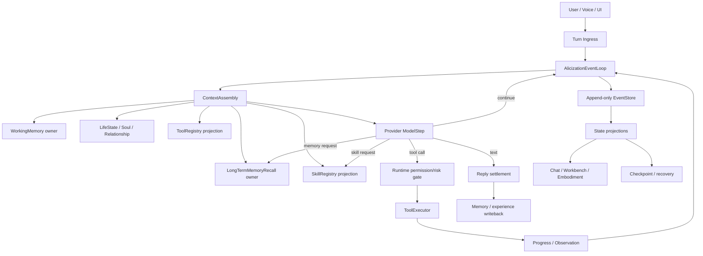

# Alicization Agentic Life Kernel Design

> 状态：Proposed
>
> 日期：2026-08-10
>
> 范围：Alicization Phase 1 本地数字生命的统一事件循环、对话、记忆、Skills、Tools、Coding Agent、人格学习和可恢复运行时。

## 1. 摘要

Alicization 当前已经拥有 WorkingMemory、LongTermMemoryRecall、Provider 对话流、
执行 adapter、Memory Workbench 和 persona/LoRA 数据治理，但这些能力仍由多套
runtime、governor、planner、callback 和 renderer 旁路共同驱动。

这种结构会产生一类比固定台词更隐蔽的模板化：

- runtime 在模型之前决定是否回忆、是否行动和如何组织回答；
- 不同执行入口各自维护 task、turn、tool-call 和结果 delivery 生命周期；
- Provider 流、工具流、Coding Agent 内部事件和 UI 状态没有一个统一事实源；
- 压缩、长期记忆、人格学习和失败处理可能各自再次解释同一轮对话；
- Skill 和 Tool 仍然更像静态 prompt/函数集合，而不是可发现、可评测、可恢复的能力。

本设计采用完整事件循环方案 C：

```text
一个用户 turn
  -> 一个可恢复的 TurnRuntime
  -> 一个 append-only event stream
  -> 一个统一的 model/tool/skill/memory loop
  -> 多个由事件派生的状态投影
```

模型拥有心智和行动选择权；运行时只负责真实能力、权限、风险、预算、超时、重试、
取消、幂等、持久化、审计和失败透明。正常自然语言回复不需要被固定 JSON 回复模板
包裹，也不再经过本地人格重写或固定治理链路。

## 2. 设计依据

本设计吸收以下成熟 agent harness 的共同模式，而不复制其产品层实现：

- OpenHands 的 typed action/observation event stream，以及未完成 action 必须能够找到
  对应 observation 的运行时不变量。
- OpenAI Agents SDK 的 tool、handoff、guardrail、interrupt 和 tracing 分层。
- LangGraph 的 thread-scoped checkpoint、durable execution 和跨会话 store 分离。
- Letta 的核心记忆与按需 archival memory 分层。
- Agent Skills 的目录化能力包、渐进式加载、版本和独立评测。

共同结论是：agentic 行为不应由一组不断增长的自然语言规则组成，而应由模型提出
行动，再由可审计的 runtime 执行和观察。状态、进度、结果、错误和 UI 展示也必须
分层，不能由一段回复文本同时承担。

## 3. 目标与非目标

### 3.1 目标

1. 所有正常用户 turn 都经过同一个 `AlicizationEventLoop`。
2. 每个 turn 具有稳定的 `turnId`、scope、deadline、abort signal 和恢复游标。
3. 普通文本、工具调用、记忆召回、Skill 执行和 Coding Agent 委托都能通过同一事件流
   观察、暂停、恢复、取消和回放。
4. Provider、工具、权限、协议和持久化失败只作为真实失败事件暴露，不伪装成人格回复。
5. WorkingMemory 仍是短期记忆 owner，LongTermMemoryRecall 仍是长期回想 owner。
6. Skill 和 Tool 都具有版本化 manifest、权限、风险、依赖、评测和激活状态。
7. persona/LoRA 学习只消费经过清洗、同意、评测和审批的 candidate。
8. Memory Workbench 只做聚合、可视化和治理，不成为新的业务 owner。
9. 所有可见回复、工具结果、记忆证据和学习候选都可以从 trace 回放。

### 3.2 非目标

- 不重写 Provider SDK 或替换 Electron。
- 不把模型输出强制改造成固定人格 JSON。
- 不恢复自然语言 regex 工具路由。
- 不用 Memory Workbench 代替 WorkingMemory 或 LongTermMemoryRecall。
- 不让 Skill 自进化直接修改生产能力或人格权重。
- 不为了事件化而删除权限、风险、审计、取消和失败边界。
- 不在本设计中引入远端中心化 persona 服务。

## 4. 核心原则

### 4.1 模型拥有心智决策

模型决定：

- 直接回答、澄清、等待还是行动；
- 是否使用长期记忆以及如何解释召回证据；
- 是否调用 Skill、Tool 或 Coding Agent；
- 是否继续执行下一步；
- 回复中的关系、情绪、语气和措辞；
- 是否提出主动行为候选。

runtime 不得根据用户文本、固定 reason tag 或正则表达式替模型作出这些决定。

### 4.2 runtime 拥有机器边界

runtime 决定：

- 能力是否存在并已激活；
- 参数是否符合 schema；
- 当前 user/card/conversation/turn 是否有权限；
- 风险、预算、并发、资源和 deadline 是否允许；
- 工具是否支持取消、重试和恢复；
- 事件是否可以提交、重复提交或写回记忆；
- 失败是否排除出长期记忆和训练数据。

这些是可验证的机器事实，不是人格提示。

### 4.3 事件是事实源，投影不是事实源

事件日志是运行时的权威事实源。数据库状态、session snapshot、UI store、
Memory Workbench 面板和 embodied projection 都从事件派生。

UI 不能反向制造 tool result、assistant reply、memory confirmation 或 training approval。

### 4.4 一个 turn 一个 owner

一个用户 turn 只能拥有一个 `TurnRuntime` 和一个普通可见回复 owner。

工具的 inline 结果由当前 turn 的 model loop 继续生成；
后台任务的 callback 结果由独立 delivery owner 生成。

两者不能同时竞争同一用户回复。

### 4.5 普通回复不需要固定结构化包装

Provider 原生 tool call 和结构化输出协议仍然可以使用，但其用途仅限于机器协议。

普通自然语言回复可以直接作为 provider text stream 发布，不得因为没有匹配固定 JSON
或固定 reply envelope 而被拦截、重写或替换。

## 5. 总体架构



### 5.1 AlicizationEventLoop

`AlicizationEventLoop` 是唯一的 turn orchestration owner。它只负责：

- 接受 turn；
- 加载 checkpoint；
- 追加事件；
- 驱动下一步 participant；
- 等待 observation；
- 检查终止条件；
- 生成 checkpoint 和最终 projection。

它不负责：

- 写人格台词；
- 解释长期记忆；
- 根据自然语言选择工具；
- 为 Provider 失败生成正常回复；
- 把多个 execution owner 合并成一个“看起来成功”的结果。

### 5.2 TurnRuntime

```ts
interface AlicizationTurnRuntime {
  turnId: string
  cardId: string
  userId: string
  conversationId: string
  parentTurnId: string | null
  status: TurnStatus
  sequence: number
  deadlineAt: number
  eventCursor: string | null
  abortSignal: AbortSignal
  activeActions: Map<string, ActiveAction>
  deliveryOwner: 'inline' | 'callback'
  memoryTrace: MemoryTrace
  retryState: RetryState
}
```

`TurnRuntime` 可从事件日志和最近 checkpoint 重建。内存对象只是执行缓存，不能成为
跨进程恢复所需的唯一状态。

### 5.3 EventStore

EventStore 采用 append-only 记录：

```ts
interface AlicizationRuntimeEventEnvelope<T = unknown> {
  eventId: string
  eventType: string
  schemaVersion: number
  sequence: number
  turnId: string
  cardId: string
  userId: string
  conversationId: string
  source: 'user' | 'model' | 'runtime' | 'tool' | 'skill' | 'memory' | 'system'
  causationId: string | null
  correlationId: string
  idempotencyKey: string | null
  occurredAt: number
  payload: T
}
```

要求：

- 相同 `idempotencyKey` 不得产生重复副作用；
- 不同 turn、card、user 的事件不得互相读取；
- 事件 payload 必须在写入前通过 schema 校验；
- 事件不可原地修改，纠正必须追加 revision、tombstone 或 compensation event；
- 敏感 payload 需要最小化持久化，并记录 consent/provenance。

### 5.4 Projection

至少提供以下投影：

- `TurnProjection`：当前对话状态、可见文本、活动动作、失败；
- `ExecutionProjection`：工具与 Coding Agent 生命周期；
- `MemoryProjection`：WorkingMemory checkpoint、长期召回和写回；
- `SkillProjection`：Skill 发现、运行和激活状态；
- `LifeStateProjection`：人格、关系、情绪和具身状态；
- `QualityProjection`：trace、延迟、召回指标、失败 fixture 和评测结果。

Projection 可重建，Workbench 只读取 projection 和 trace。

## 6. 事件协议

### 6.1 用户与模型事件

```text
turn.accepted
context.assembly.started
context.assembly.completed
model.step.started
model.text.delta
model.tool_call.proposed
model.memory_request.proposed
model.skill_request.proposed
model.clarification.proposed
model.step.completed
```

### 6.2 工具与 Skill 事件

```text
action.permission.checked
action.rejected
action.started
action.progress
action.output.delta
action.observation
action.completed
action.failed
action.cancelled
action.retry.scheduled
action.dead_lettered
```

每个 action 必须具有对应的 observation 或 terminal failure。

```ts
interface ActionObservationLink {
  actionId: string
  observationId: string
  toolCallId: string | null
  terminal: boolean
  outcome: 'success' | 'failure' | 'cancelled' | 'rejected'
}
```

迟到事件只能更新诊断，不得把已结算 action 重新变成运行中。

### 6.3 记忆事件

```text
working_memory.snapshot.created
working_memory.updated
working_memory.compression.started
working_memory.compression.completed
long_term_memory.recall.started
long_term_memory.recall.evidence
long_term_memory.recall.abstained
long_term_memory.recall.completed
memory.write.proposed
memory.write.accepted
memory.write.rejected
memory.tombstoned
```

### 6.4 失败事件

```text
provider.failed
provider.retry.scheduled
tool.failed
skill.failed
permission.denied
protocol.invalid
runtime.timed_out
runtime.cancelled
runtime.recovery.started
runtime.recovery.completed
runtime.dead_lettered
```

失败事件不能被转换成普通 `assistant.reply`，也不能进入 persona/LoRA 学习。

## 7. ModelStep 协议

### 7.1 普通文本

模型返回普通文本时直接产生 `model.text.delta`，不要求外层固定回复对象。

### 7.2 工具调用

工具调用必须来自 Provider 原生 tool call：

```ts
interface ModelToolCall {
  toolCallId: string
  qualifiedToolName: string
  arguments: unknown
}
```

runtime 只负责：

1. 根据 registry 找到工具；
2. 校验参数；
3. 校验 scope、权限、风险、预算；
4. 创建 action；
5. 执行并发布 observation；
6. 将事实结果交回同一个 model loop。

runtime 不读取用户自然语言来设置 `toolChoice`。

### 7.3 记忆请求

长期记忆使用两级策略：

1. `MemoryOS` 可以在 ContextAssembly 阶段并行生成低成本候选证据；
2. 模型在证据不足时可以请求更窄的 `memory.search` action。

自动候选只是上下文证据，不是“必须使用”或“必须提及”的指令。

### 7.4 继续与终止

模型每次 step 后由 runtime 根据实际事件判断：

- 是否有新的 action；
- 是否仍在等待 observation；
- 是否已经产生最终文本；
- 是否达到 step、时间、token 或预算上限；
- 是否收到取消信号。

runtime 不根据固定“对话阶段”决定继续或结束。

## 8. ToolRegistry 与 Coding Agent

### 8.1 统一能力 manifest

```ts
interface CapabilityManifest {
  capabilityId: string
  kind: 'tool' | 'skill'
  version: string
  description: string
  inputSchema: unknown
  outputSchema: unknown
  scope: 'user' | 'card' | 'conversation' | 'turn'
  permissions: string[]
  risk: 'low' | 'medium' | 'high' | 'critical'
  executionChannel: string
  timeoutMs: number
  supportsProgress: boolean
  supportsCancellation: boolean
  idempotency: 'required' | 'best-effort' | 'none'
  evaluationStatus: 'unverified' | 'passed' | 'failed'
  activationStatus: 'candidate' | 'active' | 'disabled' | 'revoked'
}
```

模型只接收当前 surface 的 active manifest 投影，不接收不可执行、未评测或已撤销能力。

### 8.2 Coding Agent channel

Coding Agent 不再由一个模糊的“万能执行器”承载所有语义。Registry 中使用明确的
qualified capability：

```text
coding_agent.codex
coding_agent.claude_code
coding_agent.cli
```

它们共享 Coding Agent 任务 contract，但具有不同的 channel、能力事实、超时、恢复和
进度协议。

用户只是询问“你能不能用 Codex”时，模型可以直接回答；只有模型实际产生
`coding_agent.codex` tool call 时，才创建执行任务。

### 8.3 工具执行安全边界

- 每次 action 只有一个 execution owner；
- 主对话 inline action 不得再次进入 callback delivery；
- callback action 不得抢占前台 turn；
- 工具已产生副作用后不得重放整个 Provider turn；
- 工具自己的重试必须由工具 manifest 声明幂等性；
- 活动 action 以 heartbeat 和 semantic progress 分开计时；
- cancel 必须向 adapter 传递并最终产生 terminal observation；
- crash recovery 通过 action 状态和 adapter resume contract 恢复；
- 无法恢复的 action 进入 dead-letter，不能伪造成功。

## 9. MemoryOS

### 9.1 WorkingMemory

WorkingMemory 在每个 turn 前生成 snapshot，在 turn settlement 后更新：

```text
当前用户目标
最近对话
未完成任务
用户纠正
短期承诺
当前情绪残留
待观察现象
长期候选
```

压缩必须产生：

```text
working_memory.compression.started
working_memory.compression.completed
working_memory.snapshot.created
```

下一轮 ContextAssembly 必须消费最新 snapshot，而不是重新从原始 source window 截取。

### 9.2 LongTermMemoryRecall

长期召回只返回带 provenance 的证据：

```ts
interface MemoryEvidence {
  memoryId: string
  scope: { userId: string, cardId: string | null }
  source: 'confirmed' | 'reflection' | 'episode' | 'feedback'
  confidence: number
  createdAt: number
  updatedAt: number
  rankReason: string[]
  text: string
}
```

召回系统可以确定检索范围、权限、索引和预算，但不能确定人格应该如何提及证据。

### 9.3 记忆写回

只有成功、可见、来源明确的 turn 才能进入清洗队列。

禁止写回：

- Provider 失败；
- 工具失败；
- 超时；
- 协议格式失败；
- 权限拒绝；
- 本地 fallback；
- 用户未同意的数据；
- raw transcript 直接训练样本。

## 10. Skill Registry 与自进化

Skill 生命周期：

```text
discovered
  -> loaded
  -> sandboxed
  -> replay-evaluated
  -> candidate
  -> approved
  -> active
  -> rolled-back / revoked
```

Skill 自进化只能产生：

- 新 Skill candidate；
- 现有 Skill 的新版本 candidate；
- 依赖或工具声明建议；
- 评测报告；
- 用户可审核的变更摘要。

不能直接产生：

- 自动修改 system prompt；
- 自动修改人格核心；
- 自动修改工具权限；
- 自动激活未经评测的 Skill；
- 自动加入训练集。

## 11. 人格与具身

人格上下文来自动态状态源：

- Soul/persona canonical state；
- 用户确认的关系事实；
- WorkingMemory；
- 长期记忆证据；
- 情绪 ledger；
- 工具和环境的真实 observation。

删除工程性的固定人格 cue。具身层只消费结构化状态：

```text
emotion
arousal
valence
speechActivity
actionIntent
attentionTarget
```

表情、口型、动作和语音不是通过匹配回复文字生成，而是由同一 turn projection 派生。

## 12. 迁移策略

### C0：事件协议和回放骨架

- 在 `packages/stage-shared` 定义事件 envelope、事件类型和 schema；
- 在 `apps/stage-tamagotchi/src/main/services/alicization` 建立 EventStore adapter；
- 为现有 main chat、tool、memory 运行时增加 event sink；
- 不改变既有用户行为，只先记录完整 trace；
- 建立 event replay 和 action/observation invariant 测试。

### C1：统一主对话 loop

- 以 `main-chat-session-runtime` 为入口接入 `AlicizationEventLoop`；
- 让 stream runner 成为 Provider adapter，而不是第二个 orchestration owner；
- 删除本地普通回复、structured repair 和普通 fallback；
- 保留透明 FailureSurface；
- 让 UI 从 TurnProjection 渲染。

### C2：统一 Tool/Coding Agent loop

- 统一 ToolRegistry；
- 迁移 executor、MCP、local-visual 和 task-thread；
- 修复 inline/callback delivery owner；
- 统一 canonical `toolCallId`；
- 接入 progress、cancel、retry、recovery、dead-letter。

### C3：接入 MemoryOS

- WorkingMemory snapshot 进入 ContextAssembly；
- LongTermMemoryRecall 只通过 recall event 返回证据；
- 压缩快照进入下一轮；
- 长期记忆搜索、分页、embedding 和 reindex 都通过事件记录；
- 失败 turn 不进入记忆和训练。

### C4：接入 Skill Registry

- 统一 Skill manifest；
- 实现渐进加载和 scope 投影；
- Skill 执行进入 action/observation loop；
- 增加 candidate、评测、审批、激活、回滚。

### C5：接入 ExperienceLearning

- 统一 reflection、reinforcement、tool experience；
- 接真实 dataset store；
- 完成清洗、PII、dedupe、consent、manifest、export、activate、rollback、revoke；
- 训练流水线只接受评测通过的 manifest。

### C6：删除旧治理旁路

候选删除或退休：

- `dialogue-focus-governor`
- `dialogue-ingress-governor`
- `dialogue-memory-governor`
- `dialogue-turn-ownership`
- `dialogue-turn-semantics`
- `answer-planner`
- `answer-compiler`
- `reply-deliberator`
- `runtime-card-prompt`
- `alicization-execution-intent` 的自然语言匹配部分
- local-visual 自动续跑旁路
- 未经 ToolRegistry 的 MCP 调用
- 只验证旧固定模板的 fixture 和断言

是否删除要以 C0-C5 的调用图和 replay 结果为准，不能仅按文件名直接删除。

## 13. 测试与质量 Harness

### 13.1 事件不变量

- 每个 action 必须有唯一 terminal observation；
- 每个事件必须属于一个合法 scope；
- 相同 idempotency key 不得产生重复副作用；
- 已结算 action 不得被迟到事件重新打开；
- 一个 turn 只能有一个普通回复 owner；
- inline 结果不能进入 callback delivery；
- callback 结果不能覆盖前台 turn；
- 取消最终必须产生 cancelled terminal event；
- crash recovery 后不能重复执行不可幂等工具。

### 13.2 对话 replay

覆盖：

- 普通能力咨询不调用工具；
- 明确 Coding Agent 任务进入正确 channel；
- 工具 progress 连续可见；
- Provider 首次失败后按策略重试；
- 工具产生副作用后 Provider 失败不重放整轮；
- 普通文本不因缺少固定结构化包装而失败；
- WorkingMemory 压缩影响下一轮上下文；
- 长期记忆被自然使用但不强制提及；
- 失败 turn 不进入长期记忆和 LoRA candidate。

### 13.3 Chaos Harness

模拟：

- Provider 429/5xx/连接中断；
- tool-call 流被截断；
- 工具进度长时间无语义进展；
- UI 断开后恢复；
- 主进程 crash；
- duplicate event；
- out-of-order event；
- adapter 只支持部分取消；
- embedding provider 切换和 reindex 中断。

## 14. 完成标准

C 方案完成必须同时满足：

1. 主对话、工具、记忆、Skill、Coding Agent 共用同一个 turn event loop。
2. 普通回复不依赖固定模板和本地回复作者。
3. 模型拥有心智决策权，runtime 只守机器边界。
4. 工具 action/observation、进度、错误、取消和恢复可回放。
5. WorkingMemory 和 LongTermMemoryRecall owner 边界不被打散。
6. Skill 可以发现、加载、评测、审批、激活和回滚。
7. Persona/LoRA 只消费通过治理和评测的数据。
8. Memory Workbench 能展示事件 trace、召回依据、工具进度、失败和学习候选。
9. 真实 replay 和 chaos harness 通过。
10. 删除旧治理旁路后，用户仍能获得稳定、透明、可中断的数字生命体验。

## 15. 参考资料

- OpenHands Runtime / Event Stream / Action and Observation
- OpenAI Agents SDK Tools / Handoffs / Guardrails / Tracing
- LangGraph Persistence / Checkpoints / Store / Durable Execution
- Letta Core Memory / Archival Memory / Memory Tools
- Agent Skills Specification / `SKILL.md` / Progressive Disclosure
- LongMemEval / LoCoMo 长期记忆评测
